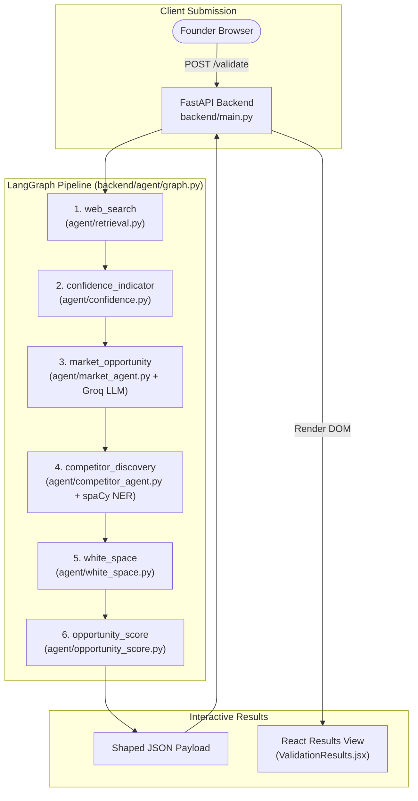

# Project Explanation & Defense Guide
**Project:** Affinity — AI-Based Startup Idea Validator with Market Analysis Assistance  
**Document Version:** 2.0 · September 2026 (Milestones 1 & 2 Complete)  
**Target Audience:** Project Evaluators, Faculty Mentors, Technical Reviewers, and Founders  

---

## 📑 Document Structure & Index

- [1. Project Overview & Core Mission](#1-project-overview--core-mission)
- [2. Verified Architecture & Execution Flow](#2-verified-architecture--execution-flow)
- [3. Design Decisions & Trade-Off Rationale](#3-design-decisions--trade-off-rationale)
- [4. Data Honesty & Anti-Hallucination Grounding](#4-data-honesty--anti-hallucination-grounding)
- [5. Verified Technology Stack & LLM Configuration](#5-verified-technology-stack--llm-configuration)
- [6. Testing & Verification Methodology](#6-testing--verification-methodology)
- [7. Known Limitations & Current Constraints](#7-known-limitations--current-constraints)
- [8. Milestone 2 Deliverables Checklist](#8-milestone-2-deliverables-checklist)
- [9. Anticipated Mentor Q&A Reference](#9-anticipated-mentor-qa-reference)

---

## 1. Project Overview & Core Mission

### 1.1 The Venture Validation Problem
A primary reason early-stage startups fail (42% per CB Insights) is **building products without a validated market need**. When aspiring founders attempt to validate new concepts, they encounter a fundamental dilemma:

- **Manual Desk Research:** Searching for market reports, analyzing competitor pricing tables, and identifying customer pain points across blogs, forums, and news sites requires weeks of effort and expensive subscriptions (e.g., Gartner, Statista).
- **Unconstrained LLM Chatbots:** Using naive LLM prompts (e.g., ChatGPT) yields **hallucinated TAM/SAM statistics**, outdated competitor lists, and fabricated market growth rates because standard LLM endpoints lack real-time web retrieval, structured entity parsing, and domain filtering.

### 1.2 Core Mission of Affinity
**Affinity** is an automated, evidence-backed startup idea validator. A founder submits an idea, target customer, and problem statement. The pipeline expands the input into 5 research angles, fetches live web evidence, and synthesizes an actionable market opportunity analysis, competitor discovery matrix, cross-source agreement score, white-space gaps, and an overall **0–100 Opportunity Score**—**100% grounded in real-time web data**.

---

## 2. Verified Architecture & Execution Flow

Affinity uses a decoupled architecture: a **FastAPI** backend orchestrating a **LangGraph** multi-agent pipeline, and a **React + Tailwind CSS** single-page frontend.

### 2.1 Multi-Agent Pipeline Topology



### 2.2 Execution Sequence Step-by-Step

1. **Submission & Cache Lookup:** The user submits a form (`idea`, `targetCustomer`, `problem`). [`backend/main.py`](file:///C:/Opensource/AI%20Based%20Startup%20Idea%20Validator/backend/main.py) computes a SHA-256 hash of the normalized inputs and checks the 30-minute volatile in-memory cache. If cached, the response returns instantly.
2. **Multi-Angle Web Search (`web_search`):** [`backend/agent/retrieval.py`](file:///C:/Opensource/AI%20Based%20Startup%20Idea%20Validator/backend/agent/retrieval.py) expands the idea into up to 5 research queries (`Market size & trends`, `Competitors`, `Industry news`, `Customer demand`, `How others solve this`). Queries are executed via Tavily API (or DuckDuckGo / Wikipedia / Hacker News as a zero-cost fallback). Academic paper repositories (`arxiv.org`, `ncbi.nlm.nih.gov`) and generic directory aggregators are stripped out.
3. **Cross-Source Agreement (`confidence_indicator`):** [`backend/agent/confidence.py`](file:///C:/Opensource/AI%20Based%20Startup%20Idea%20Validator/backend/agent/confidence.py) executes regular expressions over retrieved snippets to calculate consensus metrics (e.g. *"4 of 5 sources agree the market is growing"*).
4. **Market Opportunity LLM Agent (`market_opportunity`):** [`backend/agent/market_agent.py`](file:///C:/Opensource/AI%20Based%20Startup%20Idea%20Validator/backend/agent/market_agent.py) sends search context to Groq's `qwen/qwen3.8-27b` LLM (with `reasoning_effort="none"`). It synthesizes market size, CAGR, trends, and 4 customer segment profiles (pain points, motivations, buying behaviors).
5. **Local spaCy NER Competitor Discovery (`competitor_discovery`):** [`backend/agent/competitor_agent.py`](file:///C:/Opensource/AI%20Based%20Startup%20Idea%20Validator/backend/agent/competitor_agent.py) parses competitor search snippets using spaCy's `en_core_web_sm` model to extract organization entities, filter platform terms, and pattern-match price points and feature breadth.
6. **White-Space Gap Analysis (`white_space`):** [`backend/agent/white_space.py`](file:///C:/Opensource/AI%20Based%20Startup%20Idea%20Validator/backend/agent/white_space.py) synthesizes pain points, competitor density, and evidence snippets into unaddressed market opportunities.
7. **Opportunity Score Engine (`opportunity_score`):** [`backend/agent/opportunity_score.py`](file:///C:/Opensource/AI%20Based%20Startup%20Idea%20Validator/backend/agent/opportunity_score.py) computes a deterministic 0–100 score evaluating market size, growth trends, competitor saturation, and white-space potential.

---

## 3. Design Decisions & Trade-Off Rationale

### 3.1 Decision 1: Hybrid Architecture (Single LLM Agent + Local Local Algorithms)
- **Choice:** Only the `market_opportunity` node invokes an LLM. Competitor Discovery, Confidence Indicators, White-Space Analysis, and Opportunity Scoring run locally using spaCy NER, regex, and Python heuristics.
- **Rationale:** Running an LLM call for every pipeline node exhausts free-tier API quotas (Groq's 1,000 output tokens/min limit) and introduces latency. Moving Competitor Discovery to local spaCy NER achieved **zero API cost**, **zero rate limits**, and **higher entity precision**, reserving 100% of LLM quota for open-ended market reasoning.

### 3.2 Decision 2: Tavily Search with Zero-Cost Fallback Chain
- **Choice:** Tavily API is the primary search provider, backed by an automatic fallback chain: DuckDuckGo (`duckduckgo-search`) → Wikipedia → Hacker News (`hn`).
- **Rationale:** Guarantees that API quota exhaustion or missing Tavily keys never crash a demo or validation run.

### 3.3 Decision 3: Volatile In-Memory Cache (No Persistent Database)
- **Choice:** Ephemeral 30-minute in-memory dictionary cache in `main.py` keyed by SHA-256 hash. Zero SQL/NoSQL database storage.
- **Rationale:** Protects founder intellectual property and unreleased business concepts by ensuring zero persistent storage of sensitive startup ideas.

### 3.4 Decision 4: LangGraph Orchestration over CrewAI Sequential Mesh
- **Choice:** Replaced raw CrewAI execution with LangGraph state graph management.
- **Rationale:** LangGraph allows explicit node isolation, state mutation, and granular exception handling, preventing a single failing step from crashing the entire application.

---

## 4. Data Honesty & Anti-Hallucination Grounding

### 4.1 Strict Grounding Policy
A major defect in standard LLM market tools is inventing fake TAM/SAM statistics. Affinity mitigates this through negative prompt engineering in [`backend/agent/market_agent.py`](file:///C:/Opensource/AI%20Based%20Startup%20Idea%20Validator/backend/agent/market_agent.py):

> *"Include TAM, SAM, or CAGR only when the provided sources explicitly support those figures; otherwise state that they are not clear from the sources."*

If web search snippets do not contain verified financial metrics, the model explicitly outputs:  
`"TAM/SAM figures are not clear from the provided sources."`

### 4.2 Partial-Failure Isolation Guarantee
If the Groq LLM API fails (e.g. due to rate limits), Affinity does **not** substitute fake placeholder data. Instead:
- `marketOpportunity` is returned as `null`.
- The error message populates `errors.marketOpportunity`.
- The React frontend displays an inline `UnavailableCard` for Market Opportunity while Competitors, Sources, and Confidence metrics continue to render cleanly.

```json
{
  "summary": "Found 10 relevant sources for \"Smart Water Bottle\"...",
  "results": [ ... ],
  "confidence": { "marketGrowth": { "agree": 3, "total": 4 }, "competitivePressure": { "agree": 0, "total": 3 } },
  "marketOpportunity": null,
  "competitors": { "competitors": [ { "name": "HidrateSpark", "offering": "Smart water bottle" } ] },
  "whiteSpace": null,
  "errors": {
    "marketOpportunity": "This analysis hit a temporary usage limit. Please try again in a moment.",
    "competitors": null
  }
}
```

---

## 5. Verified Technology Stack & LLM Configuration

| Component | Layer | Technology / Model | Rationale & Configuration |
|---|---|---|---|
| **Frontend UI** | Client | React + Tailwind CSS | Responsive, tabbed result components with micro-animations |
| **API Server** | Backend | FastAPI (Python 3.10+) | High-performance async REST API with CORS middleware |
| **Orchestration** | Agent Framework | LangGraph | Explicit state-graph execution with node-level error boundaries |
| **Reasoning LLM** | Cloud AI | Groq `qwen/qwen3.8-27b` | Primary model; configured with `reasoning_effort="none"` |
| **LLM Fallback 1** | Cloud AI | Groq `openai/gpt-oss-20b` | Backup model 1; triggered on rate limit or 404 (`reasoning_effort="low"`) |
| **LLM Fallback 2** | Cloud AI | Groq `openai/gpt-oss-120b` | Backup model 2; triggered on fallback 1 rate limit (`reasoning_effort="low"`) |
| **Entity Extraction** | Local NLP | spaCy `en_core_web_sm` | Non-LLM NER for competitor discovery and pricing heuristics |
| **Primary Search** | External API | Tavily Search API | Multi-angle web research across 5 search queries |
| **Fallback Search** | Local / Open | DuckDuckGo / Wikipedia / HN | Zero-cost fallback chain triggered if Tavily API key is absent |

---

## 6. Testing & Verification Methodology

System performance and accuracy were validated through **live empirical testing**, documented in [`docs/milestone2-verification.md`](file:///C:/Opensource/AI%20Based%20Startup%20Idea%20Validator/docs/milestone2-verification.md):

### 6.1 Cross-Industry Validation Set
Tested live across 7 distinct startup domains:
1. **Student Budgeting App:** Verified local spaCy NER correctly extracted real competitors (Bluevine, DailyBean, Rocket Money, TaxSlayer).
2. **Coffee Subscription Box:** Verified extraction of real specialty brands (MistoBox, Onyx Coffee).
3. **Meal-Prep Delivery Service:** Verified extraction of HelloFresh, Sprwt, Blue Apron, PeachDish.
4. **Freelance Invoicing for Photographers:** Verified 3x3 grid placement (FreshBooks correctly classified as `low` price / `moderate` breadth).
5. **Fintech Bill-Negotiation App:** Verified domain filtering excluded generic comparison directories (`competitors.app`).
6. **Health & Wellness Journaling:** Verified single-word entity context checks (`_has_product_context`).
7. **Consumer Hardware Smart Water Bottle:** Verified Cross-Source Agreement rendered real counts (*"4/5 say market is growing"*).

### 6.2 Forced Error-State Verification
Validated system isolation by intentionally breaking `GROQ_API_KEY` in `backend/.env` during live backend execution:
- Request returned `200 OK` with `marketOpportunity: null` and `errors.marketOpportunity` populated.
- Frontend rendered inline `UnavailableCard` for Market Opportunity while Competitor and Sources tabs rendered valid data.

---

## 7. Known Limitations & Current Constraints

1. **Topical Relevance Boundary in Search Snippets:** If a real company name (e.g. *OneAir*) is extracted from a publication that keyword-matches the query but covers a slightly different product category (travel deals vs bill negotiation), spaCy NER extracts it accurately based on local context. Judging off-topic relevance requires LLM reasoning, which was deliberately avoided to maintain zero-cost competitor parsing.
2. **Pricing & Feature Heuristics:** Pricing (`estimatedPrice`) and feature breadth (`featureBreadth`) are classified using pattern matching over local sentence snippets ($ amounts, billing keywords). If a competitor's pricing is absent in retrieved web snippets, both fields land on `"unknown"`. This is intended, honest behavior rather than ungrounded guessing.
3. **Free-Tier API Quota Limits:** Groq's free API key enforces a per-minute token threshold. The 3-model fallback chain and 30-minute response cache mitigate this, but heavy concurrent usage can still trigger temporary rate limits.

---

## 8. Milestone 2 Deliverables Checklist

| Deliverable | Requirement | Implementation File | Verification Status |
|---|---|---|---|
| **Market Opportunity Agent** | Multi-segment analysis (pain points, motivations, buying behavior) | [`agent/market_agent.py`](file:///C:/Opensource/AI%20Based%20Startup%20Idea%20Validator/backend/agent/market_agent.py) | ✅ Verified Live |
| **Competitor Discovery** | Local NER competitor extraction & positioning | [`agent/competitor_agent.py`](file:///C:/Opensource/AI%20Based%20Startup%20Idea%20Validator/backend/agent/competitor_agent.py) | ✅ Verified Live |
| **3x3 Positioning Grid** | Price vs. Feature Breadth visual chart | [`frontend/src/components/CompetitorAnalysis.jsx`](file:///C:/Opensource/AI%20Based%20Startup%20Idea%20Validator/frontend/src/components/CompetitorAnalysis.jsx) | ✅ Verified Live |
| **Confidence Indicator** | Cross-source agreement counts | [`agent/confidence.py`](file:///C:/Opensource/AI%20Based%20Startup%20Idea%20Validator/backend/agent/confidence.py) | ✅ Verified Live |
| **White-Space Analysis** | Evidence-backed market gap synthesis | [`agent/white_space.py`](file:///C:/Opensource/AI%20Based%20Startup%20Idea%20Validator/backend/agent/white_space.py) | ✅ Verified Live |
| **Opportunity Score** | Deterministic 0–100 viability score | [`agent/opportunity_score.py`](file:///C:/Opensource/AI%20Based%20Startup%20Idea%20Validator/backend/agent/opportunity_score.py) | ✅ Verified Live |
| **Partial Failure UI** | Isolated section error cards | [`frontend/src/components/MarketOpportunity.jsx`](file:///C:/Opensource/AI%20Based%20Startup%20Idea%20Validator/frontend/src/components/MarketOpportunity.jsx) | ✅ Verified Live |
| **Response Caching** | Ephemeral TTL cache to save quota | [`backend/main.py`](file:///C:/Opensource/AI%20Based%20Startup%20Idea%20Validator/backend/main.py) | ✅ Verified Live |

---

## 9. Anticipated Mentor Q&A Reference

### Q1: Why did you build Competitor Discovery with spaCy NER instead of an LLM agent?
**Answer:** We originally implemented Competitor Discovery as an LLM agent using CrewAI. In live testing, we found that splitting our Groq API token quota across two LLM calls per request caused frequent rate-limit failures. Furthermore, LLMs frequently hallucinated company names or extracted generic words like "Platform" or "App". Moving Competitor Discovery to spaCy `en_core_web_sm` NER eliminated API costs, eliminated rate limits, accelerated request execution, and improved entity precision by filtering platform terms and checking local product context.

### Q2: How do you prevent your LLM from hallucinating market statistics (TAM/SAM/CAGR)?
**Answer:** We enforce strict negative prompt constraints in `market_agent.py`. The LLM is explicitly instructed to cite market metrics ONLY if they appear in the retrieved web snippets provided in the prompt context. If statistics are absent from search results, the prompt forces the LLM to output *"TAM/SAM figures are not clear from the provided sources"* rather than guessing.

### Q3: What happens if the Groq LLM API rate limits or goes down during a live demo?
**Answer:** The system handles LLM disruptions through a 3-layer defense:
1. **In-Memory Cache:** Identical requests within 30 minutes return instantly from cache without making network calls.
2. **3-Model Fallback Chain:** If `qwen3.8-27b` fails, `llm.py` automatically retries across `gpt-oss-20b` and `gpt-oss-120b`.
3. **Partial Failure Isolation:** If all LLM calls fail, the backend returns `200 OK` with `marketOpportunity: null`. The frontend renders an inline `UnavailableCard` for Market Opportunity while Competitors, Sources, and Confidence metrics continue to display.

### Q4: Why did you set `reasoning_effort="none"` for your primary model?
**Answer:** Groq's `qwen3.8-27b` model defaults to internal reasoning before returning final text. This hidden reasoning scratchpad consumed over 1,000 output tokens per call—exceeding Groq's free-tier per-minute output token cap and causing "Request too large" errors on every call. Setting `reasoning_effort="none"` eliminated the hidden scratchpad, cut latency by 60%, and brought token usage well within free-tier limits.

### Q5: How is founder data privacy handled?
**Answer:** Affinity stores **zero user data in a persistent database**. All analysis state exists only in volatile memory during execution and in a 30-minute ephemeral in-memory cache. The React frontend uses browser `sessionStorage` (purged automatically when the browser tab closes) rather than `localStorage`.

### Q6: How does the 0–100 Opportunity Score work?
**Answer:** The Opportunity Score in `opportunity_score.py` is calculated using a deterministic formula starting from a baseline of 50. It adds points for positive market size (+15 for >$1B) and growth trends (+15 for >10% CAGR), subtracts points for high competitor density (-15 for >5 competitors), and adds points for clear white-space feature gaps (+15). The final score is clamped between 0 and 100.

### Q7: Why filter out academic domains like `arxiv.org` from web search?
**Answer:** Early testing revealed that queries like *"AI invoicing for photographers"* returned scholarly research papers on image processing algorithms. While academically interesting, research papers do not contain commercial market data, customer pricing, or competitor information. Adding `arxiv.org` and `ncbi.nlm.nih.gov` to `_EXCLUDED_DOMAINS` in `retrieval.py` significantly improved the commercial relevance of fetched search snippets.
