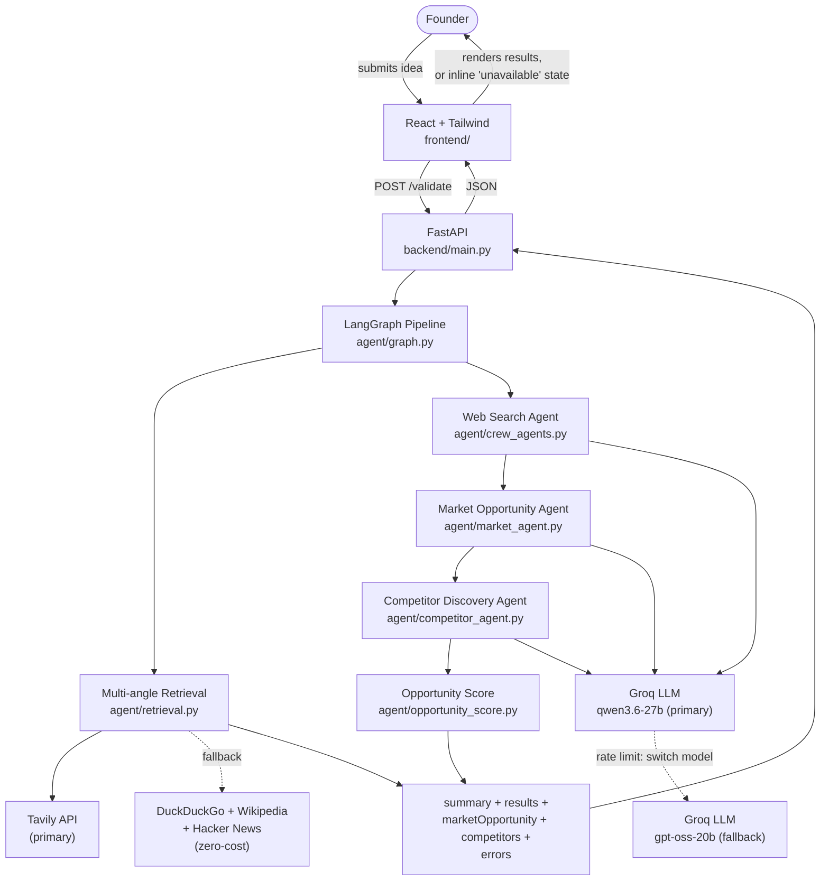

# Affinity

**Before you build it, measure the affinity.**

An AI-based startup idea validator with market analysis assistance. The project lets
a founder enter a startup idea, target customer, and problem statement, and get back
real search results across 5 research angles, a structured market opportunity analysis
(size, trends, customer segments with pain points/motivations/buying behavior), and a
competitor comparison (offerings, positioning, gaps) — three agents chained in
sequence, each reasoning over real data rather than inventing it. Search runs on
Tavily, with a free DuckDuckGo/Wikipedia/Hacker News fallback so it still works without
a search API key; academic/research-paper sources are filtered out since they don't add
useful signal for a founder. Milestone 1 is complete; Milestone 2 (Market Opportunity +
Competitor Discovery agents) is in progress.


## Architecture

The app is being split into a proper frontend/backend, per
[`docs/architecture.md`](docs/architecture.md):



A failure in the Market Opportunity or Competitor Discovery node doesn't crash the
request — on a Groq rate limit, the call immediately switches to a second Groq model
with its own separate quota (see Reasoning LLM below); only if that also fails does the
section come back `null` with an `errors.<node>` message, and the frontend shows an
inline "unavailable" state for just that section while the rest of the response still
renders.

| Layer        | Tech                                  |
|--------------|----------------------------------------|
| Frontend     | React + Tailwind CSS (`frontend/`) |
| Backend      | FastAPI (`backend/`) — exposes `POST /validate` |
| Agent framework | [CrewAI](https://www.crewai.com) — 3 agents: Web Search (`crew_agents.py`), Market Opportunity (`market_agent.py`), Competitor Discovery (`competitor_agent.py`) |
| Orchestration | [LangGraph](https://www.langchain.com/langgraph) — 4-node pipeline, `web_search → market_opportunity → competitor_discovery → opportunity_score` (`backend/agent/graph.py`) |
| Search       | Tavily API (primary), with DuckDuckGo + Wikipedia + Hacker News as a zero-cost fallback chain — fetched directly (not LLM-mediated) across 5 search angles, academic sources filtered out (`backend/agent/tools.py`, `retrieval.py`) |
| Reasoning LLM | [Groq](https://console.groq.com) — primary `qwen/qwen3.6-27b`, automatic fallback to a second Groq model (`openai/gpt-oss-20b`) on rate limit, since Groq rate-limits per-model, not per-account — a genuinely separate quota, not just a longer wait on the same one (see `backend/agent/llm.py`). A cross-*provider* fallback to Gemini was tested and dropped (it hangs for minutes past its own timeout instead of failing fast); summary output also passes a quality gate that rejects leaked reasoning text |
| Database     | None yet |
| Deployment   | [Render](https://render.com) — two services, config in `render.yaml` |
| Version control | Git / GitHub |

The product UI intentionally doesn't name any of the underlying frameworks/providers —
status and footer text describe capability generically ("Multi-agent Pipeline," "Live
Web Search") rather than saying "CrewAI," "Groq," or "Tavily."

The original single-file Streamlit prototype (`app.py`) is kept for reference but is
superseded by the `frontend/` + `backend/` split going forward.

## API

The frontend talks to exactly one backend endpoint, `POST /validate`. Full field-level
contract (types, required/optional, error shapes) is in
[`docs/architecture.md`](docs/architecture.md#4-api-contract) — below is a real example
of what goes over the wire.

**Request**

```bash
curl -X POST https://startup-validator-backend.onrender.com/validate \
  -H "Content-Type: application/json" \
  -d '{
    "idea": "A subscription box for eco-friendly cleaning products",
    "targetCustomer": "environmentally conscious households",
    "problem": "plastic waste from cleaning product packaging"
  }'
```

**Response `200 OK`**

```json
{
  "summary": "The eco-friendly cleaning subscription market is growing steadily, driven by rising consumer demand for sustainable household products...",
  "results": [
    {
      "title": "Sustainable Cleaning Products Market Size Report, 2026",
      "snippet": "The global sustainable cleaning products market was valued at $4.2B in 2025 and is projected to grow at a CAGR of 11.3%...",
      "url": "https://example.com/market-report",
      "query": "eco-friendly cleaning subscription market size trends",
      "angle": "market_size",
      "score": 0.87
    }
  ],
  "marketOpportunity": {
    "marketSize": "The global market was valued at $2.1 billion in 2024 and is growing at 12% annually.",
    "trends": ["Rising demand for subscription-based delivery", "Increased focus on eco-friendly packaging"],
    "segments": [
      {
        "segment": "Urban millennials",
        "painPoints": "Limited time to research and compare options",
        "motivations": "Convenience and sustainability credentials",
        "buyingBehavior": "Research online, prefer subscription models over one-off purchases"
      }
    ],
    "opportunityScore": 63
  },
  "competitors": {
    "competitors": [
      {
        "name": "Acme Meal Co",
        "offering": "Subscription meal kits with pre-portioned ingredients delivered weekly.",
        "url": "https://example.com/acme-meal-co",
        "gap": "No options for large families or bulk ordering.",
        "estimatedPrice": "mid",
        "featureBreadth": "moderate"
      }
    ]
  },
  "errors": {
    "marketOpportunity": null,
    "competitors": null
  }
}
```

`results` is grouped client-side by `angle` (one of `market_size`, `competitors`,
`industry_news`, `customer_demand`, `existing_solutions`) — that's what powers the
"grouped by research angle" sections in the UI. `score` is a 0–1 relevance value used
for the animated count-up on each result card. `marketOpportunity` and `competitors`
come back `null` (not an object with empty arrays) if that agent's LLM call fails
outright or its output can't be validated, with the failure message in
`errors.<node>` — the frontend shows an inline "analysis wasn't available" state for
just that section rather than an error, since the rest of the response is still valid.
An empty `competitors: []` array (not `null`) is different: the node ran fine and
genuinely found none.

**Error responses** — same shape either way, only the status code and message differ:

```json
// 400 — empty/missing idea
{ "error": "Idea is required." }

// 502 — every search source (Tavily + all fallbacks) failed
{ "error": "Search is temporarily unavailable. Please try again shortly." }
```

The frontend renders `EmptyState` when `results` comes back as an empty array (valid
request, zero matches) and `ErrorState` with a retry button for any non-200 response.

## Project Structure

```
.
├── frontend/            # React + Tailwind app (idea submission UI)
├── backend/             # FastAPI app + CrewAI/LangGraph agent pipeline
│   ├── main.py              # POST /validate route
│   └── agent/
│       ├── graph.py              # LangGraph pipeline: state + node wiring
│       ├── crew_agents.py         # Web Search Agent (Milestone 1)
│       ├── market_agent.py        # Market Opportunity Agent (Milestone 2)
│       ├── competitor_agent.py    # Competitor Discovery Agent (Milestone 2)
│       ├── opportunity_score.py   # Opportunity Score post-processing node (Milestone 2 stretch)
│       ├── output_guard.py        # shared reasoning-leak detection
│       ├── retrieval.py           # 5-angle query expansion, dedup, academic-source filter
│       ├── tools.py               # Tavily (primary) + DuckDuckGo/Wikipedia/Hacker News fallback
│       └── llm.py                 # reasoning LLM provider/model selection + rate-limit retry
├── docs/
│   ├── architecture.md       # system design, data flow, API contract
│   ├── milestone1-plan.md    # task division + timeline
│   └── frontend-spec.md      # UI design spec
├── app.py               # legacy Streamlit prototype
├── requirements.txt      # Streamlit prototype dependencies
├── render.yaml           # Render deployment config
└── README.md
```

## Getting Started

### Prerequisites
- Node.js 18+ and npm
- Python 3.10+ and pip
- A [Groq](https://console.groq.com) API key (used by the CrewAI agents)
- Optionally, a [Tavily](https://tavily.com) API key for higher-quality search — the
  app works without one, falling back to free DuckDuckGo/Wikipedia/Hacker News search

### Backend

```bash
cd backend
pip install -r requirements.txt
cp .env.example .env   # then fill in GROQ_API_KEY (and TAVILY_API_KEY if you have one)
uvicorn main:app --reload --port 8000
```

### Frontend

```bash
cd frontend
npm install
cp .env.example .env   # VITE_API_URL should point at the backend, e.g. http://127.0.0.1:8000
npm run dev
```

The frontend will be available at `http://localhost:5173` and calls the backend at the
URL set in `VITE_API_URL`.

### Legacy Streamlit prototype

```bash
pip install -r requirements.txt
streamlit run app.py
```

## Branching Strategy

- **`staging`** — active development branch. All feature work and fixes land here first.
- **`main`** — stable, reviewed branch. Only tested, working code is merged here from `staging`.

Workflow: branch off `staging` for a feature/fix → open a PR into `staging` → once verified,
`staging` is merged into `main` for a stable release.

## Deployment

Deployment is handled via Render, configured in [`render.yaml`](render.yaml) as two
services:

| Service | Type | Root dir | Notes |
|---|---|---|---|
| `startup-validator-backend` | Python web service | `backend/` | Needs `GROQ_API_KEY` set manually in the Render dashboard (not in `render.yaml`, never committed). `TAVILY_API_KEY` is optional — falls back to free search if unset. |
| `startup-validator-frontend` | Static site | `frontend/` | Built with `npm run build`; calls the backend via `VITE_API_URL` |

Both auto-deploy on push to `staging`. After the first deploy, double-check the actual
Render-assigned URLs match what's hardcoded in `render.yaml` for `FRONTEND_ORIGIN` and
`VITE_API_URL` — if Render assigns different subdomains, update those env vars in the
dashboard to match.

The legacy Streamlit prototype (`app.py`) is no longer deployed by this config.

## Contributing

1. Create a branch off `staging`.
2. Make your changes and test locally (see Getting Started above).
3. Open a PR into `staging`.
4. Once verified, changes are promoted to `main`.
