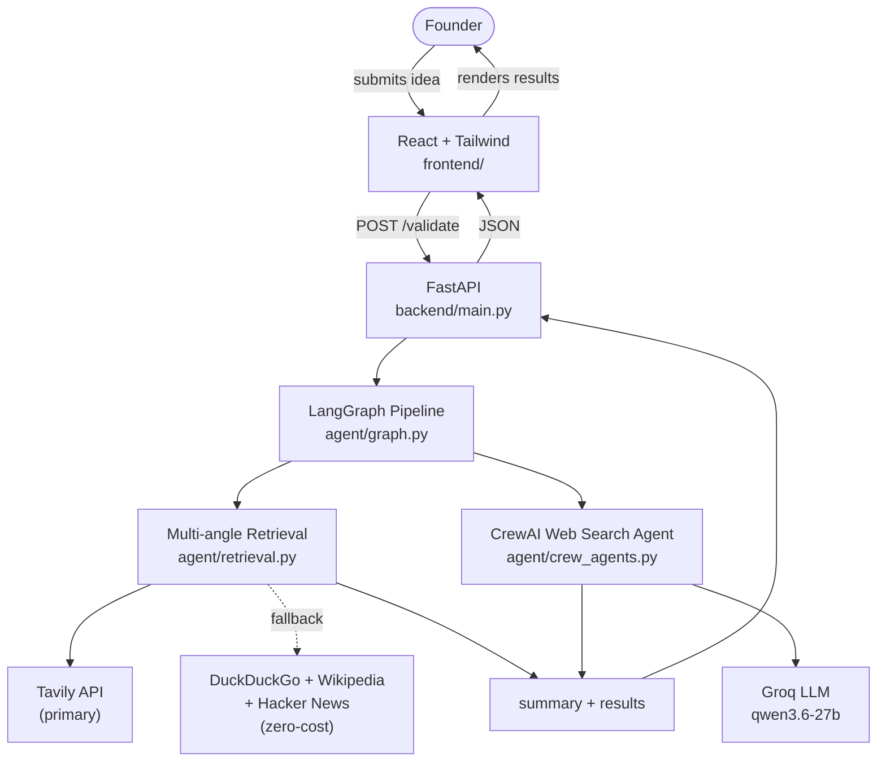

# AI Based Startup Idea Validator

Development of an AI-based startup idea validator with market analysis assistance.

The project lets a founder enter a startup idea, target customer, and problem statement,
and get back an initial validation summary backed by real web search results across 5
research angles (market size, competitors, industry news, customer demand, and how
others solve the problem). Search runs on Tavily, with a free DuckDuckGo/Wikipedia/
Hacker News fallback so it still works without a search API key; academic/research-paper
sources are filtered out since they don't add useful signal for a founder. Milestone 1
is in progress — see [`docs/milestone1-plan.md`](docs/milestone1-plan.md) for the
current task breakdown and timeline.

## Architecture

The app is being split into a proper frontend/backend, per
[`docs/architecture.md`](docs/architecture.md):



| Layer        | Tech                                  |
|--------------|----------------------------------------|
| Frontend     | React + Tailwind CSS (`frontend/`) |
| Backend      | FastAPI (`backend/`) — exposes `POST /validate` |
| Agent framework | [CrewAI](https://www.crewai.com) — role/goal/tool-based agents (`backend/agent/crew_agents.py`) |
| Orchestration | [LangGraph](https://www.langchain.com/langgraph) — pipeline state graph, one node per agent (`backend/agent/graph.py`) |
| Search       | Tavily API (primary), with DuckDuckGo + Wikipedia + Hacker News as a zero-cost fallback chain — fetched directly (not LLM-mediated) across 5 search angles, academic sources filtered out (`backend/agent/tools.py`, `retrieval.py`) |
| Reasoning LLM | [Groq](https://console.groq.com) (`qwen/qwen3.6-27b`, configurable — see `backend/agent/llm.py`); summary output passes a quality gate that rejects leaked reasoning text |
| Database     | None yet |
| Deployment   | [Render](https://render.com) — two services, config in `render.yaml` |
| Version control | Git / GitHub |

The product UI intentionally doesn't name any of the underlying frameworks/providers —
status and footer text describe capability generically ("Multi-agent Pipeline," "Live
Web Search") rather than saying "CrewAI," "Groq," or "Tavily."

The original single-file Streamlit prototype (`app.py`) is kept for reference but is
superseded by the `frontend/` + `backend/` split going forward.

## Project Structure

```
.
├── frontend/            # React + Tailwind app (idea submission UI)
├── backend/             # FastAPI app + CrewAI/LangGraph agent pipeline
│   ├── main.py            # POST /validate route
│   └── agent/
│       ├── graph.py         # LangGraph pipeline: state + node wiring
│       ├── crew_agents.py    # CrewAI Agent/Task/Crew definitions
│       ├── retrieval.py      # 5-angle query expansion, dedup, academic-source filter
│       ├── tools.py          # Tavily (primary) + DuckDuckGo/Wikipedia/Hacker News fallback
│       └── llm.py            # reasoning LLM provider/model selection
├── docs/
│   ├── architecture.md       # system design, data flow, API contract
│   ├── milestone1-plan.md    # task division + timeline
│   └── frontend-spec.md      # UI design spec
├── app.py               # legacy Streamlit prototype
├── requirements.txt      # Streamlit prototype dependencies
├── render.yaml           # Render deployment config
└── README.md
```

## Getting Started

### Prerequisites
- Node.js 18+ and npm
- Python 3.10+ and pip
- A [Groq](https://console.groq.com) API key (used by the CrewAI agents)
- Optionally, a [Tavily](https://tavily.com) API key for higher-quality search — the
  app works without one, falling back to free DuckDuckGo/Wikipedia/Hacker News search

### Backend

```bash
cd backend
pip install -r requirements.txt
cp .env.example .env   # then fill in GROQ_API_KEY (and TAVILY_API_KEY if you have one)
uvicorn main:app --reload --port 8000
```

### Frontend

```bash
cd frontend
npm install
cp .env.example .env   # VITE_API_URL should point at the backend, e.g. http://127.0.0.1:8000
npm run dev
```

The frontend will be available at `http://localhost:5173` and calls the backend at the
URL set in `VITE_API_URL`.

### Legacy Streamlit prototype

```bash
pip install -r requirements.txt
streamlit run app.py
```

## Branching Strategy

- **`staging`** — active development branch. All feature work and fixes land here first.
- **`main`** — stable, reviewed branch. Only tested, working code is merged here from `staging`.

Workflow: branch off `staging` for a feature/fix → open a PR into `staging` → once verified,
`staging` is merged into `main` for a stable release.

## Deployment

Deployment is handled via Render, configured in [`render.yaml`](render.yaml) as two
services:

| Service | Type | Root dir | Notes |
|---|---|---|---|
| `startup-validator-backend` | Python web service | `backend/` | Needs `GROQ_API_KEY` set manually in the Render dashboard (not in `render.yaml`, never committed). `TAVILY_API_KEY` is optional — falls back to free search if unset. |
| `startup-validator-frontend` | Static site | `frontend/` | Built with `npm run build`; calls the backend via `VITE_API_URL` |

Both auto-deploy on push to `staging`. After the first deploy, double-check the actual
Render-assigned URLs match what's hardcoded in `render.yaml` for `FRONTEND_ORIGIN` and
`VITE_API_URL` — if Render assigns different subdomains, update those env vars in the
dashboard to match.

The legacy Streamlit prototype (`app.py`) is no longer deployed by this config.

## Contributing

1. Create a branch off `staging`.
2. Make your changes and test locally (see Getting Started above).
3. Open a PR into `staging`.
4. Once verified, changes are promoted to `main`.
