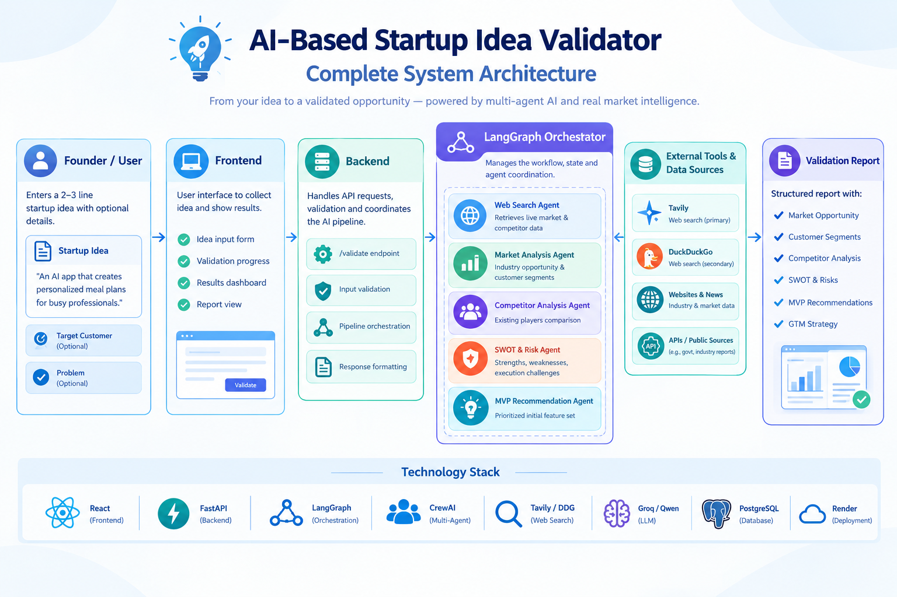
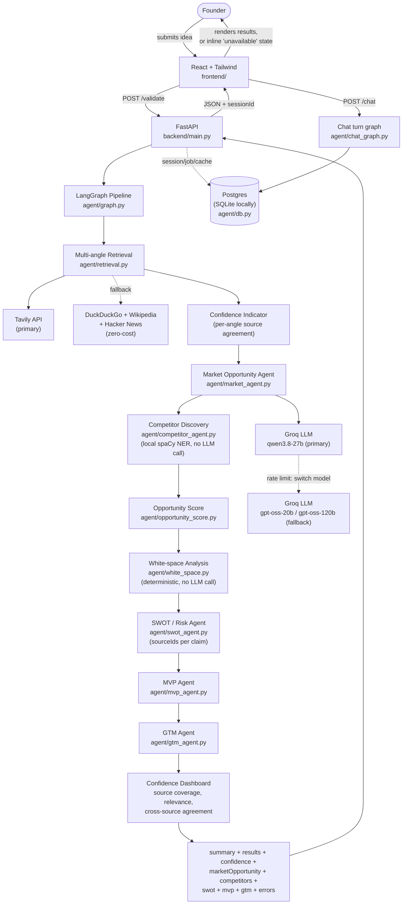

# Affinity

**Before you build it, measure the affinity.**


An AI-based startup idea validator with market analysis assistance. A founder enters a
startup idea, target customer, and problem statement, and gets back real search results
across 5 research angles, a structured market opportunity analysis (size, trends,
customer segments with pain points/motivations/buying behavior), a competitor comparison
identified locally via NER, an evidence-backed SWOT/risk analysis, MVP feature
recommendations, a GTM strategy, and a session-based conversational advisor for
follow-up questions — plus a downloadable PDF dossier and optional email delivery.

Milestones 1–3 are complete. Milestone 4 (evidence citations, a confidence dashboard,
contradiction detection, validation experiments, and a canonical report object) is in
progress — see [`PENDING-TASKS.md`](PENDING-TASKS.md) for the current breakdown (local
reference only, not committed).

## How it works


1. **Founder enters a startup idea** — idea, target customer, and problem, through the
   web app.
2. **The system searches the web** — live results across 5 research angles (market size,
   competitors, industry news, customer demand, existing solutions), Tavily first with a
   free DuckDuckGo/Wikipedia/Hacker News fallback chain.
3. **AI analyzes market opportunity** — size, trends, and customer segments, grounded
   only in the retrieved sources, never invented.
4. **AI discovers competitors** — via local spaCy NER, not an LLM call, so the shared
   Groq quota isn't split across a fifth agent.
5. **AI evaluates risks & signals** — SWOT/risk analysis, an opportunity score, and
   white-space (opportunity-gap) analysis, all grounded in the pipeline's own upstream
   artifacts.
6. **The system generates a validation report** — MVP feature recommendations, a GTM
   strategy, a confidence dashboard, and (optionally) a downloadable PDF or emailed
   report.

A failure at any LLM-backed step doesn't crash the request or leave that section blank:
every agent that calls an LLM has a deterministic, evidence-based fallback (see
`backend/agent/deterministic_fallback.py`) that's honestly labeled `"degraded": true`
rather than silently passed off as a full AI-reasoned result.

## Architecture



The precise node-by-node pipeline, as actually implemented in
[`backend/agent/graph.py`](backend/agent/graph.py):



A failure in any LLM-backed node doesn't crash the request — on a Groq rate limit, the
call immediately switches to the next Groq model with its own separate quota (see
Reasoning LLM below); only once every model in the chain fails does that section fall
back to its deterministic summary, with the failure noted in `errors.<section>`, and the
frontend shows an inline "unavailable" state for just that section while the rest of the
response still renders. Competitor Discovery and White-space have no LLM call to fail
this way — they're local, deterministic steps, so they always return real data.


Every SWOT claim and risk carries a `sourceIds` array pointing back to the specific
search result(s) it's grounded in (see `backend/agent/structured_output.py`'s
`compact_sources`) — a `sourceId` the model invents that wasn't actually in its given
context is dropped before it ever reaches a caller, never silently trusted.

| Layer        | Tech                                  |
|--------------|----------------------------------------|
| Frontend     | React + Tailwind CSS (`frontend/`) |
| Backend      | FastAPI (`backend/`) — exposes `POST /validate`, `POST /chat`, PDF export, and job-status polling, with a database-backed response cache, per-IP rate limiting, and request-id tracing |
| Agent framework | [CrewAI](https://www.crewai.com) — bounded reasoning agents for Market Opportunity, SWOT/Risk, MVP recommendations, GTM strategy, and advisor responses. Web Search summaries, Competitor Discovery, and White-space analysis remain local/deterministic to avoid unnecessary calls |
| Orchestration | [LangGraph](https://www.langchain.com/langgraph) — main validation pipeline plus a separate conditional chat graph (`backend/agent/graph.py`, `chat_graph.py`) |
| Search       | Tavily API (primary), with DuckDuckGo + Wikipedia + Hacker News as a zero-cost fallback chain — fetched directly (not LLM-mediated) across 5 search angles, academic sources filtered out (`backend/agent/tools.py`, `retrieval.py`) |
| Competitor identification | Local NER ([spaCy](https://spacy.io) `en_core_web_sm`), not an LLM call — reads competitor names directly off the already-fetched search results, by deliberate design: zero API cost, zero rate limit, and it frees the entire shared Groq quota for Market Opportunity instead of splitting it across two agents. `estimatedPrice`/`featureBreadth` are always `"unknown"` as a result — an honest trade, not a bug — the UI hides those badges and the positioning grid when nothing is classified |
| Reasoning LLM | [Groq](https://console.groq.com) — primary `qwen/qwen3.8-27b` plus two same-provider fallback models. Per-agent output limits, compact upstream artifacts, disabled/low reasoning effort, caching, and deterministic search intent reduce quota pressure. Every call's latency and token usage is logged (`backend/agent/llm.py`) |
| Database     | Postgres in production (SQLite locally/in tests) via SQLAlchemy — `backend/agent/db.py`. Set `DATABASE_URL`; unset falls back to a local `affinity.db` SQLite file. Connection pool size is configurable (`DB_POOL_*` env vars) for running multiple backend instances |
| Advisor state | Bounded sessions with a separate LangGraph chat flow, stored in the same database (`backend/agent/session_store.py`); sessions still expire on a TTL, but now survive a restart and are shared across every backend instance |
| Report export | ReportLab-generated PDF dossier (`backend/agent/pdf_exporter.py`), and optional async email delivery via Resend for long-running validations (`backend/agent/email_delivery.py`, `job_store.py`) |
| Deployment   | [Render](https://render.com) — two web services plus a managed Postgres database, config in `render.yaml` |
| Version control | Git / GitHub |

The product UI intentionally doesn't name any of the underlying frameworks/providers —
status and footer text describe capability generically ("Multi-agent Pipeline," "Live
Web Search") rather than saying "CrewAI," "Groq," or "Tavily."


The original single-file Streamlit prototype (`app.py`) is kept for reference but is
superseded by the `frontend/` + `backend/` split going forward.

## API

The frontend primarily talks to `POST /validate`. Full field-level contract (types,
required/optional, error shapes) is in
[`docs/architecture.md`](docs/architecture.md#4-api-contract) — below is a real example
of what goes over the wire.

**Request**

```bash
curl -X POST https://startup-validator-backend-pruu.onrender.com/validate \
  -H "Content-Type: application/json" \
  -d '{
    "idea": "A subscription box for eco-friendly cleaning products",
    "targetCustomer": "environmentally conscious households",
    "problem": "plastic waste from cleaning product packaging"
  }'
```

**Response `200 OK`** (abridged — full shape also includes `swot`, `mvp`, `gtm`,
`whiteSpace`, and `sessionId`)

```json
{
  "summary": "The eco-friendly cleaning subscription market is growing steadily, driven by rising consumer demand for sustainable household products...",
  "results": [
    {
      "title": "Sustainable Cleaning Products Market Size Report, 2026",
      "snippet": "The global sustainable cleaning products market was valued at $4.2B in 2025 and is projected to grow at a CAGR of 11.3%...",
      "url": "https://example.com/market-report",
      "angle": "Market size & trends",
      "score": 0.87
    }
  ],
  "confidence": {
    "agreeingSources": 8,
    "totalSources": 10,
    "percentage": 80,
    "perAngle": { "...": "one entry per research angle" },
    "sourceCoverage": { "claimsWithSource": 6, "totalClaims": 9, "percentage": 67 },
    "averageRelevance": 0.74,
    "crossSourceAgreement": { "claimsWithMultipleSources": 2, "totalClaims": 9, "percentage": 22 },
    "directEvidenceRatio": { "direct": 6, "inferred": 3, "percentage": 67 },
    "sourceRecency": "not available - source publish dates are not currently captured"
  },
  "marketOpportunity": {
    "marketSize": "The global market was valued at $2.1 billion in 2024 and is growing at 12% annually.",
    "trends": ["Rising demand for subscription-based delivery", "Increased focus on eco-friendly packaging"],
    "segments": [
      {
        "segment": "Urban millennials",
        "painPoints": "Limited time to research and compare options",
        "motivations": "Convenience and sustainability credentials",
        "buyingBehavior": "Research online, prefer subscription models over one-off purchases"
      }
    ],
    "opportunityScore": 63
  },
  "competitors": {
    "competitors": [
      {
        "name": "Acme Meal Co",
        "offering": "Subscription meal kits with pre-portioned ingredients delivered weekly.",
        "url": "https://example.com/acme-meal-co",
        "gap": "No options for large families or bulk ordering.",
        "estimatedPrice": "unknown",
        "featureBreadth": "unknown"
      }
    ]
  },
  "errors": {
    "marketOpportunity": null,
    "competitors": null
  }
}
```

`results` is grouped client-side by `angle` (one of `Market size & trends`,
`Competitors`, `Industry news`, `Customer demand`, `How others solve this`) — that's
what powers the "grouped by research angle" sections in the UI. `score` is a 0–1
relevance value used for the animated count-up on each result card. `marketOpportunity`
comes back `null` (not an object) only if its LLM call fails outright *and* the
deterministic fallback path is bypassed — in practice a real response always contains at
least the fallback shape, labeled `"degraded": true`, with the failure noted in
`errors.marketOpportunity`. `competitors` has no LLM call to fail this way (it's local
NER), so an empty `competitors: []` array (not `null`) is the normal "sources didn't
name an identifiable company" outcome, not a failure — `estimatedPrice`/`featureBreadth`
will also always be `"unknown"` in real responses for the same reason (see Competitor
identification above), unlike the illustrative example above.

Every SWOT strength/weakness/opportunity/threat/risk is `{"text": "...", "sourceIds":
["src-2"]}` rather than a bare string, so a founder (or the UI) can trace any claim back
to the source it came from.

**Error responses** — same shape either way, only the status code and message differ:

```json
// 400 — empty/missing idea
{ "error": "idea is required" }

// 429 — per-IP rate limit exceeded
{ "error": "Too many validation requests. Please wait a minute and try again." }

// 502 — every search source (Tavily + all fallbacks) failed
{ "error": "Search is temporarily unavailable. Please try again shortly." }
```

Every response — success or error — carries an `X-Request-ID` header, and every request
is logged with that same id, method, path, status, and duration
(`backend/main.py`'s tracing middleware), so a single request's log lines can be
correlated with what a caller actually saw.

The frontend renders `EmptyState` when `results` comes back as an empty array (valid
request, zero matches) and `ErrorState` with a retry button for any non-200 response.

`POST /validate` also returns `sessionId`. The frontend uses the session ID with
`POST /chat` (`{ sessionId, message }`) for follow-up questions. Chat performs one
bounded search only for messages that explicitly require fresh information; other turns
reuse the stored validation artifacts. If `email` is supplied and the pipeline is still
running past a threshold, `/validate` returns `202` with a `jobId` instead of holding the
connection open — poll `GET /validate/status/{jobId}`, or wait for the emailed report.

The same `sessionId` also downloads a publication-ready PDF report via
`GET /validate/{sessionId}/pdf` (ReportLab, `backend/agent/pdf_exporter.py`).
`POST /export-pdf` accepts a validation response body directly (validated against a real
schema, not an arbitrary dict), for callers that already have the payload without a live
session.

## Project Structure

```
.
├── frontend/            # React + Tailwind app (idea submission UI)
├── backend/             # FastAPI app + CrewAI/LangGraph agent pipeline
│   ├── main.py              # /validate, /chat, PDF export routes; rate limiting; request tracing
│   └── agent/
│       ├── graph.py                  # LangGraph pipeline: state + node wiring, incl. the confidence dashboard node
│       ├── chat_graph.py             # Separate LangGraph chat flow for the conversational advisor
│       ├── market_agent.py           # Market Opportunity Agent
│       ├── competitor_agent.py       # Competitor Discovery - local spaCy NER, no LLM call
│       ├── swot_agent.py             # SWOT & Risk Agent - sourceIds per claim
│       ├── mvp_agent.py              # MVP Feature Recommendation Agent
│       ├── gtm_agent.py              # Go-To-Market Strategy Agent
│       ├── opportunity_score.py      # Opportunity Score post-processing node
│       ├── white_space.py            # White-space/opportunity-gap analysis - deterministic, no LLM call
│       ├── deterministic_fallback.py # Non-LLM fallback content for every LLM-backed agent
│       ├── output_guard.py           # Reasoning-leak stripping used by the LLM-backed agents
│       ├── structured_output.py      # Shared JSON-extraction/repair + compact_sources (sourceId assignment)
│       ├── retrieval.py              # 5-angle query expansion, dedup, academic-source filter
│       ├── tools.py                  # Tavily (primary) + DuckDuckGo/Wikipedia/Hacker News fallback
│       ├── llm.py                    # LLM provider/model selection + rate-limit fallback + latency/token logging
│       ├── db.py                     # SQLAlchemy engine (Postgres/SQLite) backing sessions/jobs/cache
│       ├── session_store.py          # Validation + chat sessions (database-backed)
│       ├── job_store.py              # Background validation jobs for the async/email path (database-backed)
│       ├── pdf_exporter.py           # ReportLab PDF dossier generation
│       └── email_delivery.py         # Resend-based report email delivery
│   └── tests/                        # Unit, contract, async, and integration/concurrency tests
├── docs/
│   ├── architecture.md       # system design, data flow, API contract
│   ├── images/                # architecture/pitch diagrams (see below)
│   └── ...                    # milestone plans, API/cost metrics, security notes, and more
├── app.py               # legacy Streamlit prototype
├── requirements.txt      # Streamlit prototype dependencies
├── render.yaml           # Render deployment config (backend, frontend, Postgres)
└── README.md
```

## Getting Started

### Prerequisites
- Node.js 18+ and npm
- Python 3.10+ and pip
- A [Groq](https://console.groq.com) API key (used by the CrewAI agents)
- Optionally, a [Tavily](https://tavily.com) API key for higher-quality search — the
  app works without one, falling back to free DuckDuckGo/Wikipedia/Hacker News search
- No database setup needed for local dev — unset `DATABASE_URL` falls back to a local
  SQLite file automatically

### Backend

```bash
cd backend
pip install -r requirements.txt
cp .env.example .env   # then fill in GROQ_API_KEY (and TAVILY_API_KEY if you have one)
uvicorn main:app --reload --port 8000
```

### Frontend

```bash
cd frontend
npm install
cp .env.example .env   # VITE_API_URL should point at the backend, e.g. http://127.0.0.1:8000
npm run dev
```

The frontend will be available at `http://localhost:5173` and calls the backend at the
URL set in `VITE_API_URL`.

### Running tests

```bash
cd backend
python -m unittest discover -s tests
```

The real-provider integration test (`tests/test_integration.py`) only runs if
`GROQ_API_KEY` is set in the environment — it makes a real, billed API call, so it's
skipped by default in environments without a key.

### Legacy Streamlit prototype

```bash
pip install -r requirements.txt
streamlit run app.py
```

## Branching Strategy

- **`staging`** — active development branch. All feature work and fixes land here first.
- **`main`** — stable, reviewed branch. Only tested, working code is merged here from `staging`.

Workflow: branch off `staging` for a feature/fix → open a PR into `staging` → once verified,
`staging` is merged into `main` for a stable release.

## Deployment


Deployment is handled via Render, configured in [`render.yaml`](render.yaml) as a
Blueprint with a managed database and two services:

| Resource | Type | Notes |
|---|---|---|
| `startup-validator-db` | Postgres (free plan) | Provisioned from `render.yaml`; its connection string is wired into the backend automatically via `fromDatabase` |
| `startup-validator-backend` | Python web service (`backend/`) | Needs `GROQ_API_KEY` set manually in the Render dashboard (not in `render.yaml`, never committed). `TAVILY_API_KEY` is optional — falls back to free search if unset. `DATABASE_URL` is set automatically from the database resource above |
| `startup-validator-frontend` | Static site (`frontend/`) | Built with `npm run build`; calls the backend via `VITE_API_URL` |

All three auto-deploy/provision on push to `staging` **only if the services were created
as a Blueprint** pointing at this `render.yaml` — if they were set up manually instead,
re-sync the Blueprint from the Render dashboard (or add the database and set
`DATABASE_URL` by hand) after any change to `render.yaml`. After the first deploy,
double-check the actual Render-assigned URLs match what's hardcoded in `render.yaml` for
`FRONTEND_ORIGIN` and `VITE_API_URL` — if Render assigns different subdomains, update
those env vars in the dashboard to match.

The legacy Streamlit prototype (`app.py`) is no longer deployed by this config.

### Scaling out

Before the database migration (see `backend/agent/db.py`), sessions/jobs/cache lived only
in each backend instance's own memory, so running more than one instance meant a request
could land on an instance that had never seen that session — scaling out would have
silently broken chat/PDF export/status polling. That's no longer the blocker: with state
shared in Postgres, adding more instances on Render's Scaling tab is safe from a
correctness standpoint.

What running multiple instances does *not* fix on its own: the Groq API quota
(`backend/agent/llm.py`'s model-fallback chain) is shared account-wide, not per-instance —
more backend instances means more concurrent requests hitting the same quota sooner, not
more total LLM throughput. `DB_POOL_SIZE`/`DB_POOL_MAX_OVERFLOW` (env vars, default 5/5)
control how many Postgres connections each instance opens; keep
`instances × (pool_size + max_overflow)` comfortably under the database plan's max
connection count.

## Documentation

[`docs/`](docs/) has the full documentation suite — architecture, API reference,
milestone plans, security/privacy notes, cost/accuracy metrics, and the diagrams used
throughout this README (`docs/images/`), including several not shown above (problem
statement, proposed solution, ER diagram, hallucination-prevention design, and future
scope). Start at [`docs/README.md`](docs/README.md) for the index.

## Contributing

1. Create a branch off `staging`.
2. Make your changes and test locally (see Getting Started above).
3. Open a PR into `staging`.
4. Once verified, changes are promoted to `main`.
