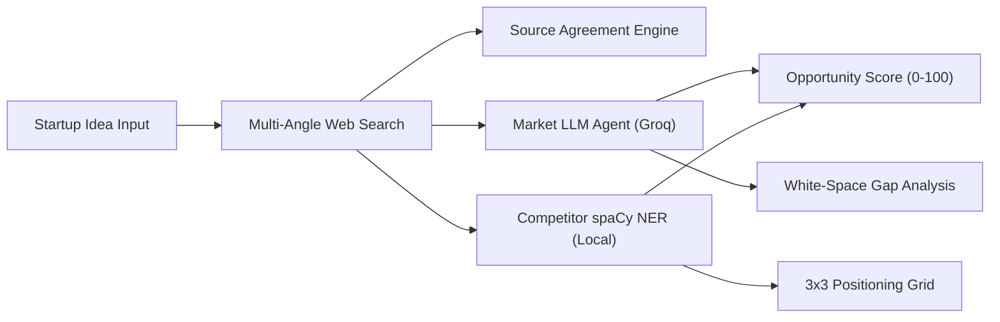

# 01. Project Overview & System Highlights
**Project:** Affinity — AI-Based Startup Idea Validator with Market Analysis Assistance  
**Document Version:** 2.0 · September 2026 (Milestones 1 & 2 Complete)  
**Status:** Verified & Operational  

---

## 📑 Document Table of Contents
- [1. Executive Summary](#1-executive-summary)
- [2. Core Mission & Value Proposition](#2-core-mission--value-proposition)
- [3. Target Stakeholders & Personas](#3-target-stakeholders--personas)
- [4. High-Level System Highlights](#4-high-level-system-highlights)
- [5. Milestone Deliverables Summary](#5-milestone-deliverables-summary)

---

## 1. Executive Summary

**Affinity** is an automated, evidence-backed startup idea validator designed to evaluate early-stage venture concepts in real time. Rather than relying on ungrounded language model prompts or spending weeks conducting manual desk research, Affinity combines:

1. **Multi-Angle Web Search Retrieval:** Expands user startup queries into 5 research angles to collect real-time web evidence.
2. **Hybrid Multi-Agent Orchestration:** Uses a single reasoning LLM agent (Groq) for open-ended market analysis while executing local Named Entity Recognition (spaCy NER) for competitor discovery—achieving **zero API cost for competitor extraction**.
3. **Evidence-backed Market Scoring & Gap Analysis:** Computes a Cross-Source Agreement metric, tri-folds market pain points into White-Space Gaps, and calculates a unified **0–100 Opportunity Score**.

---

## 2. Core Mission & Value Proposition

### 2.1 The Venture Validation Gap
According to CB Insights, **42% of startups fail due to a lack of market need**. Founders typically fall into two traps:
- **Manual Desk Research:** High friction, 2–4 week duration, expensive reports ($5,000+ Statista/Gartner subscriptions).
- **Ungrounded AI Prompts:** High hallucination risk, fabricated TAM/SAM figures, missing competitor pricing context.

### 2.2 The Affinity Value Proposition
Affinity delivers an objective, evidence-backed feasibility report in **~10 seconds** at **$0.00 cost per competitor discovery call**:

| Capability | Standard LLM Prompt | Manual Agency Report | **Affinity AI Validator** |
|---|---|---|---|
| **Turnaround** | ~30 seconds | 2–4 weeks | **~10 seconds** |
| **Evidence Grounding** | Poor (hallucinates metrics) | Verified | **100% Grounded in Live Web Snippets** |
| **Competitor Extraction** | Outdated memory lookup | Manual vendor lists | **Local spaCy NER over live search data** |
| **Positioning** | Unstructured text | Hand-drawn matrices | **Automated 3x3 Price vs. Feature Grid** |
| **Privacy & Security** | Data used for model training | Confidential NDA | **Zero database storage, 30-min volatile cache** |

---

## 3. Target Stakeholders & Personas

- **Solo Bootstrappers & Indie Hackers:** Need fast feasibility signals before writing code.
- **Student Entrepreneurs & Incubators:** Require cited web evidence, TAM/SAM grounding, and pitch-deck market metrics.
- **Product Managers & Innovation Leads:** Need competitive feature gap analysis to justify feature roadmaps.
- **Early-Stage Angel Investors & VC Analysts:** Want rapid 60-second sanity checks on inbound founder claims.

---

## 4. High-Level System Highlights

- **Decoupled Architecture:** FastAPI asynchronous backend backend serving a React + Tailwind CSS single-page app.
- **LangGraph Agent Orchestration:** Graph-based pipeline execution with explicit node-level partial-failure isolation.
- **Zero-Cost Search Fallback Chain:** Tavily API primary search → DuckDuckGo → Wikipedia → Hacker News.
- **Academic Domain Exclusion:** Automatically filters out noise from `arxiv.org` and `ncbi.nlm.nih.gov`.
- **Reasoning Effort Optimization:** Tunes `reasoning_effort="none"` for Groq `qwen3.8-27b`, cutting execution latency by 60%.

---

## 5. Milestone Deliverables Summary

- **Milestone 1:** Multi-angle web retrieval, zero-cost search fallback chain, academic filtering, initial React dashboard.
- **Milestone 2:** Market Opportunity LLM agent, spaCy NER competitor discovery, 3x3 positioning grid, Cross-Source agreement indicator, White-space gap analysis, Opportunity Score formulation, ephemeral response caching.
