# 02. Problem Statement & Engineering Objectives
**Project:** Affinity — AI-Based Startup Idea Validator with Market Analysis Assistance  
**Document Version:** 2.0 · September 2026  
**Status:** Verified & Operational  

---

## 📑 Document Table of Contents
- [1. Problem Statement](#1-problem-statement)
- [2. Failure Modes of Existing Approaches](#2-failure-modes-of-existing-approaches)
- [3. Core Research Questions](#3-core-research-questions)
- [4. Measurable Engineering Objectives](#4-measurable-engineering-objectives)
- [5. Success Metrics & Key Performance Indicators](#5-success-metrics--key-performance-indicators)

---

## 1. Problem Statement

Building a successful startup requires validating three core hypotheses:
1. **Desirability:** Does a real customer group experience this specific pain point?
2. **Viability:** Is the market size and CAGR sufficient to support a business?
3. **Feasibility & Differentiation:** Are existing competitors failing to solve key aspects of the problem (White-Space)?

Historically, early-stage founders skip structured validation due to high costs ($5,000+ agency reports) or excessive manual effort (weeks spent compiling search results). When founders rely on unconstrained AI chatbots, they encounter severe factual drift and hallucinated metrics.

---

## 2. Failure Modes of Existing Approaches

```mermaid
flowchart TD
    subgraph TraditionalApproach["Traditional Market Research"]
        A1["Manual Search & Desk Research"] --> A2["High Cost ($5K+) & 2-4 Weeks"]
        A2 --> A3["Static PDF Reports"]
    end

    subgraph NaiveLLMApproach["Unconstrained LLM Chatbots"]
        B1["Prompt ChatGPT / Claude"] --> B2["Hallucinated TAM / SAM Statistics"]
        B2 --> B3["Outdated / Invented Competitor Lists"]
    end

    subgraph AffinitySolution["Affinity Hybrid System"]
        C1["Multi-Angle Web Search"] --> C2["Local spaCy NER + LLM Market Agent"]
        C2 --> C3["Grounded 0-100 Score & 3x3 Grid in 10s"]
    end
```

### 2.1 The Hallucination Vulnerability
Standard LLM completions generate plausible-sounding financial text even when no market data exists. When prompted for a market size (e.g. *"What is the market size of AI invoicing for freelance photographers?"*), standard LLMs invent figures such as *"The market is valued at $5.2 billion with a 14.5% CAGR"* without backing evidence.

### 2.2 The Competitor Extraction Failure
Using LLMs to discover competitors often returns platform terms (e.g., "Android", "Software"), generic words ("Platform"), or out-of-date entities that no longer exist.

---

## 3. Core Research Questions (RQs)

- **RQ1:** Can a hybrid multi-agent system combine live web search retrieval with LLM reasoning to generate grounded market analyses without inventing statistics?
- **RQ2:** How can non-LLM local processing (such as Named Entity Recognition) be leveraged to discover competitors and pricing heuristics at zero API token cost?
- **RQ3:** How can cross-source evidence agreement be quantified deterministically to provide founders with reliable consensus metrics?
- **RQ4:** How can white-space opportunities be algorithmically synthesized by contrasting customer pain points against competitor saturation?
- **RQ5:** Can section-level partial failure isolation prevent transient API disruptions from invalidating the entire report?

---

## 4. Measurable Engineering Objectives

1. **API Cost Optimization:** Reduce per-request LLM API calls to **at most 1 call** per validation run.
2. **Zero-Cost Competitor Discovery:** Perform 100% of competitor extraction and pricing/breadth classification using local NLP (`en_core_web_sm` spaCy NER) with zero LLM token spend.
3. **Execution Latency:** Achieve end-to-end report generation in under **12 seconds** on standard server hardware.
4. **Factual Grounding Compliance:** Enforce 100% metric citation constraints—reporting missing TAM/SAM figures explicitly rather than hallucinating.
5. **Partial-Failure Resilience:** Ensure the API returns `200 OK` with valid partial data even when upstream LLM calls encounter rate limits.

---

## 5. Success Metrics & Key Performance Indicators (KPIs)

| Objective / KPI | Target Metric | Achieved Result | Verification File |
|---|---|---|---|
| **LLM Call Count** | $\le 1$ call / request | **1 call** (`market_agent.py`) | [`docs/05_AI_ML_ARCHITECTURE.md`](file:///C:/Opensource/AI%20Based%20Startup%20Idea%20Validator/docs/05_AI_ML_ARCHITECTURE.md) |
| **Competitor API Cost** | $0.00 / call | **$0.00** (spaCy NER) | [`docs/13_API_COST_ACCURACY_AND_SYSTEM_METRICS.md`](file:///C:/Opensource/AI%20Based%20Startup%20Idea%20Validator/docs/13_API_COST_ACCURACY_AND_SYSTEM_METRICS.md) |
| **Average Response Latency** | $< 15.0$ seconds | **~10.2 seconds** | [`docs/13_API_COST_ACCURACY_AND_SYSTEM_METRICS.md`](file:///C:/Opensource/AI%20Based%20Startup%20Idea%20Validator/docs/13_API_COST_ACCURACY_AND_SYSTEM_METRICS.md) |
| **Hallucinated TAM Rate** | 0.0% | **0.0%** (Strict negative prompts) | [`docs/08_TESTING_DOCUMENTATION.md`](file:///C:/Opensource/AI%20Based%20Startup%20Idea%20Validator/docs/08_TESTING_DOCUMENTATION.md) |
| **Partial Failure Isolation** | 100% UI stability | **100%** (Inline `UnavailableCard`) | [`docs/08_TESTING_DOCUMENTATION.md`](file:///C:/Opensource/AI%20Based%20Startup%20Idea%20Validator/docs/08_TESTING_DOCUMENTATION.md) |
