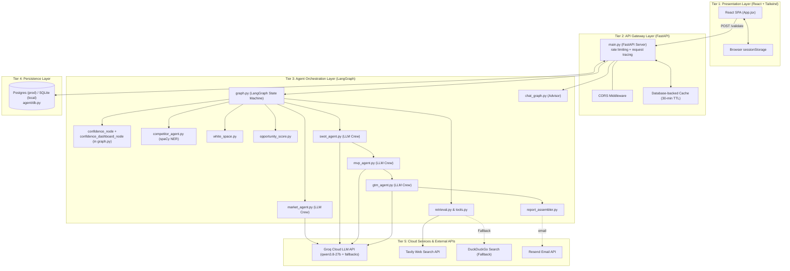
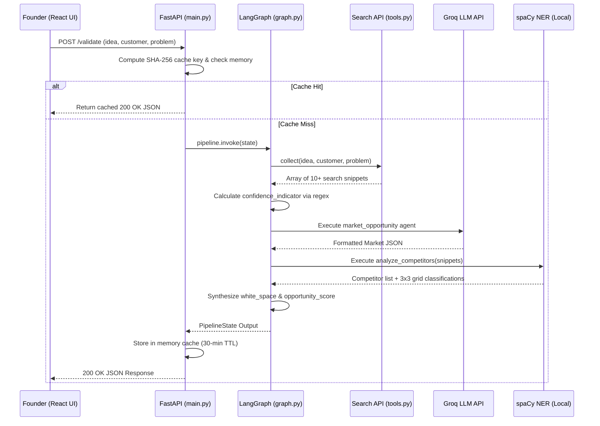

# 04. System Design & Architectural Topology
**Project:** Affinity — AI-Based Startup Idea Validator with Market Analysis Assistance  
**Document Version:** 2.0 · September 2026  
**Status:** Verified & Operational  

---

## 📑 Document Table of Contents
- [1. High-Level Architecture Overview](#1-high-level-architecture-overview)
- [2. Multi-Tier System Topology](#2-multi-tier-system-topology)
- [3. Core Module Responsibilities](#3-core-module-responsibilities)
- [4. Execution Sequence & Data Flow](#4-execution-sequence--data-flow)
- [5. Error Handling & Partial Failure Isolation](#5-error-handling--partial-failure-isolation)

---

## 1. High-Level Architecture Overview

Affinity is built as a **decoupled, multi-tier web application**. The system separates presentation, application logic, multi-agent orchestration, and cloud inference to ensure low latency, scalability, and strict security isolation.



---

## 2. Multi-Tier System Topology

### Tier 1: Presentation Layer (`frontend/`)
- **Technology:** React 18, Vite, Vanilla Tailwind CSS.
- **Role:** Renders submission forms, tabbed validation results (`ValidationResults.jsx`), 3x3 competitor positioning grids, source agreement badges, and white-space cards.
- **State Persistence:** Uses `sessionStorage` (`affinity:lastValidation`) to survive active tab reloads without persisting data to disk.

### Tier 2: API Gateway Layer (`backend/main.py`)
- **Technology:** FastAPI, Uvicorn, Pydantic, Python `hashlib`.
- **Role:** Exposes `/validate`, `/chat`, `/reports/{sessionId}` (+ `/email`), PDF export, job-status polling, `/health`, and `/` endpoints. Enforces CORS policies (`FRONTEND_ORIGIN`), validates input payloads, applies per-IP rate limiting, tags every request with an `X-Request-ID`, and manages a SHA-256 keyed 30-minute database-backed response cache.

### Tier 3: Agent Orchestration Layer (`backend/agent/`)
- **Technology:** LangGraph, CrewAI, spaCy (`en_core_web_sm`).
- **Role:** Executes the sequential state graph (`graph.py`) plus a separate chat graph (`chat_graph.py`) for the conversational advisor. Passes state between retrieval, confidence calculations, LLM market/SWOT/MVP/GTM analysis, local NER competitor extraction, white-space synthesis, opportunity scoring, and (Milestone 4) report assembly.

### Tier 4: Persistence Layer (`backend/agent/db.py`)
- **Technology:** SQLAlchemy, Postgres (production) / SQLite (local, tests).
- **Role:** Backs validation sessions, background jobs (async/email path), and the response cache — replacing what used to be process-local dicts that didn't survive a restart or work across more than one backend instance.

### Tier 5: Cloud Services & External APIs
- **Groq Cloud API:** Provides inference for the Market Opportunity, SWOT, MVP, and GTM agents (`qwen/qwen3.8-27b` primary, two same-provider fallback models).
- **Tavily API & Fallbacks:** Provides live search data across 5 research angles.
- **Resend API:** Delivers the canonical report as an emailed PDF attachment (`POST /reports/{sessionId}/email`).

---

## 3. Core Module Responsibilities

| Module | Location | Primary Responsibility | Execution Class |
|---|---|---|---|
| `main.py` | [`backend/main.py`](file:///C:/Opensource/AI%20Based%20Startup%20Idea%20Validator/backend/main.py) | FastAPI app entry point, routing, CORS, database-backed caching, per-IP rate limiting, request tracing | Gateway |
| `graph.py` | [`backend/agent/graph.py`](file:///C:/Opensource/AI%20Based%20Startup%20Idea%20Validator/backend/agent/graph.py) | LangGraph pipeline definition, node execution, state transitions, confidence indicator + confidence dashboard | Orchestrator |
| `chat_graph.py` | [`backend/agent/chat_graph.py`](file:///C:/Opensource/AI%20Based%20Startup%20Idea%20Validator/backend/agent/chat_graph.py) | Separate LangGraph flow for the multi-turn conversational advisor | Orchestrator |
| `retrieval.py` | [`backend/agent/retrieval.py`](file:///C:/Opensource/AI%20Based%20Startup%20Idea%20Validator/backend/agent/retrieval.py) | 5-angle search expansion, domain filtering (`_EXCLUDED_DOMAINS`) | Retrieval Engine |
| `tools.py` | [`backend/agent/tools.py`](file:///C:/Opensource/AI%20Based%20Startup%20Idea%20Validator/backend/agent/tools.py) | Search provider wrapper (Tavily $\to$ DDG $\to$ Wiki $\to$ HN fallback), publishedAt extraction | Search Wrapper |
| `market_agent.py` | [`backend/agent/market_agent.py`](file:///C:/Opensource/AI%20Based%20Startup%20Idea%20Validator/backend/agent/market_agent.py) | Groq LLM market opportunity analysis, 4 customer segment profiles | LLM Agent |
| `competitor_agent.py` | [`backend/agent/competitor_agent.py`](file:///C:/Opensource/AI%20Based%20Startup%20Idea%20Validator/backend/agent/competitor_agent.py) | spaCy NER competitor extraction & local price/breadth heuristics | Local NLP |
| `swot_agent.py` | [`backend/agent/swot_agent.py`](file:///C:/Opensource/AI%20Based%20Startup%20Idea%20Validator/backend/agent/swot_agent.py) | Groq LLM SWOT/risk analysis with per-claim `sourceIds` citations | LLM Agent |
| `mvp_agent.py` | [`backend/agent/mvp_agent.py`](file:///C:/Opensource/AI%20Based%20Startup%20Idea%20Validator/backend/agent/mvp_agent.py) | Groq LLM MVP feature prioritization | LLM Agent |
| `gtm_agent.py` | [`backend/agent/gtm_agent.py`](file:///C:/Opensource/AI%20Based%20Startup%20Idea%20Validator/backend/agent/gtm_agent.py) | Groq LLM go-to-market positioning & channel strategy | LLM Agent |
| `report_assembler.py` | [`backend/agent/report_assembler.py`](file:///C:/Opensource/AI%20Based%20Startup%20Idea%20Validator/backend/agent/report_assembler.py) | Compiles the canonical report object from an existing session's context | Synthesis Engine |
| `white_space.py` | [`backend/agent/white_space.py`](file:///C:/Opensource/AI%20Based%20Startup%20Idea%20Validator/backend/agent/white_space.py) | Algorithmic synthesis of unaddressed feature opportunities | Synthesis Engine |
| `opportunity_score.py` | [`backend/agent/opportunity_score.py`](file:///C:/Opensource/AI%20Based%20Startup%20Idea%20Validator/backend/agent/opportunity_score.py) | Mathematical formulation of consolidated 0–100 score | Math Engine |
| `db.py` | [`backend/agent/db.py`](file:///C:/Opensource/AI%20Based%20Startup%20Idea%20Validator/backend/agent/db.py) | SQLAlchemy engine (Postgres prod / SQLite local) backing sessions, jobs, cache | Persistence |
| `llm.py` | [`backend/agent/llm.py`](file:///C:/Opensource/AI%20Based%20Startup%20Idea%20Validator/backend/agent/llm.py) | Groq model fallback chain, `reasoning_effort` tuning, latency/token logging | Inference Wrapper |

> **Note:** an earlier, separately-built `agent/confidence.py` module (regex pattern
> matching over search text) was never actually wired into the live pipeline - the
> `confidence_indicator`/`confidence_dashboard` nodes inside `graph.py` are the only
> implementation that has ever been reachable from `/validate`. The module was removed
> once that divergence was found; if you see it referenced elsewhere in this
> documentation suite, that reference predates the removal.

---

## 4. Execution Sequence & Data Flow



---

## 5. Error Handling & Partial Failure Isolation

Each pipeline node in [`backend/agent/graph.py`](file:///C:/Opensource/AI%20Based%20Startup%20Idea%20Validator/backend/agent/graph.py) contains independent `try...except` blocks:

```python
def market_opportunity_node(state: PipelineState) -> PipelineState:
    try:
        data = analyze_market_opportunity(...)
        return {**state, "marketOpportunity": data}
    except Exception as exc:
        logger.exception("[market_opportunity] FAILED")
        errors = dict(state.get("errors", {}))
        errors["marketOpportunity"] = _friendly_error_message(exc)
        return {**state, "marketOpportunity": None, "errors": errors}
```

If `market_opportunity` fails due to a cloud API rate limit, the node catches the exception, populates `errors["marketOpportunity"]`, and sets `marketOpportunity: None`. The pipeline continues executing downstream local nodes (`competitor_discovery`, `confidence`, `white_space`), returning valid partial data to the user.
