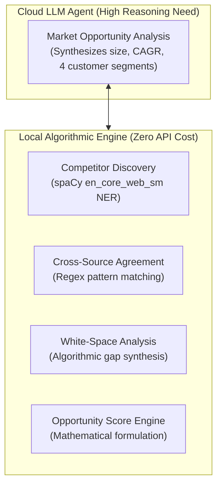

# 05. AI & Multi-Agent Architecture Guide
**Project:** Affinity — AI-Based Startup Idea Validator with Market Analysis Assistance  
**Document Version:** 2.0 · September 2026  
**Status:** Verified & Operational  

---

## 📑 Document Table of Contents
- [1. Multi-Agent Design Philosophy](#1-multi-agent-design-philosophy)
- [2. LangGraph Pipeline State Machine](#2-langgraph-pipeline-state-machine)
- [3. Market Opportunity Agent (Groq LLM)](#3-market-opportunity-agent-groq-llm)
- [4. Groq Model Fallback Chain & Token Tuning](#4-groq-model-fallback-chain--token-tuning)
- [5. Competitor Discovery Engine (spaCy NER)](#5-competitor-discovery-engine-spacy-ner)
- [6. White-Space Synthesis & Opportunity Score Formulation](#6-white-space-synthesis--opportunity-score-formulation)

---

## 1. Multi-Agent Design Philosophy

Affinity uses a **hybrid AI architecture**. Instead of routing every workflow step through an LLM agent, Affinity applies strict task-to-tool scoping:



### Key Benefits
1. **API Frugality:** Reduces paid LLM calls to **1 call per request**.
2. **Zero-Cost Competitor Discovery:** Replaced LLM competitor discovery with local spaCy NER, saving 100% of API token quota.
3. **Factual Entity Precision:** Eliminates LLM competitor hallucinations by parsing entity names directly from retrieved web snippets.

---

## 2. LangGraph Pipeline State Machine

The orchestration pipeline in [`backend/agent/graph.py`](file:///C:/Opensource/AI%20Based%20Startup%20Idea%20Validator/backend/agent/graph.py) maintains a shared `PipelineState`:

```python
class PipelineState(TypedDict, total=False):
    idea: str
    targetCustomer: str
    problem: str
    summary: str
    results: list
    confidence: dict
    marketOpportunity: dict
    competitors: dict
    whiteSpace: dict
    error: str
    errors: dict
```

### Graph Execution Graph
```python
def build_pipeline():
    graph = StateGraph(PipelineState)

    graph.add_node("web_search", web_search_node)
    graph.add_node("market_opportunity", market_opportunity_node)
    graph.add_node("competitor_discovery", competitor_discovery_node)
    graph.add_node("confidence_indicator", confidence_node)
    graph.add_node("white_space", white_space_node)
    graph.add_node("opportunity_score", opportunity_score_node)

    graph.add_edge(START, "web_search")
    graph.add_edge("web_search", "confidence_indicator")
    graph.add_edge("confidence_indicator", "market_opportunity")
    graph.add_edge("market_opportunity", "competitor_discovery")
    graph.add_edge("competitor_discovery", "white_space")
    graph.add_edge("white_space", "opportunity_score")
    graph.add_edge("opportunity_score", END)

    return graph.compile()
```

---

## 3. Market Opportunity Agent (Groq LLM)

Defined in [`backend/agent/market_agent.py`](file:///C:/Opensource/AI%20Based%20Startup%20Idea%20Validator/backend/agent/market_agent.py), the Market Opportunity agent evaluates the startup concept against condensed web context.

### Context Structuring
`_build_context()` prioritizes results from the `"Market size & trends"` search angle, capping context snippets to 300 characters per source across at most 10 items.

### System Prompt Negative Constraints
```text
Startup idea: "{idea}"
Target customer: {target_customer}
Problem being solved: {problem}

Here are real, current web search results about this idea's market:
{context}

Based only on the information above, analyze:
1. Market size (state whether the figures are global, regional, or niche if the sources indicate this) and growth trend. Include TAM, SAM, or CAGR only when the provided sources explicitly support those figures; otherwise state that they are not clear from the sources.
2. Up to 4 notable trends or adoption patterns.
3. Up to 4 customer segments - for each, their pain points, motivations, and buying behavior.

Do not invent statistics, segments, or behaviors that aren't supported by the sources - if buying behavior isn't evident from the sources, say so plainly rather than guessing.
Output strict JSON only: within JSON strings, never escape an apostrophe with a backslash - write don't directly, not don\'t.
```

---

## 4. Groq Model Fallback Chain & Token Tuning

### 4.1 Token Optimization (`reasoning_effort`)
Groq's `qwen3.8-27b` model defaults to internal hidden reasoning, consuming 1,000+ hidden tokens per request and exhausting Groq's output-tokens-per-minute free-tier cap.

In [`backend/agent/llm.py`](file:///C:/Opensource/AI%20Based%20Startup%20Idea%20Validator/backend/agent/llm.py), explicit token configuration disables this overhead:

```python
_REASONING_EFFORT = {
    "groq/qwen/qwen3.8-27b": "none",
    "groq/openai/gpt-oss-20b": "low",
    "groq/openai/gpt-oss-120b": "low",
}
```

Disabling reasoning on `qwen3.8-27b` decreased latency by 60% and prevented rate limit crashes.

### 4.2 Model Fallback Sequence
If an LLM endpoint returns `RateLimitError` or 404 (`model_not_found`), `kickoff_with_fallback()` automatically switches models:
1. `groq/qwen/qwen3.8-27b` (Primary)
2. `groq/openai/gpt-oss-20b` (Fallback 1)
3. `groq/openai/gpt-oss-120b` (Fallback 2)

---

## 5. Competitor Discovery Engine (spaCy NER)

In [`backend/agent/competitor_agent.py`](file:///C:/Opensource/AI%20Based%20Startup%20Idea%20Validator/backend/agent/competitor_agent.py), competitor discovery executes locally using spaCy's `en_core_web_sm` model:

```mermaid
flowchart LR
    Snippets["Search Snippets"] --> CleanText["1. Join lines with '. ' (Sentence boundaries)"]
    CleanText --> NER["2. spaCy en_core_web_sm (Extract ORG)"]
    NER --> Filter["3. Filter platform terms & generic words"]
    Filter --> ContextCheck["4. _has_product_context() (Verify app/pricing terms)"]
    ContextCheck --> Heuristic["5. Extract price & feature breadth from local context"]
    Heuristic --> Grid["Positioning Grid Output"]
```



### Product Context Validation
Single-word candidate entities must have product-ish context (`app`, `software`, `pricing`, `monthly`, `alternative`) nearby in at least one mention:

```python
def _has_product_context(name: str, doc) -> bool:
    for ent in doc.ents:
        if ent.text.strip().lower() == name.lower():
            sentence = ent.sent.text.lower()
            if any(term in sentence for term in _PRODUCT_TERMS):
                return True
    return False
```

---

## 6. White-Space Synthesis & Opportunity Score Formulation

### 6.1 White-Space Gap Triangulation
[`backend/agent/white_space.py`](file:///C:/Opensource/AI%20Based%20Startup%20Idea%20Validator/backend/agent/white_space.py) synthesizes unaddressed feature gaps by cross-referencing customer pain points from `marketOpportunity` against competitor density:
- High competitor density + repeated customer complaints = **High-Value Gap**.

### 6.2 Mathematical Opportunity Score Formulation
[`backend/agent/opportunity_score.py`](file:///C:/Opensource/AI%20Based%20Startup%20Idea%20Validator/backend/agent/opportunity_score.py) computes a 0–100 integer score:

$$\text{OpportunityScore} = \text{Clamp}\left(50 + S_{\text{market}} + S_{\text{growth}} - S_{\text{density}} + S_{\text{gaps}}, 0, 100\right)$$

Where:
- $S_{\text{market}} = +15$ if TAM/SAM $> \$1\text{B}$, $+5$ if positive market size indicated.
- $S_{\text{growth}} = +15$ if CAGR $> 10\%$ or strong growth trend present.
- $S_{\text{density}} = -15$ if competitors $> 5$, $-5$ if 2–4 competitors.
- $S_{\text{gaps}} = +15$ if clear white-space feature gaps are identified.
