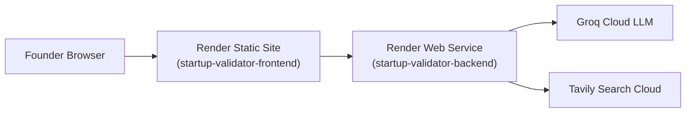

# 09. Deployment & DevOps Infrastructure Guide
**Project:** Affinity — AI-Based Startup Idea Validator with Market Analysis Assistance  
**Document Version:** 2.0 · September 2026  
**Status:** Operational  

---

## 📑 Document Table of Contents
- [1. Deployment Architecture Overview](#1-deployment-architecture-overview)
- [2. Render Infrastructure (`render.yaml`)](#2-render-infrastructure-renderyaml)
- [3. Environment Variables & Secrets Management](#3-environment-variables--secrets-management)
- [4. Operational Incident Playbooks](#4-operational-incident-playbooks)
- [5. Diagnostic & Monitoring Commands](#5-diagnostic--monitoring-commands)

---

## 1. Deployment Architecture Overview

Affinity is deployed as a dual web service architecture on **Render**:
1. `startup-validator-backend`: Python FastAPI service executing the LangGraph agent pipeline.
2. `startup-validator-frontend`: Static web application built with React and Vite.



---

## 2. Render Infrastructure (`render.yaml`)

Production hosting is managed via [`render.yaml`](file:///C:/Opensource/AI%20Based%20Startup%20Idea%20Validator/render.yaml):

```yaml
services:
  - type: web
    name: startup-validator-backend
    env: python
    buildCommand: "cd backend && pip install -r requirements.txt && python -m spacy download en_core_web_sm"
    startCommand: "cd backend && uvicorn main:app --host 0.0.0.0 --port $PORT"
    envVars:
      - key: FRONTEND_ORIGIN
        value: https://startup-validator-frontend.onrender.com

  - type: static
    name: startup-validator-frontend
    buildCommand: "cd frontend && npm install && npm run build"
    staticPublishPath: "./frontend/dist"
    envVars:
      - key: VITE_API_URL
        value: https://startup-validator-backend.onrender.com
```

---

## 3. Environment Variables & Secrets Management

| Variable | Target Service | Mandatory? | Value / Description |
|---|---|---|---|
| `GROQ_API_KEY` | Backend | **Yes** | Cloud API key for Groq LLM inference (Set in Render Dashboard) |
| `TAVILY_API_KEY` | Backend | Optional | API key for Tavily Search (DuckDuckGo fallback used if absent) |
| `FRONTEND_ORIGIN` | Backend | **Yes** | Allowed CORS origin (e.g., `https://startup-validator-frontend.onrender.com`) |
| `VITE_API_URL` | Frontend | **Yes** | Production backend API target URL |

> [!CAUTION]
> **API Key Safety:** `GROQ_API_KEY` and `TAVILY_API_KEY` must **never** be committed to Git. They are configured securely via the Render Dashboard environment settings.

---

## 4. Operational Incident Playbooks

### Playbook 1: Groq LLM Quota Exhaustion (`RateLimitError`)
- **Action:** System automatically fails over to backup models (`qwen3.8-27b` $\to$ `gpt-oss-20b` $\to$ `gpt-oss-120b`). If all rate-limit, pipeline populates `errors.marketOpportunity` while competitors render. Quota resets in 60s.

### Playbook 2: Groq Model Deprecation (`model_not_found`)
- **Action:** `_is_model_not_found_error()` automatically advances model fallback chain. Update `DEFAULT_MODEL` in `backend/agent/llm.py` and Render environment variables.

### Playbook 3: spaCy Model Missing on Startup
- **Action:** Ensure build command includes `python -m spacy download en_core_web_sm`.

---

## 5. Diagnostic & Monitoring Commands

### Check Backend Process (PowerShell)
```powershell
Get-CimInstance Win32_Process -Filter "Name='python.exe'" | Where-Object { $_.CommandLine -like "*uvicorn*" }
```

### Direct Health Check Probe (cURL)
```bash
curl -i https://startup-validator-backend.onrender.com/health
```
