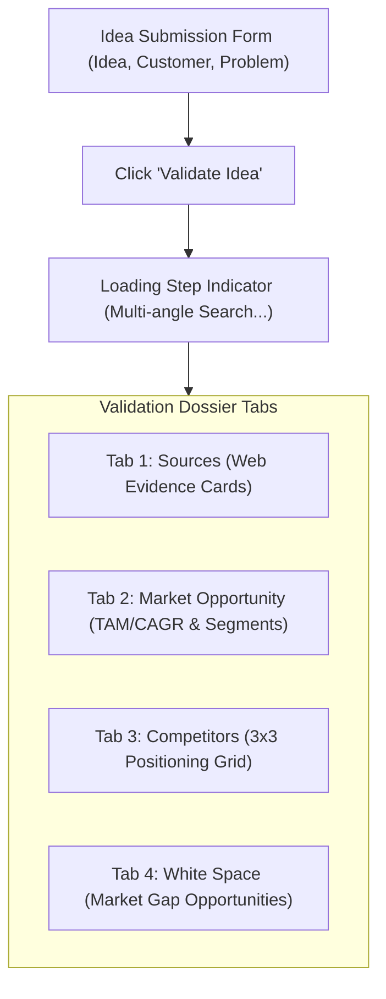

# 10. User Guide & Operations Manual
**Project:** Affinity — AI-Based Startup Idea Validator with Market Analysis Assistance  
**Document Version:** 2.0 · September 2026  
**Status:** Operational  

---

## 📑 Document Table of Contents
- [1. User Interface Overview](#1-user-interface-overview)
- [2. Step-by-Step Validation Walkthrough](#2-step-by-step-validation-walkthrough)
- [3. Phrasing Tips for Best Results](#3-phrasing-tips-for-best-results)
- [4. Interpreting Validation Dossier Outputs](#4-interpreting-validation-dossier-outputs)
- [5. Troubleshooting Common Issues](#5-troubleshooting-common-issues)

---

## 1. User Interface Overview

The Affinity web application features a clean, tabbed interface designed for rapid startup validation:

---

## 2. Step-by-Step Validation Walkthrough

### Step 1: Submit Your Idea
1. Open the Affinity web dashboard (e.g. `http://localhost:5173`).
2. **Startup Idea (Required):** Enter a concise 1–2 sentence description of your product concept.
3. **Target Customer (Optional):** Specify the primary demographic or user persona (e.g., *"Freelance photographers"*).
4. **Problem Statement (Optional):** Briefly state the pain point being solved (e.g., *"Manual invoice reminders take hours and clients miss due dates"*).
5. Click **Validate Idea**.

### Step 2: Automated Pipeline Execution
During processing (~10 seconds), the step indicator displays live status:
- *Step 1:* Expanding idea into 5 research angles...
- *Step 2:* Collecting live web evidence...
- *Step 3:* Evaluating source agreement & market size...
- *Step 4:* Extracting competitors via local spaCy NER...
- *Step 5:* Synthesizing white-space gaps & 0–100 score...

### Step 3: Inspect the Dossier
Review results across the 4 interactive tabs.

---

## 3. Phrasing Tips for Best Results

| Field | Recommended Phrasing | Bad Phrasing (To Avoid) |
|---|---|---|
| **Startup Idea** | *"AI invoice management app that locks photo delivery until client pays balance"* | *"An app for photographers"* (Too vague) |
| **Target Customer** | *"Freelance wedding and portrait photographers"* | *"Everyone"* (Too broad) |
| **Problem Statement** | *"Clients delay final balance payments until weeks after event delivery"* | *"Invoices are annoying"* (Lacks specifics) |

---

## 4. Interpreting Validation Dossier Outputs

### 4.1 Validation Summary & Opportunity Score (0–100)
- **Score > 75 (High Viability):** Strong market CAGR, clear customer pain points, and unaddressed white-space opportunities.
- **Score 50–74 (Moderate Viability):** Viable market, but crowded competitor presence or niche target customer size.
- **Score < 50 (High Competition / Low Signal):** Highly saturated market with few market gaps identified.

### 4.2 Source Agreement Badge
- Demonstrates consensus across retrieved web sources (e.g. *"4 of 5 sources agree the market is growing"*).

### 4.3 3x3 Competitor Positioning Grid
- **Vertical Axis (Price):** `Low`, `Mid`, `High`.
- **Horizontal Axis (Feature Breadth):** `Narrow`, `Moderate`, `Broad`.
- **Strategy Tip:** Look for empty cells on the grid. An empty cell indicates a **positioning white-space**.

---

## 5. Troubleshooting Common Issues

### Issue 1: "Analysis wasn't available for this section"
- **Cause:** Upstream LLM rate limit or usage cap.
- **Solution:** Wait 60 seconds and click **Validate Idea** again. Competitor and Sources tabs remain valid.

### Issue 2: Submit Button Is Disabled
- **Cause:** A 5-second cooldown protects the Groq free-tier quota after each submission.
- **Solution:** Wait 5 seconds for the cooldown to clear.

### Issue 3: Stale Dashboard Render
- **Cause:** Browser `sessionStorage` cache.
- **Solution:** Open DevTools Console (F12) and run `sessionStorage.clear()`, then reload.
