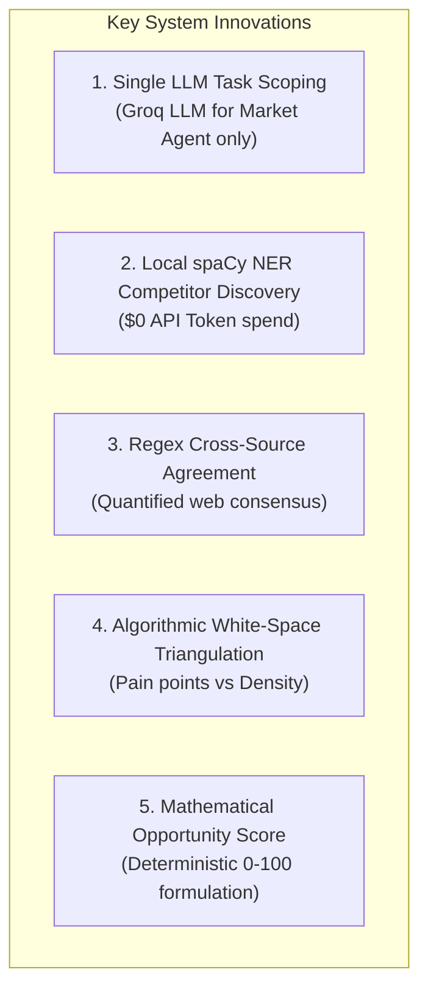

# 11. Final Academic & Capstone Project Report
**Project Title:** Affinity — Development of an AI-Based Startup Idea Validator with Market Analysis Assistance  
**Document Version:** 2.0 · September 2026 (Milestones 1 & 2 Completed)  
**Status:** Capstone Evaluation Ready  

---

## 📑 Report Structure & Index
- [1. Abstract & Executive Summary](#1-abstract--executive-summary)
- [2. System Methodology & Novelty](#2-system-methodology--novelty)
- [3. Team Structure & Task Divisions](#3-team-structure--task-divisions)
- [4. Milestone 1 & 2 Results & Key Findings](#4-milestone-1--2-results--key-findings)
- [5. Known Limitations & Academic Future Work](#5-known-limitations--academic-future-work)
- [6. Mentor & Viva Q&A Reference Guide](#6-mentor--viva-qa-reference-guide)

---

## 1. Abstract & Executive Summary

Developing a new venture requires validating market feasibility before committing capital and engineering effort. Traditional market research is manual, slow, and expensive ($5,000+ reports), while naive LLM prompting produces hallucinated TAM/SAM statistics and outdated competitor listings.

**Affinity** introduces a novel, hybrid AI architecture that validates early-stage startup concepts in ~10 seconds. The system expands user inputs into 5 web-search angles, fetches live web snippets, runs a single Groq LLM reasoning agent for Market Opportunity, and extracts competitors using local spaCy Named Entity Recognition (NER)—achieving **$0.00 API token cost for competitor extraction**. The pipeline computes a Cross-Source Agreement metric, synthesizes White-Space Gaps, and emits a consolidated **0–100 Opportunity Score**.

---

## 2. System Methodology & Novelty

### Architectural Novelty
1. **Hybrid Task Scoping:** Eliminates the anti-pattern of multi-LLM chains by reserving LLM calls strictly for open-ended market reasoning while handling entity discovery with local spaCy NER.
2. **Deterministic Anti-Hallucination Constraints:** Strict negative prompts force the LLM to output *"TAM/SAM figures are not clear from the provided sources"* when web snippets lack financial metrics.
3. **Stateless Privacy Guarantee:** Operates with zero persistent database storage, relying on volatile memory and SHA-256 keyed 30-minute ephemeral caching.

---

## 3. Team Structure & Task Divisions

| Team Member | Project Role | Primary Deliverables & File Ownership | Status |
|---|---|---|---|
| **Yasaswini (Lead)** | System Architecture & Core Agents | Market Opportunity Agent (`market_agent.py`), Competitor Discovery rewrite (`competitor_agent.py`), System Architecture (`docs/architecture.md`), API Metrics. | ✅ Complete |
| **Yalene** | Orchestration & Isolation | LangGraph orchestration (`graph.py`), partial-failure exception handling, backend routing (`main.py`). | ✅ Complete |
| **Sashi** | Viability Scoring & Agreement | Opportunity Score formulation (`opportunity_score.py`), Cross-source Confidence Indicator (`confidence.py`). | ✅ Complete |
| **Anu Kumari** | Frontend & Visualization | React dashboard (`App.jsx`), 3x3 Positioning Grid UI (`CompetitorAnalysis.jsx`), Null-state UI (`MarketOpportunity.jsx`). | ✅ Complete |
| **Varshini** | QA & Empirical Verification | Cross-industry validation testing across 7 domains (`docs/milestone2-verification.md`), forced-failure error check suites. | ✅ Complete |

---

## 4. Milestone 1 & 2 Results & Key Findings

- **Milestone 1:** Successfully established 5-angle web retrieval (`retrieval.py`), zero-cost search fallback chain (Tavily $\to$ DDG $\to$ Wiki $\to$ HN), academic domain exclusion (`_EXCLUDED_DOMAINS`), and initial React interface.
- **Milestone 2:** Delivered the complete hybrid agent pipeline:
  - Market Opportunity LLM Agent (4 customer segment profiles).
  - Local spaCy NER Competitor Discovery & 3x3 Positioning Grid.
  - Cross-Source Agreement Indicator & White-Space Gap Analysis.
  - Consolidated 0–100 Opportunity Score.
  - Ephemeral 30-minute in-memory cache & submit cooldown.

---

## 5. Known Limitations & Academic Future Work

1. **Topical Relevance Boundary:** Judging whether an extracted entity (e.g. *OneAir*) is genuinely off-topic vs. a direct competitor requires LLM reasoning, which was deliberately omitted to maintain $0 API cost for competitors.
2. **Pricing Heuristics:** Pricing and feature breadth are classified using local text pattern-matching. If web snippets omit pricing, items land on `"unknown"`.
3. **Future Work:** Milestone 3 will introduce one-click PDF report export, side-by-side startup idea comparison, and customizable domain filters.

---

## 6. Mentor & Viva Q&A Reference Guide

### Q1: Why did you replace LLM Competitor Discovery with spaCy NER?
**Answer:** Running a second LLM agent for competitor discovery exhausted Groq free-tier rate limits (1,000 output tokens/min cap) and frequently hallucinated non-existent companies or platform terms like "Software". Moving to spaCy `en_core_web_sm` NER achieved **$0.00 API token cost**, zero rate limits, faster latency (~10s total pipeline), and higher entity accuracy.

### Q2: How does the system prevent hallucinated TAM/SAM statistics?
**Answer:** We enforce strict negative prompt constraints in `market_agent.py`. The LLM is explicitly instructed to cite TAM, SAM, or CAGR metrics **only** when retrieved web snippets explicitly contain those figures. If statistics are absent from search results, the prompt forces the LLM to output *"TAM/SAM figures are not clear from the provided sources"* rather than guessing.

### Q3: What happens if an API fails during a live demo?
**Answer:** The system uses 3 layers of defense:
1. **In-memory cache:** Identical requests within 30 minutes return instantly without network calls.
2. **3-Model Fallback Chain:** If `qwen3.8-27b` fails, `llm.py` retries across `gpt-oss-20b` and `gpt-oss-120b`.
3. **Partial Failure Isolation:** If all LLM calls fail, the API returns `200 OK` with `marketOpportunity: null`, rendering an inline `UnavailableCard` in the UI while Competitor and Web Source tabs display normally.
