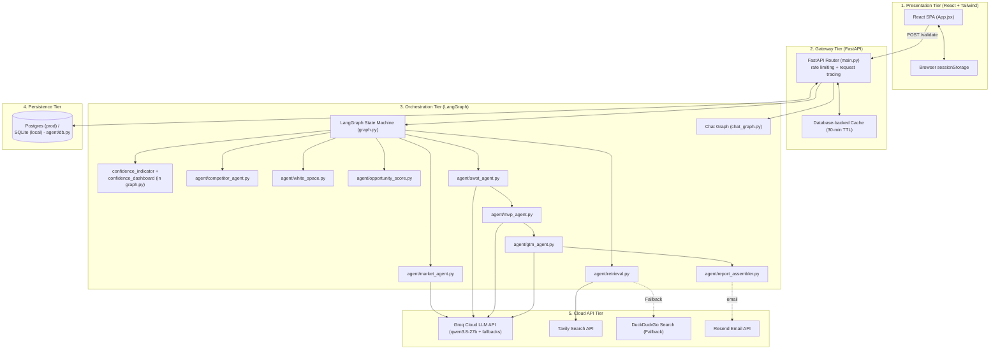
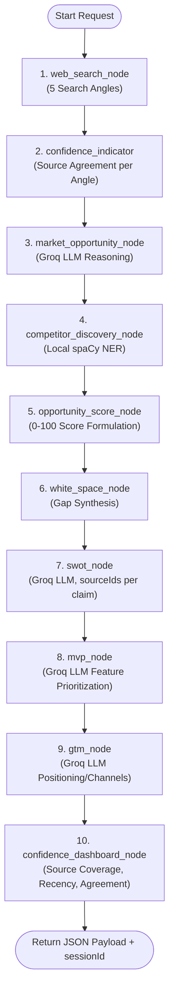
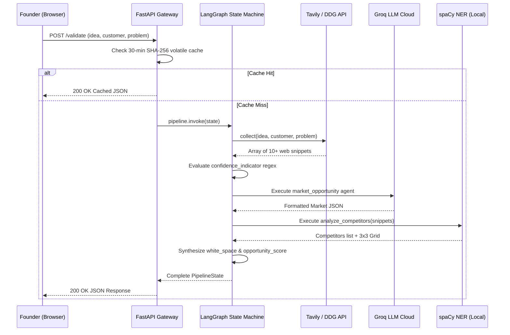
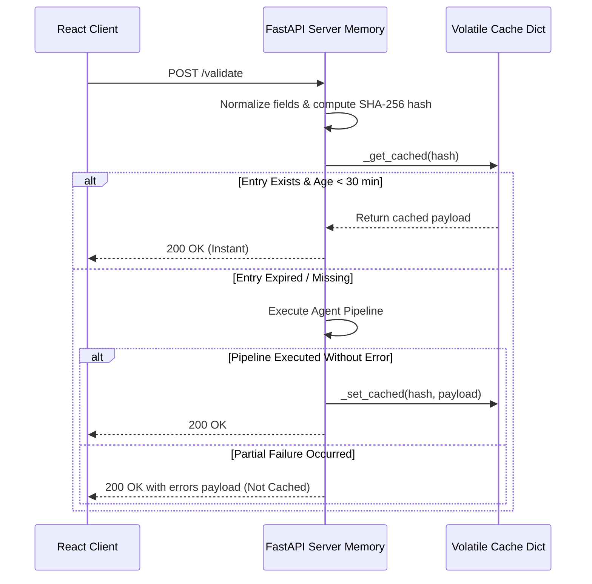
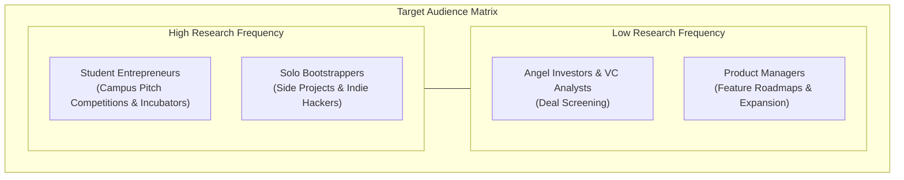
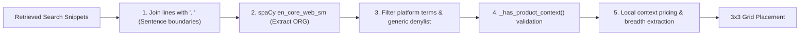
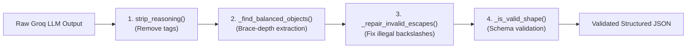

# 12. System Architecture & Diagrams Gallery
**Project:** Affinity — AI-Based Startup Idea Validator with Market Analysis Assistance  
**Document Version:** 2.0 · September 2026  
**Status:** Verified & Operational  

---

## 📑 Diagrams Index
1. [Diagram 1: Multi-Tier System Topology](#diagram-1-multi-tier-system-topology)
2. [Diagram 2: LangGraph Pipeline State Machine](#diagram-2-langgraph-pipeline-state-machine)
3. [Diagram 3: End-to-End Request Sequence](#diagram-3-end-to-end-request-sequence)
4. [Diagram 4: Data Privacy & Ephemeral Caching Lifecycle](#diagram-4-data-privacy--ephemeral-caching-lifecycle)
5. [Diagram 5: Target Audience Segmentation Matrix](#diagram-5-target-audience-segmentation-matrix)
6. [Diagram 6: User Journey & Interactive State Flow](#diagram-6-user-journey--interactive-state-flow)
7. [Diagram 7: Local spaCy NER Competitor Pipeline](#diagram-7-local-spacy-ner-competitor-pipeline)
8. [Diagram 8: Multi-Stage LLM Output Repair Guard](#diagram-8-multi-stage-llm-output-repair-guard)

---

## Diagram 1: Multi-Tier System Topology

---

## Diagram 2: LangGraph Pipeline State Machine

---

## Diagram 3: End-to-End Request Sequence

---

## Diagram 4: Data Privacy & Ephemeral Caching Lifecycle

---

## Diagram 5: Target Audience Segmentation Matrix

---

## Diagram 6: User Journey & Interactive State Flow

```mermaid
flowchart LR
    subgraph InputPhase["1. Submission"]
        direction TB
        A1["Founder inputs Idea"] --> A2["Optionally enters Customer & Problem"]
        A2 --> A3["Clicks Validate Idea"]
    end

    subgraph ExecutionPhase["2. Processing Engine"]
        direction TB
        B1["Multi-Angle Web Search"] --> B2["Cross-Source Agreement"]
        B2 --> B3["LLM Market Reasoning"]
        B3 --> B4["spaCy NER Competitor Parsing"]
        B4 --> B5["Score & White-Space Triangulation"]
    end

    subgraph DisplayPhase["3. Validation Dossier"]
        direction TB
        C1["Review 0-100 Score"] --> C2["Inspect Market Segments & Trends"]
        C2 --> C3["Analyze 3x3 Positioning Grid"]
        C3 --> C4["Evaluate White-Space Gaps & Sources"]
    end

    A3 --> B1
    B5 --> C1
```

---

## Diagram 7: Local spaCy NER Competitor Pipeline

---

## Diagram 8: Multi-Stage LLM Output Repair Guard

