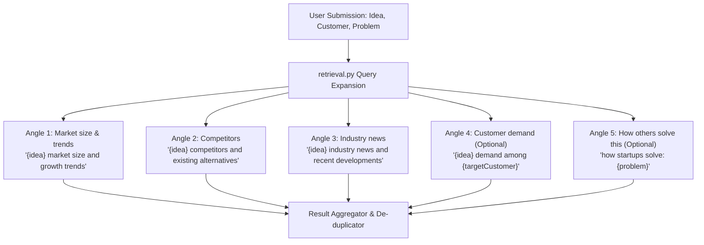
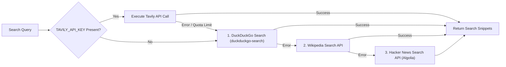

# 16. Multi-Angle Search Retrieval & Domain Filtering Engine
**Project:** Affinity — AI-Based Startup Idea Validator with Market Analysis Assistance  
**Document Version:** 2.0 · September 2026  
**Status:** Verified & Operational  

---

## 📑 Document Table of Contents
- [1. Executive Summary & Retrieval Strategy](#1-executive-summary--retrieval-strategy)
- [2. Multi-Angle Query Expansion Engine](#2-multi-angle-query-expansion-engine)
- [3. Search Provider Architecture & Zero-Cost Fallback Chain](#3-search-provider-architecture--zero-cost-fallback-chain)
- [4. Domain Exclusion & Noise Filtering (`_EXCLUDED_DOMAINS`)](#4-domain-exclusion--noise-filtering-_excluded_domains)
- [5. Code Specifications (`retrieval.py` & `tools.py`)](#5-code-specifications-retrievalpy--toolspy)

---

## 1. Executive Summary & Retrieval Strategy

A generic search query (e.g., *"invoice app for photographers"*) returns unstructured web results that crowd out critical market signals.

Affinity's retrieval layer in [`backend/agent/retrieval.py`](file:///C:/Opensource/AI%20Based%20Startup%20Idea%20Validator/backend/agent/retrieval.py) expands a single startup submission into **up to 5 targeted research angles**, executes queries across live web search tools, and applies domain filtering to eliminate noise.

---

## 2. Multi-Angle Query Expansion Engine



### Query Templates
- **Angle 1 (`Market size & trends`):** Always fired. Focuses on market CAGR, TAM/SAM, and industry revenue.
- **Angle 2 (`Competitors`):** Always fired. Focuses on existing vendor products, software reviews, and pricing.
- **Angle 3 (`Industry news`):** Always fired. Focuses on recent acquisitions, funding, and adoption patterns.
- **Angle 4 (`Customer demand`):** Fired if `targetCustomer` is provided. Focuses on demographic pain points.
- **Angle 5 (`How others solve this`):** Fired if `problem` is provided. Focuses on current workflow workarounds.

---

## 3. Search Provider Architecture & Zero-Cost Fallback Chain

In [`backend/agent/tools.py`](file:///C:/Opensource/AI%20Based%20Startup%20Idea%20Validator/backend/agent/tools.py), search execution is wrapped with an automated fallback chain:



- **Tavily Primary:** High-precision search tuned for AI agents. Free tier provides 1,000 credits/month.
- **Zero-Cost Fallback:** Guarantees that search retrieval succeeds even if Tavily API keys are missing or exhausted.

---

## 4. Domain Exclusion & Noise Filtering (`_EXCLUDED_DOMAINS`)

Early testing revealed that queries like *"AI invoicing for photographers"* returned academic papers on image processing or generic affiliate software directory pages.

[`backend/agent/retrieval.py`](file:///C:/Opensource/AI%20Based%20Startup%20Idea%20Validator/backend/agent/retrieval.py) maintains `_EXCLUDED_DOMAINS` to strip out irrelevant sources:

```python
_EXCLUDED_DOMAINS = {
    # Academic Repositories (Omit non-commercial paper noise)
    "arxiv.org",
    "ncbi.nlm.nih.gov",
    "sciencedirect.com",
    "researchgate.net",

    # Generic Directory Aggregators (Omit affiliate list noise)
    "alternativeto.net",
    "saashub.com",
    "competitors.app",
    "directory.io"
}
```

- **Academic Filtering Rationale:** Scientific papers discuss algorithmic proofs, not commercial market size, prices, or customer pain points.
- **Directory Filtering Rationale:** Aggregator sites keyword-match almost any query without offering specific product evidence.

---

## 5. Code Specifications (`retrieval.py`)

```python
def collect(idea: str, target_customer: str = "", problem: str = "") -> list:
    queries = [
        (f"{idea} market size and growth trends", "Market size & trends"),
        (f"{idea} competitors and existing alternatives", "Competitors"),
        (f"{idea} industry news and recent developments", "Industry news"),
    ]
    if target_customer:
        queries.append((f"{idea} demand among {target_customer}", "Customer demand"))
    if problem:
        queries.append((f"how startups solve: {problem}", "How others solve this"))

    all_results = []
    seen_urls = set()

    for q, angle in queries:
        raw_snippets = search_tool.run(q)
        for r in raw_snippets:
            url = r.get("url", "")
            domain = _extract_domain(url)
            if domain in _EXCLUDED_DOMAINS or url in seen_urls:
                continue
            seen_urls.add(url)
            r["angle"] = angle
            all_results.append(r)

    return all_results
```
