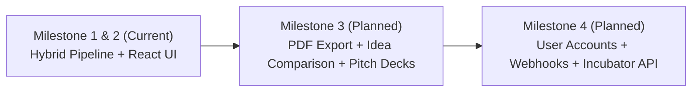

# 17. Future Technical Roadmap & Milestones 3 & 4 Specifications
**Project:** Affinity — AI-Based Startup Idea Validator with Market Analysis Assistance  
**Document Version:** 2.0 · September 2026  
**Status:** Feature Specification  

---

## 📑 Document Table of Contents
- [1. Executive Summary & Strategic Architecture](#1-executive-summary--strategic-architecture)
- [2. Milestone 3 Engineering Specifications](#2-milestone-3-engineering-specifications)
- [3. Milestone 4 Engineering Specifications](#3-milestone-4-engineering-specifications)
- [4. Architectural Migration Path](#4-architectural-migration-path)

---

## 1. Executive Summary & Strategic Architecture

With **Milestones 1 & 2 complete and verified operational**, Affinity currently delivers real-time web retrieval, LLM market opportunity analysis, local spaCy NER competitor extraction, 3x3 positioning grids, Cross-Source Agreement metrics, and 0–100 Opportunity Scoring.

Milestones 3 and 4 expand Affinity into a enterprise-ready venture screening platform:



---

## 2. Milestone 3 Engineering Specifications

### 2.1 One-Click Validation Dossier PDF Export
- **Objective:** Enable founders to export a formatted validation dossier for investor meetings.
- **Implementation:** Backend endpoint `POST /export/pdf` using ReportLab or Puppeteer headless rendering.
- **Contents:**
  - Executive Pitch & 0–100 Opportunity Score Badge.
  - Source Agreement Consensus Metrics.
  - 4 Customer Segment Profiles Table.
  - 3x3 Competitor Positioning Grid Graphic.
  - Citations and Web Source Evidence Directory.

### 2.2 Side-by-Side Startup Idea Comparison Matrix
- **Objective:** Allow founders to submit 2 or 3 competing startup concepts and compare their viability.
- **Frontend UI:** Dual-column dashboard view comparing Opportunity Scores, market sizes, competitor counts, and white-space gap counts.
- **Backend Routing:** Asynchronous `POST /compare` executing parallel LangGraph state graph instances using Python `asyncio.gather()`.

### 2.3 Automatic Pitch Deck Outline Generator
- **Objective:** Convert validation results into a 10-slide Pitch Deck Outline.
- **Slide Mapping:**
  - *Slide 1:* Title & One-Liner Pitch
  - *Slide 2:* Problem Statement & Customer Pain Points
  - *Slide 3:* Market Opportunity (TAM/SAM/CAGR)
  - *Slide 4:* Target Customer Segments & Buying Behaviors
  - *Slide 5:* Competitor Landscape & 3x3 Grid
  - *Slide 6:* White-Space Differentiation

---

## 3. Milestone 4 Engineering Specifications

### 3.1 Authenticated Workspaces & Saved Validation History
- **Objective:** Provide persistent user accounts for incubators, VC firms, and serial entrepreneurs.
- **Database Layer:** PostgreSQL database with Supabase / FastAPI SQLAlchemy ORM integration.
- **Authentication:** JWT (JSON Web Tokens) with OAuth2 Google/GitHub SSO.

### 3.2 Automated Monthly Competitor Tracking Webhooks
- **Objective:** Continuously monitor competitors discovered in validated startup dossiers.
- **Engine:** Monthly cron job scheduled via Celery / Redis workers running spaCy NER against fresh news query angles.
- **Alert Channels:** Email summaries and Slack/Discord webhooks alerting founders when a competitor updates pricing or launches new features.

### 3.3 University & Incubator API Portal
- **Objective:** Allow university pitch competitions to embed Affinity directly into student submission portals.
- **Features:** Developer API Keys, rate-limit tiers, custom white-label reports, and administrative analytics dashboards.

---

## 4. Architectural Migration Path

```typescript
// Milestone 4 Database Entity Preview (PostgreSQL / Prisma Schema)
model IdeaValidation {
  id              String   @id @default(uuid())
  userId          String
  idea            String
  targetCustomer  String?
  problem         String?
  opportunityScore Int
  summary         String
  createdAt       DateTime @default(now())
  
  // Relations
  sources         Source[]
  competitors     Competitor[]
}
```
