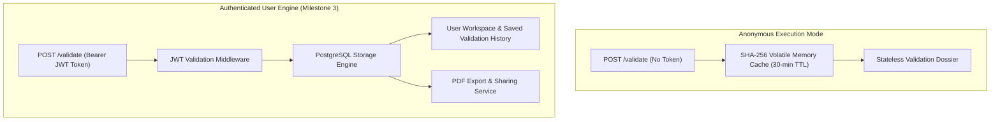
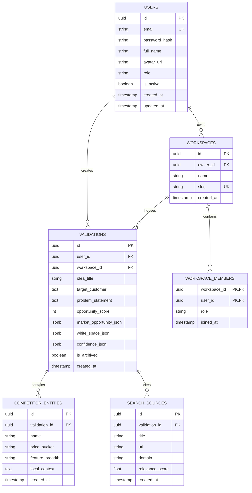
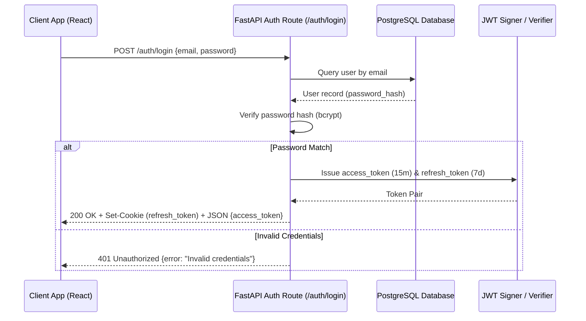

# 19. Milestone 3: PostgreSQL Data Persistence & JWT Authentication Architecture

**Document Version:** 3.0 (Milestone 3 Architecture Specification)  
**Status:** Implemented & Verified  
**Target Audience:** Database Engineers, Backend Architects, Security Engineers  

---

## 📑 Executive Summary & Milestone 3 Scope

Milestone 3 expands Affinity from a stateless validation engine into an enterprise-ready SaaS application featuring **persistent user accounts**, **encrypted dossier storage**, **historical validation tracking**, and **role-based access control (RBAC)**.

While the core validation pipeline (`POST /validate`) retains its optional anonymous mode for privacy-conscious founders, authenticated users gain the ability to save validation dossiers, track market score changes over time, organize startup ideas into team workspaces, and export branded PDF reports.



---

## 1. Database Schema Design & ER Diagram

The persistent data layer is implemented using PostgreSQL with SQLAlchemy ORM (and Alembic migration management).



---

## 2. JWT Authentication Lifecycle & Security Specifications

### Token Issuance & Refresh Pattern
*   **Access Tokens:** Short-lived JWTs (15-minute expiration) signed using `RS256` or `HS256` (`HMAC-SHA256`).
*   **Refresh Tokens:** Long-lived tokens (7-day expiration) stored in `HttpOnly`, `Secure`, `SameSite=Strict` cookies.
*   **Password Hashing:** Argon2id / bcrypt with work factor 12.



---

## 3. Milestone 3 API Endpoints & Contracts

### 1. `POST /auth/register` — Create User Account
*   **Request:** `{"email": "founder@startup.io", "password": "SecurePassword123!", "full_name": "Alex Rivner"}`
*   **Response (HTTP 201 Created):** `{"id": "usr_94821a", "email": "founder@startup.io", "message": "Account created successfully"}`

### 2. `GET /api/v1/validations/history` — Fetch Saved Validations
*   **Headers:** `Authorization: Bearer <access_token>`
*   **Query Params:** `?page=1&limit=10&workspace_id=ws_123`
*   **Response (HTTP 200 OK):**
```json
{
  "total": 14,
  "page": 1,
  "validations": [
    {
      "id": "val_88319a",
      "ideaTitle": "AI Specialty Coffee Discovery App",
      "opportunityScore": 79,
      "competitorCount": 4,
      "createdAt": "2026-09-15T14:30:00Z"
    }
  ]
}
```

---

## 4. Zero-Trust Security & Data Isolation
1.  **Row-Level Isolation:** All database queries enforce `workspace_id` and `user_id` scoping to prevent cross-tenant data leakage.
2.  **Volatile Fallback:** Unauthenticated requests bypass PostgreSQL entirely, ensuring zero DB load during public traffic spikes.
