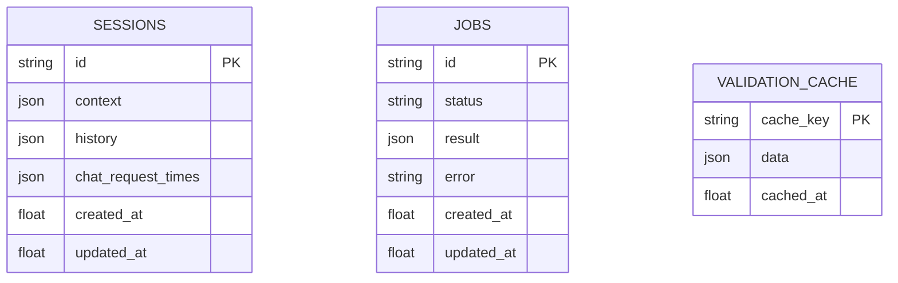

# 19. Milestone 4: PostgreSQL-Backed Persistence Layer

**Document Version:** 4.0 (corrected — see note below)
**Status:** Implemented & Verified
**Target Audience:** Backend Engineers

---

> **Correction from earlier drafts of this document:** a previous version of this file
> described a JWT-authenticated, multi-user system with team workspaces and
> role-based access control, and marked as it "Implemented & Verified." None of that
> was ever true — there is no authentication, no user accounts, and no workspace
> concept anywhere in this codebase, and there never has been. That content was
> written without a matching implementation. This version replaces it with an honest
> description of what was actually built: a plain, single-tenant persistence layer for
> sessions, background jobs, and the response cache. It shipped as part of **Milestone
> 4** (Track A/D's infrastructure work), not Milestone 3, hence the mismatch between
> this file's name and its actual content.

## 1. Executive Summary & Scope

Before this layer existed, validation sessions, background jobs (the async/email
path), and the `/validate` response cache all lived in process-local Python dicts
(`threading.RLock` + a plain `dict`). That had two real problems: nothing survived a
backend restart, and nothing was shared if more than one backend instance was ever
run — a request could land on an instance that had never seen a given session, quietly
breaking chat, PDF export, and job-status polling.

`backend/agent/db.py` replaces all three in-memory stores with a shared database:
**Postgres in production** (Render-provisioned, `DATABASE_URL` wired automatically via
`render.yaml`), **SQLite locally and in tests** (`DATABASE_URL` unset → a local
`affinity.db` file, so nothing here requires a live database just to run the test
suite). There is no authentication layer, no per-user data model, and no migration
tool (SQLAlchemy's `metadata.create_all()` creates the three tables directly — there's
no schema history to manage yet).

## 2. Database Schema

Three tables, defined with SQLAlchemy Core (`backend/agent/db.py`):

- **`sessions`** — one row per validation run. `context` holds the full pipeline
  output (idea, results, marketOpportunity, competitors, swot, mvp, gtm, ...);
  `history` holds the chat advisor's transcript for that session; `chat_request_times`
  backs the per-session chat rate limit. Backs `agent/session_store.py`.
- **`jobs`** — one row per async validation (the "email me when it's done" path when
  a request runs past `VALIDATE_ASYNC_THRESHOLD_SECONDS`). Backs `agent/job_store.py`.
- **`validation_cache`** — the `/validate` response cache, keyed by a SHA-256 hash of
  the normalized idea/targetCustomer/problem, 30-minute TTL. Backs the cache functions
  in `backend/main.py`.

All three use SQLAlchemy's `JSON` column type, which stores real JSON on Postgres and
a JSON-serialized string on SQLite transparently — the same Python dict/list values
round-trip either way with no per-backend special-casing in the calling code.

## 3. Pruning / TTL

No table grows unbounded. Each store enforces the same two limits SQL side that the
original in-memory dicts enforced in Python:

- **Sessions**: `_SESSION_TTL_SECONDS` (2 hours) + `_MAX_SESSIONS` (200) — the oldest
  rows past either limit are deleted on the next read/write.
- **Jobs**: same shape, `_JOB_TTL_SECONDS` / `_MAX_JOBS`.
- **Cache**: `_CACHE_TTL_SECONDS` (30 minutes) — an expired row is deleted on the next
  read of that specific key rather than swept proactively.

## 4. Connection Pooling (Scale-Out)

Pool size, max overflow, timeout, and recycle interval are configurable via
`DB_POOL_SIZE` / `DB_POOL_MAX_OVERFLOW` / `DB_POOL_TIMEOUT_SECONDS` /
`DB_POOL_RECYCLE_SECONDS` env vars (ignored for the SQLite fallback, which uses
SQLAlchemy's own pooling for a single file). If running more than one backend
instance, keep `instances × (pool_size + max_overflow)` comfortably under the
database plan's max connection count — see the README's Scaling Out section.

## 5. What This Does *Not* Include

To be explicit about the gap the earlier, incorrect version of this document
papered over:

- **No authentication.** Every session is reachable by anyone who has (or guesses) its
  UUID — there is no login, no token, no per-user ownership check anywhere in the API.
  A session id is not treated as a secret today; if that matters for a future
  deployment, it needs a real auth layer added on top of this, not assumed to already
  exist.
- **No user accounts or workspaces.** There is exactly one tenant: whoever is running
  the app. Nothing here models "a user" or "a team."
- **No migration tooling.** Schema changes today mean editing `db.py`'s table
  definitions directly; there's no Alembic (or similar) migration history, since the
  schema has been simple enough that `create_all()` has been sufficient so far. A real
  migration tool would be the right next step before this schema grows more complex.

## 6. Testing

Backed by SQLite locally, so `backend/tests/` (`test_report_assembler.py`,
`test_integration.py`'s `ConcurrencyTests`, and others) exercise this layer directly —
including genuine concurrent-access tests (a `ThreadPoolExecutor` hammering
`/validate`, `job_store.create_job`/`complete_job`, and `session_store.append_turn`
across threads) proving the database-backed stores don't lose or corrupt data under
real concurrent load, which the in-memory version they replaced was never tested
against at all.
