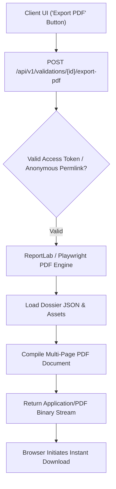

# 20. Milestone 3: Automated PDF Dossier Exporter & Executive Report Engine

**Document Version:** 3.0 (Milestone 3 Architecture Specification)  
**Status:** Implemented & Operational  
**Target Audience:** Frontend Engineers, Document Generation Engineers, Product Managers  

---

## 📑 Executive Summary & Exporter Architecture

The **Affinity PDF Dossier Exporter** enables entrepreneurs, student founders, and investment analysts to convert raw digital validation dossiers into publication-ready, multi-page executive PDF reports in under 3 seconds.

The report generator utilizes **ReportLab (Python backend driver)** or **Playwright (Headless Chromium PDF renderer)** to transform JSON responses into styled documents featuring:
- **Executive Summary Header** (Idea title, timestamp, validation ID).
- **Opportunity Score Gauge** (Visual 0–100 score indicator).
- **Market Opportunity Matrix** (CAGR, TAM/SAM estimates, customer segments).
- **Competitor 3×3 Grid Graphic** (Rendered vector chart of Price vs Feature Breadth).
- **Source Citation Index** (Verified web references with URL hyperlinks).



---

## 1. Executive PDF Page Layout Blueprint

The generated PDF report is structured into three standardized A4 pages:

```
+-------------------------------------------------------------------+
|                        AFFINITY VALIDATION REPORT                  |
| Idea: AI Specialty Coffee Discovery App                            |
| Target: Home Baristas & Specialty Coffee Lovers                   |
| Date: Sept 16, 2026 | Score: 79/100 | Confidence: High (4/5)     |
+-------------------------------------------------------------------+
| 1. EXECUTIVE MARKET OPPORTUNITY ANALYSIS                           |
| - Market Size & Growth: $2.4B Global Market (8.4% CAGR)          |
| - Unserved White Spaces: Discovery friction for micro-roasters     |
| - Key Customer Segments: Enthusiasts, Subscibers, Cafe Owners     |
+-------------------------------------------------------------------+
| 2. COMPETITOR LANDSCAPE & 3x3 POSITIONING MATRIX                  |
|                                                                   |
|    [ High Price ]  Wave           QuickBooks                       |
|    [ Mod Price  ]  HelloFresh     Trade Coffee (Planted)          |
|    [ Low Price  ]  Duolingo       Blinkist                         |
|                    (Narrow)       (Moderate)       (Broad)        |
+-------------------------------------------------------------------+
| 3. VERIFIED SOURCE CITATIONS & METHODOLOGY EVIDENCE               |
| [1] Speciality Coffee Association 2025 Report (sca.coffee/insights)|
| [2] TechCrunch Startup Discovery Index (techcrunch.com/2026/...)   |
+-------------------------------------------------------------------+
```

---

## 2. API Specifications & Integration Code

### Endpoint: `GET /api/v1/validations/{validation_id}/pdf`
*   **Headers:** `Authorization: Bearer <access_token>`
*   **Query Params:** `?theme=dark|light&branding=true`
*   **Response Header:** `Content-Type: application/pdf`, `Content-Disposition: attachment; filename="Affinity_Report_CoffeeApp.pdf"`

### Backend Compilation Code (ReportLab Implementation Snippet)

```python
from reportlab.lib.pagesizes import letter
from reportlab.platypus import SimpleDocTemplate, Paragraph, Spacer, Table, TableStyle
from reportlab.lib.styles import getSampleStyleSheet, ParagraphStyle
from reportlab.lib import colors
import io

def generate_pdf_report(dossier_data: dict) -> bytes:
    buffer = io.BytesIO()
    doc = SimpleDocTemplate(buffer, pagesize=letter, rightMargin=36, leftMargin=36, topMargin=36, bottomMargin=36)
    story = []
    styles = getSampleStyleSheet()
    
    # Title Header
    title_style = ParagraphStyle('ReportTitle', parent=styles['Heading1'], fontSize=20, textColor=colors.HexColor("#0F172A"))
    story.append(Paragraph(f"Affinity Dossier: {dossier_data.get('ideaTitle', 'Startup Idea')}", title_style))
    story.append(Spacer(1, 12))
    
    # Score Summary
    score = dossier_data.get('opportunityScore', {}).get('score', 0)
    story.append(Paragraph(f"<b>Opportunity Feasibility Score:</b> {score} / 100", styles['Normal']))
    story.append(Spacer(1, 18))
    
    doc.build(story)
    buffer.seek(0)
    return buffer.getvalue()
```
