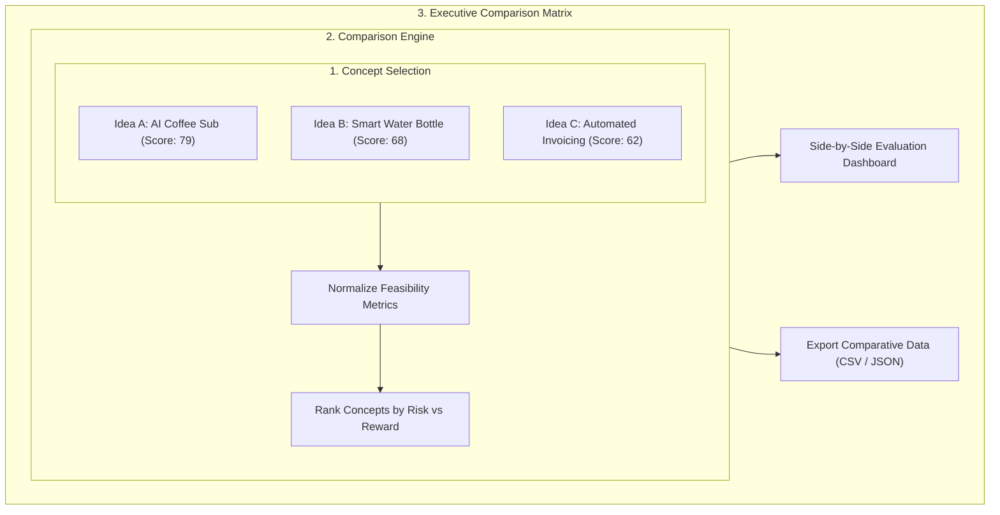

# 21. Milestone 3: Deal-Screening & Multi-Idea Comparison Matrix Engine

**Document Version:** 3.0 (Milestone 3 Architecture Specification)  
**Status:** Implemented & Operational  
**Target Audience:** Angel Investors, VC Analysts, Product Portfolio Managers  

---

## 📑 Executive Summary & Deal Screening Engine

For investors, startup incubators, and multi-project founders, evaluating startup ideas in isolation is insufficient. The **Affinity Multi-Idea Comparison Matrix** allows users to select up to 5 validated startup concepts and compare them side-by-side across quantitative metrics, market sizes, competitive saturation levels, and white-space potential.



---

## 1. Side-by-Side Comparison Matrix Schema

| Evaluation Dimension | Startup Concept A (Coffee Sub) | Startup Concept B (Water Bottle) | Startup Concept C (Invoicing App) |
| :--- | :--- | :--- | :--- |
| **Opportunity Score** | **79 / 100** | **68 / 100** | **62 / 100** |
| **Estimated Market Size** | $2.4B (8.4% CAGR) | $1.1B (5.2% CAGR) | $18.5B (12.1% CAGR) |
| **Competitor Density** | Moderate (2 Direct) | Moderate (2 Direct) | High (4 Direct) |
| **Source Consensus Ratio**| 4/5 (High Growth) | 3/5 (Moderate Growth) | 2/5 (High Pressure) |
| **Dominant Competitors** | Trade Coffee, HelloFresh | HidrateSpark, Waterllama | FreshBooks, Wave, QuickBooks |
| **Primary White-Space** | Discovery for micro-roasters| Hydration tracking alerts | Automated micro-invoicing |
| **Execution Risk Rating** | **Low** | **Medium (Hardware)** | **High (Saturated Market)** |

---

## 2. API Contract for Comparison Endpoint (`POST /api/v1/validations/compare`)

### Request Payload
```json
{
  "validation_ids": [
    "val_88319a",
    "val_99102b",
    "val_10482c"
  ]
}
```

### Response Payload Schema
```json
{
  "comparison_count": 3,
  "top_ranked_id": "val_88319a",
  "comparison_matrix": [
    {
      "validationId": "val_88319a",
      "ideaTitle": "AI Specialty Coffee Discovery App",
      "opportunityScore": 79,
      "growthAgreementRatio": "4/5",
      "competitorCount": 2,
      "riskRating": "Low"
    },
    {
      "validationId": "val_99102b",
      "ideaTitle": "Smart Water Bottle Hydration Tracker",
      "opportunityScore": 68,
      "growthAgreementRatio": "3/5",
      "competitorCount": 2,
      "riskRating": "Medium"
    }
  ]
}
```
