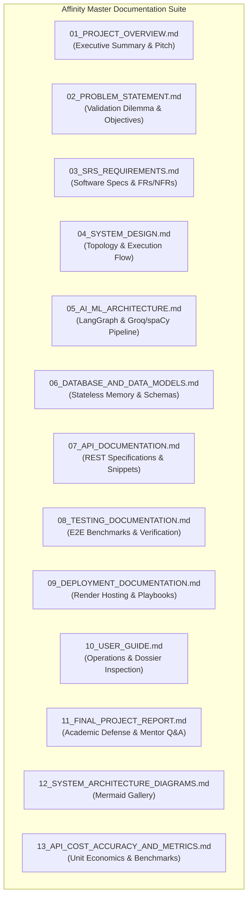

# Affinity Documentation Suite & Master Directory
**Project:** Affinity — AI-Based Startup Idea Validator with Market Analysis Assistance  
**Document Version:** 2.0 · September 2026 (Milestones 1 & 2 Complete)  
**Status:** Verified & Operational  

---

## 📑 Master Documentation Index

Welcome to the central documentation hub for **Affinity**. Every document in this directory is kept in sync with active production implementation in the codebase.

---

## 📚 Core Documentation Modules

| # | Document | Target Audience | Primary Focus |
|---|---|---|---|
| **01** | [`01_PROJECT_OVERVIEW.md`](01_PROJECT_OVERVIEW.md) | Executive / All | Core mission, value proposition, key stakeholders, and system highlights. |
| **02** | [`02_PROBLEM_STATEMENT_AND_OBJECTIVES.md`](02_PROBLEM_STATEMENT_AND_OBJECTIVES.md) | Evaluators / Mentors | Founder validation dilemma, market risks, research questions (RQs), and KPIs. |
| **03** | [`03_SRS_REQUIREMENTS.md`](03_SRS_REQUIREMENTS.md) | Software Engineers | Functional requirements (FR-01 to FR-10), NFRs, user stories, boundary contracts. |
| **04** | [`04_SYSTEM_DESIGN.md`](04_SYSTEM_DESIGN.md) | System Architects | 4-tier topology (React UI, FastAPI Gateway, LangGraph, Cloud AI), sequence diagrams. |
| **05** | [`05_AI_ML_ARCHITECTURE.md`](05_AI_ML_ARCHITECTURE.md) | AI Engineers | Hybrid LLM + spaCy NER architecture, Groq model failover chain, token tuning. |
| **06** | [`06_DATABASE_AND_DATA_MODELS.md`](06_DATABASE_AND_DATA_MODELS.md) | Backend Engineers | Stateless data lifecycle, Pydantic contracts, SHA-256 30-min volatile caching. |
| **07** | [`07_API_DOCUMENTATION.md`](07_API_DOCUMENTATION.md) | Developers | OpenAPI REST endpoints (`/validate`, `/health`), partial failure contracts, code snippets. |
| **08** | [`08_TESTING_DOCUMENTATION.md`](08_TESTING_DOCUMENTATION.md) | QA / Mentors | 7-industry E2E live verification, forced error-state isolation suite, 16/16 test suite. |
| **09** | [`09_DEPLOYMENT_DOCUMENTATION.md`](09_DEPLOYMENT_DOCUMENTATION.md) | DevOps Engineers | Render deployment (`render.yaml`), environment variables, 5 incident playbooks. |
| **10** | [`10_USER_GUIDE.md`](10_USER_GUIDE.md) | End Users / Founders | Step-by-step UI walkthrough, pitch phrasing tips, dossier interpretation, troubleshooting. |
| **11** | [`11_FINAL_PROJECT_REPORT.md`](11_FINAL_PROJECT_REPORT.md) | Viva Committees | Capstone academic report, methodology, novelty, team roles, and 7 mentor Q&As. |
| **12** | [`12_SYSTEM_ARCHITECTURE_DIAGRAMS.md`](12_SYSTEM_ARCHITECTURE_DIAGRAMS.md) | Technical Reviewers | Complete gallery of 8 GFM-compliant Mermaid diagrams. |
| **13** | [`13_API_COST_ACCURACY_AND_SYSTEM_METRICS.md`](13_API_COST_ACCURACY_AND_SYSTEM_METRICS.md) | Technical Lead | Unit economics ($0.00067 paid / $0.00 free), latency breakdown (~10.2s), token metrics. |
| **14** | [`14_COMPETITOR_POSITIONING_AND_MAPPING.md`](14_COMPETITOR_POSITIONING_AND_MAPPING.md) | AI / Product | spaCy NER entity discovery, product context checks (`_has_product_context`), 3x3 grid algorithm. |
| **15** | [`15_MARKET_SCORE_MATHEMATICAL_MODEL.md`](15_MARKET_SCORE_MATHEMATICAL_MODEL.md) | Data Engineers | Opportunity Score mathematical derivation ($\text{Score} = \text{Clamp}(50 + S_{\text{mkt}} + S_{\text{growth}} - S_{\text{den}} + S_{\text{gaps}})$, 0-100 bounds). |
| **16** | [`16_SEARCH_RETRIEVAL_AND_DOMAIN_FILTERING.md`](16_SEARCH_RETRIEVAL_AND_DOMAIN_FILTERING.md) | Backend Engineers | 5-angle query expansion, domain exclusion (`_EXCLUDED_DOMAINS`), zero-cost search fallback chain. |
| **17** | [`17_FUTURE_ROADMAP_AND_MILESTONE_3_4_SPEC.md`](17_FUTURE_ROADMAP_AND_MILESTONE_3_4_SPEC.md) | Product / DevOps | Technical spec for Milestones 3 & 4 (PDF export, comparison matrix, user accounts, webhooks). |
| **18** | [`18_ACADEMIC_VIVA_AND_DEFENSE_SLIDES_OUTLINE.md`](18_ACADEMIC_VIVA_AND_DEFENSE_SLIDES_OUTLINE.md) | Presenters / Evaluators | 15-slide presentation deck outline, speaker notes, and capstone defense Q&A. |

---

## 🛠️ Specialized Technical References

In addition to the 18 numbered modules above, the following detailed reference specifications are maintained in this directory:

- [`architecture.md`](architecture.md) — Technical system specification & data contracts.
- [`prompt-engineering-agent-design.md`](prompt-engineering-agent-design.md) — Deep dive into LLM prompt engineering, `reasoning_effort` tuning, and JSON repair.
- [`security-privacy-ethics.md`](security-privacy-ethics.md) — Information security, cryptographic caching, and AI hallucination safeguards.
- [`api-reference.md`](api-reference.md) — OpenAPI specs and TypeScript response interface contracts.
- [`product-strategy-and-personas.md`](product-strategy-and-personas.md) — Detailed persona profiles, JTBD framework, and GTM strategy.
- [`ops-runbook-troubleshooting.md`](ops-runbook-troubleshooting.md) — Operational incident playbooks and diagnostic commands.
- [`milestone2-verification.md`](milestone2-verification.md) — Live empirical verification log across 7 distinct startup domains.
- [`milestone2-status.md`](milestone2-status.md) — Milestone 2 task tracking and timeline.
- [`milestone1-plan.md`](milestone1-plan.md), [`milestone2-plan.md`](milestone2-plan.md), [`milestone3-plan.md`](milestone3-plan.md), [`milestone4-plan.md`](milestone4-plan.md) — Historical and future milestone engineering plans.
