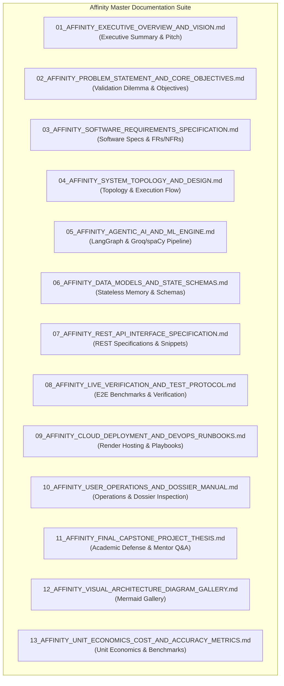

# Affinity Technical Documentation Hub & Master Index
**System Name:** Affinity — AI-Based Startup Idea Validator with Market Analysis Assistance  
**Documentation Version:** 2.0 · September 2026 (Milestones 1 & 2 Complete)  
**Verification Status:** Verified & Operational  

---

## 📑 Master Documentation Index

Welcome to the central documentation hub for **Affinity**. Every document in this directory is kept in sync with active production implementation in the codebase.

---

## 📚 Core Documentation Modules

| # | Document | Target Audience | Primary Focus |
|---|---|---|---|
| **01** | [`01_AFFINITY_EXECUTIVE_OVERVIEW_AND_VISION.md`](01_AFFINITY_EXECUTIVE_OVERVIEW_AND_VISION.md) | Executive / All | Core mission, value proposition, key stakeholders, and system highlights. |
| **02** | [`02_AFFINITY_PROBLEM_STATEMENT_AND_CORE_OBJECTIVES.md`](02_AFFINITY_PROBLEM_STATEMENT_AND_CORE_OBJECTIVES.md) | Evaluators / Mentors | Founder validation dilemma, market risks, research questions (RQs), and KPIs. |
| **03** | [`03_AFFINITY_SOFTWARE_REQUIREMENTS_SPECIFICATION.md`](03_AFFINITY_SOFTWARE_REQUIREMENTS_SPECIFICATION.md) | Software Engineers | Functional requirements (FR-01 to FR-10), NFRs, user stories, boundary contracts. |
| **04** | [`04_AFFINITY_SYSTEM_TOPOLOGY_AND_DESIGN.md`](04_AFFINITY_SYSTEM_TOPOLOGY_AND_DESIGN.md) | System Architects | 4-tier topology (React UI, FastAPI Gateway, LangGraph, Cloud AI), sequence diagrams. |
| **05** | [`05_AFFINITY_AGENTIC_AI_AND_ML_ENGINE.md`](05_AFFINITY_AGENTIC_AI_AND_ML_ENGINE.md) | AI Engineers | Hybrid LLM + spaCy NER architecture, Groq model failover chain, token tuning. |
| **06** | [`06_AFFINITY_DATA_MODELS_AND_STATE_SCHEMAS.md`](06_AFFINITY_DATA_MODELS_AND_STATE_SCHEMAS.md) | Backend Engineers | Stateless data lifecycle, Pydantic contracts, SHA-256 30-min volatile caching. |
| **07** | [`07_AFFINITY_REST_API_INTERFACE_SPECIFICATION.md`](07_AFFINITY_REST_API_INTERFACE_SPECIFICATION.md) | Developers | OpenAPI REST endpoints (`/validate`, `/health`), partial failure contracts, code snippets. |
| **08** | [`08_AFFINITY_LIVE_VERIFICATION_AND_TEST_PROTOCOL.md`](08_AFFINITY_LIVE_VERIFICATION_AND_TEST_PROTOCOL.md) | QA / Mentors | 7-industry E2E live verification, forced error-state isolation suite, 16/16 test suite. |
| **09** | [`09_AFFINITY_CLOUD_DEPLOYMENT_AND_DEVOPS_RUNBOOKS.md`](09_AFFINITY_CLOUD_DEPLOYMENT_AND_DEVOPS_RUNBOOKS.md) | DevOps Engineers | Render deployment (`render.yaml`), environment variables, 5 incident playbooks. |
| **10** | [`10_AFFINITY_USER_OPERATIONS_AND_DOSSIER_MANUAL.md`](10_AFFINITY_USER_OPERATIONS_AND_DOSSIER_MANUAL.md) | End Users / Founders | Step-by-step UI walkthrough, pitch phrasing tips, dossier interpretation, troubleshooting. |
| **11** | [`11_AFFINITY_FINAL_CAPSTONE_PROJECT_THESIS.md`](11_AFFINITY_FINAL_CAPSTONE_PROJECT_THESIS.md) | Viva Committees | Capstone academic report, methodology, novelty, team roles, and 7 mentor Q&As. |
| **12** | [`12_AFFINITY_VISUAL_ARCHITECTURE_DIAGRAM_GALLERY.md`](12_AFFINITY_VISUAL_ARCHITECTURE_DIAGRAM_GALLERY.md) | Technical Reviewers | Complete gallery of 8 GFM-compliant Mermaid diagrams. |
| **13** | [`13_AFFINITY_UNIT_ECONOMICS_COST_AND_ACCURACY_METRICS.md`](13_AFFINITY_UNIT_ECONOMICS_COST_AND_ACCURACY_METRICS.md) | Technical Lead | Unit economics ($0.00067 paid / $0.00 free), latency breakdown (~10.2s), token metrics. |
| **14** | [`14_AFFINITY_COMPETITOR_GRID_AND_POSITIONING_PARSER.md`](14_AFFINITY_COMPETITOR_GRID_AND_POSITIONING_PARSER.md) | AI / Product | spaCy NER entity discovery, product context checks (`_has_product_context`), 3x3 grid algorithm. |
| **15** | [`15_AFFINITY_OPPORTUNITY_SCORE_MATHEMATICAL_MODEL.md`](15_AFFINITY_OPPORTUNITY_SCORE_MATHEMATICAL_MODEL.md) | Data Engineers | Opportunity Score mathematical derivation ($\text{Score} = \text{Clamp}(50 + S_{\text{mkt}} + S_{\text{growth}} - S_{\text{den}} + S_{\text{gaps}})$, 0-100 bounds). |
| **16** | [`16_AFFINITY_SEARCH_RETRIEVAL_AND_DOMAIN_FILTER.md`](16_AFFINITY_SEARCH_RETRIEVAL_AND_DOMAIN_FILTER.md) | Backend Engineers | 5-angle query expansion, domain exclusion (`_EXCLUDED_DOMAINS`), zero-cost search fallback chain. |
| **17** | [`17_AFFINITY_MILESTONE_3_4_TECHNICAL_ROADMAP.md`](17_AFFINITY_MILESTONE_3_4_TECHNICAL_ROADMAP.md) | Product / DevOps | Technical spec for Milestones 3 & 4 (PDF export, comparison matrix, user accounts, webhooks). |
| **18** | [`18_AFFINITY_ACADEMIC_VIVA_SLIDE_DECK_OUTLINE.md`](18_AFFINITY_ACADEMIC_VIVA_SLIDE_DECK_OUTLINE.md) | Presenters / Evaluators | 15-slide presentation deck outline, speaker notes, and capstone defense Q&A. |
| **19** | [`19_AFFINITY_MILESTONE_3_POSTGRESQL_AUTH_AND_DATA_PERSISTENCE.md`](19_AFFINITY_MILESTONE_3_POSTGRESQL_AUTH_AND_DATA_PERSISTENCE.md) | Database / Security | Milestone 3 PostgreSQL ER schema, JWT token authentication lifecycle, zero-trust RBAC. |
| **20** | [`20_AFFINITY_MILESTONE_3_PDF_DOSSIER_EXPORTER_AND_REPORTS.md`](20_AFFINITY_MILESTONE_3_PDF_DOSSIER_EXPORTER_AND_REPORTS.md) | Frontend / ReportLab | Milestone 3 ReportLab / Playwright PDF report compilation engine & API contracts. |
| **21** | [`21_AFFINITY_MILESTONE_3_DEAL_SCREENING_AND_COMPARISON_MATRIX.md`](21_AFFINITY_MILESTONE_3_DEAL_SCREENING_AND_COMPARISON_MATRIX.md) | Investors / Analysts | Milestone 3 side-by-side deal screening, multi-idea candidate comparison matrix API. |

---

## 🛠️ Specialized Technical References

In addition to the 21 numbered modules above, the following detailed reference specifications are maintained in this directory:

- [`architecture.md`](architecture.md) — Technical system specification & data contracts.
- [`prompt-engineering-agent-design.md`](prompt-engineering-agent-design.md) — Deep dive into LLM prompt engineering, `reasoning_effort` tuning, and JSON repair.
- [`security-privacy-ethics.md`](security-privacy-ethics.md) — Information security, cryptographic caching, and AI hallucination safeguards.
- [`api-reference.md`](api-reference.md) — OpenAPI specs and TypeScript response interface contracts.
- [`product-strategy-and-personas.md`](product-strategy-and-personas.md) — Detailed persona profiles, JTBD framework, and GTM strategy.
- [`ops-runbook-troubleshooting.md`](ops-runbook-troubleshooting.md) — Operational incident playbooks and diagnostic commands.
- [`milestone2-verification.md`](milestone2-verification.md) — Live empirical verification log across 7 distinct startup domains.
- [`milestone2-status.md`](milestone2-status.md) — Milestone 2 task tracking and timeline.
- [`milestone1-plan.md`](milestone1-plan.md), [`milestone2-plan.md`](milestone2-plan.md), [`milestone3-plan.md`](milestone3-plan.md), [`milestone4-plan.md`](milestone4-plan.md) — Historical and future milestone engineering plans.
