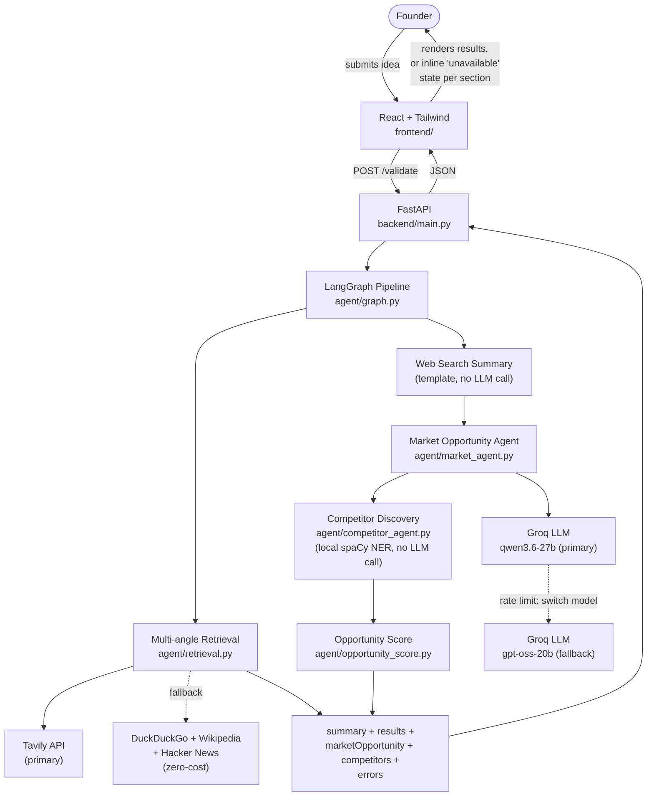
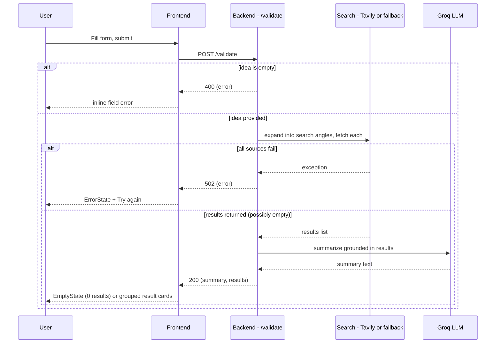

# System Architecture — Milestone 1 & 2

Owner: Yasaswini · Status: Milestone 1 & 2 complete (updated Sep 6, 2026)

## 1. System Overview

The system has four pieces:

1. **Frontend** — React + Tailwind app. Renders the idea submission form and displays
   validation results.
2. **Backend API** — a small FastAPI service exposing `POST /validate`. Receives the
   submitted idea, runs it through the agent pipeline, and returns a shaped response.
3. **Web Search step** (Milestone 1) — a Python module that searches the web (Tavily
   when configured, otherwise DuckDuckGo/Wikipedia/Hacker News as a free fallback) for
   market/competitor information related to the submitted idea, then builds a summary
   directly from those results via a plain template - no LLM call (see §7).
4. **Market Opportunity Agent & Competitor Discovery step** (Milestone 2) — run after
   the Web Search step, consuming its real results (context passing). Market
   Opportunity is an LLM agent producing structured market analysis; Competitor
   Discovery is a **local, non-LLM** step (spaCy NER over the same results, see §2) —
   a deliberate design choice, not a fallback, made to keep the shared Groq quota free
   for the one agent that actually needs open-ended reasoning.
5. **Opportunity Score node** (Milestone 2 stretch) — a post-processing step that
   combines the Market Opportunity and Competitor Discovery outputs (falling back to
   raw search-result signal if both upstream agents failed) into a single 0–100 score.

Flow at a glance:



`market_opportunity` is the only node that calls the reasoning LLM at all (`web_search`
and `competitor_discovery` were both cut over to zero-cost, zero-API local logic — see
§2). It catches its own failure: a Groq rate-limit switches immediately to the next
model in the fallback chain (see §7), and if every model fails, `marketOpportunity`
comes back `null` with an `errors.marketOpportunity` message instead of crashing the
whole request — the other sections still render normally. `competitor_discovery` has
no LLM call to fail this way; an empty `competitors: []` there is a genuine "none
found in the sources" outcome, not a failure.

The frontend never talks to the search sources directly — it only ever calls our own
backend. This gives us one place to shape/validate responses before they reach the UI.

## 2. Agent Breakdown

The pipeline is orchestrated by a **LangGraph** `StateGraph`; not every node is an LLM
agent. Market Opportunity is a **CrewAI** crew (agent + task, no tools). Competitor
Discovery used to be a CrewAI crew too, but was rewritten to a pure local step (spaCy
NER, no LLM call at all — see below) once it became clear that task didn't need
open-ended reasoning, just reliably reading company names off a page, and every LLM
call it made was one the Market Opportunity agent might need instead from the same
shared Groq quota. New Milestone 3+ agents are still added as new graph nodes without
restructuring the backend either way — a node just isn't required to wrap a crew.

Market Opportunity doesn't use CrewAI's `output_pydantic`/function-calling for
structured output — that proved unreliable with our tested Groq model (repeated
"tool_use_failed" errors, then silent fallback to garbage text). Instead its task asks
for plain JSON in its answer, which we parse ourselves via balanced-brace scanning
(finds a valid JSON object even if the model rambles through a scratchpad first) and
validate against a strict shape before trusting it — falling back to a safe default
otherwise. See `agent/output_guard.py`'s `strip_reasoning()`, used by the Market
Opportunity agent before its own JSON-shape validation. Competitor Discovery has no
LLM output to strip or validate this way — its output is deterministic given the same
search results.

### Web Search Step (Milestone 1)

- **Input**: `{ idea, targetCustomer, problem }` from the submitted form
- **Not a CrewAI agent** — no LLM call at all. `agent/retrieval.py` expands the idea
  into 5 search angles (market size & trends, competitors, industry news, customer
  demand, how others solve this problem — see diagram below), fetches up to 8 results
  per angle, drops academic/research-paper domains (arXiv, ResearchGate, IEEE, etc. —
  not useful signal for a founder), dedupes by URL, and ranks the rest — all directly
  in code. The summary is then built from those same results by a plain template
  (`graph.py`'s `_build_summary`), not generated by an LLM.
  This used to be a CrewAI crew that asked an LLM to paraphrase the results into a
  short summary, but that call was cut entirely: it was rejected by the reasoning-leak
  quality gate often enough that the deterministic template was already producing the
  actual summary most of the time, so making it the only path removes an LLM call
  (roughly a third of the pipeline's Groq usage) for no loss in what users actually saw.
- **LangGraph node**: `web_search`
- **Output**: `{ summary, results[] }` where `results` is
  `{ title, snippet, url, query, score }[]` — `query` is which search angle surfaced
  that result, `score` is a computed relevance score (word-overlap between the query
  and the result's text, since these free sources don't provide their own ranking)


### Market Opportunity & Customer Segmentation Agent (Milestone 2)

- **Input**: the Web Search step's real results (context passing — no re-searching)
- **CrewAI role**: "Market Opportunity & Customer Segmentation Analyst" — no tools,
  reasons only over the search results given to it
- **LangGraph node**: `market_opportunity` — runs after `web_search`
- **Output**: `{ marketSize, trends[], segments[], opportunityScore }` where each
  `segments[]` entry is `{ segment, painPoints, motivations, buyingBehavior }` — all
  four fields required per segment (not just a segment label), per the Milestone 2
  guide's requirement to surface pain points, motivations, and buying behavior, not
  just customer types. `opportunityScore` is a Milestone-2-stretch stub (`0` for now).

### Competitor Discovery (Milestone 2) — local NER, not an LLM agent

- **Input**: the Web Search step's real results (same context-passing pattern)
- **Not a CrewAI agent, no LLM call, no API dependency** — by explicit decision, not
  as a fallback. Every LLM call on the shared Groq key is a call the Market
  Opportunity agent might need instead, and this task (recognizing which capitalized
  phrases in real search snippets are company names) doesn't need open-ended
  reasoning — it needs to reliably read names off a page, which local Named Entity
  Recognition (spaCy's `en_core_web_sm`) does well for zero API cost, zero rate
  limit, and zero latency variance.
- **LangGraph node**: `competitor_discovery` — runs after `market_opportunity`, last
  in the current chain (kept in the same position even though it no longer depends on
  Market Opportunity's output, to minimize churn in the graph wiring)
- **How it works** (`agent/competitor_agent.py`): runs spaCy NER over the
  "Competitors"-angle search results, keeping an `ORG` entity only if it's camelCase
  (a strong, count-independent signal — `HelloFresh`, `QuickBooks`) or mentioned 2+
  times across those results, after filtering out generic/listicle words (`"best"`,
  `"bank"`, `"ratings"`, etc.) and near-duplicate substrings. A scraped snippet's
  embedded newlines are given their own sentence boundary (joined with `". "`, not a
  plain space) before parsing — comparison-table/listicle pages (a "best budgeting
  apps" roundup) scrape into one fact per line, and naively squashing those into a
  single line let spaCy merge unrelated adjacent lines into one garbled entity,
  which both produced garbage and lost the real competitors buried in it. A
  camelCase-segment-repeat check catches a related merge artifact (`"CostCost"`).
- **Output**: `{ competitors[] }` where each entry is
  `{ name, offering, url, gap, estimatedPrice, featureBreadth }` — `url` is copied
  from the actual source it was found in (not invented), `offering` is that source's
  snippet (normalized to a single line), `gap` is an honest generic disclosure rather
  than a genuine comparative judgment (NER can't reason about the startup idea the
  way an LLM's `gap` field used to), and `estimatedPrice`/`featureBreadth` are always
  `"unknown"` for the same reason — the frontend already hides badges and the
  positioning grid for `"unknown"` values, so this degrades cleanly instead of
  showing fabricated categories. An empty `competitors: []` is a genuine "the sources
  didn't name an identifiable company" outcome, not a failure — see §4.

### Opportunity Score (Milestone 2 stretch)

- **Input**: the Market Opportunity and Competitor Discovery outputs, plus the raw
  search results as a grounded fallback signal
- **Not a CrewAI agent** — a plain post-processing function
  (`agent/opportunity_score.py`), run as the last LangGraph node (`opportunity_score`),
  since it's a deterministic weighted formula over data the two agents already
  produced, not something that needs its own LLM call
- **Output**: a single `opportunityScore` (0–100) written into `marketOpportunity`. If
  both upstream agents failed, it falls back to a signal computed from raw search-result
  count/relevance (capped at 50, since it's a weaker signal than real agent analysis) —
  see `agent/docs/opportunity-score-edge-cases.md` for the documented edge cases

### Confidence Indicator — not yet built

The Milestone 2 plan's third stretch feature (a "3 of 5 sources agree" indicator
aggregating per-source relevance from `retrieval.py`) has no corresponding code yet —
no `confidence.py` module, and no `confidence` field in the API contract below. Flagging
this explicitly since the contract in `docs/milestone2-plan.md` describes it as an
already-planned field.

**Future extension point (Milestone 3+):** SWOT/Risk, MVP Recommendation, GTM, and
Report Generation agents each become a new CrewAI crew wrapped in a new LangGraph node,
wired into the same graph with `add_edge`. LangGraph's state dict carries each stage's
output forward so later agents can consume earlier agents' results (context passing),
and partial failures are handled per-node rather than crashing the whole pipeline.

## 3. Data Flow

1. User fills in idea / target customer / problem and submits the form
2. Frontend sends `POST /validate` with the form data
3. Backend validates input (idea field required, non-empty)
   - If invalid → return `400` with `{ error: "..." }`, frontend shows inline field error
4. Backend calls the Search Agent, which expands the idea into several search angles
   and queries Tavily per angle (falling back to DuckDuckGo/Wikipedia/Hacker News per
   angle if Tavily isn't configured or fails)
   - If every source fails for every angle → backend returns `502` with
     `{ error: "..." }`, frontend shows an `ErrorState` ("couldn't fetch results, try
     again")
   - If search returns zero results → backend returns `200` with `{ summary: "...",
     results: [] }`, frontend shows an `EmptyState` ("no market data found for this
     idea")
5. The Market Opportunity Agent runs next, reasoning over the same real results —
   never re-searches, never runs at all if the web search step itself failed entirely
   (see node code: `if state.get("error"): return state`). If its own LLM call fails
   (after one rate-limit retry — see §7), `marketOpportunity` comes back `null` and
   `errors.marketOpportunity` is set; the pipeline still continues.
6. Competitor Discovery runs next — local NER, no LLM call, so it has nothing to rate-
   limit or fail on for this reason; it always returns `{ competitors: [...] }`
   (possibly empty), independent of whether the Market Opportunity node succeeded
7. The Opportunity Score node runs last, combining whatever the two agents above
   actually produced (or falling back to raw search signal if both failed)
8. Backend shapes the combined response into the shared contract and returns `200`
   (a `200` even with one or both of `marketOpportunity`/`competitors` `null` — only a
   failure in step 4, the web search step itself, returns a non-200)
9. Frontend renders the summary, market opportunity, competitor analysis (including the
   price/feature-breadth positioning grid), and grouped result cards — any section whose
   value is `null` renders its own inline "this analysis wasn't available" message
   instead of an error or a blank gap



## 4. API Contract

```
POST /validate
Content-Type: application/json

Request:
{
  "idea": string,            // required, non-empty
  "targetCustomer": string,  // optional
  "problem": string          // optional
}

Response 200:
{
  "summary": string,
  "results": [
    { "title": string, "snippet": string, "url": string, "query": string, "angle": string, "score": number }
  ],
  "marketOpportunity": {
    "marketSize": string,
    "trends": [string],
    "segments": [
      { "segment": string, "painPoints": string, "motivations": string, "buyingBehavior": string }
    ],
    "opportunityScore": number   // 0-100, computed by agent/opportunity_score.py
  } | null,   // null if the market_opportunity node failed (see errors.marketOpportunity)
  "competitors": {
    "competitors": [
      {
        "name": string,
        "offering": string,
        "url": string,
        "gap": string,
        "estimatedPrice": "low" | "mid" | "high" | "unknown",
        "featureBreadth": "narrow" | "moderate" | "broad" | "unknown"
      }
    ]
  } | null,   // null only on an unexpected exception (see errors.competitors) - no LLM
              // call here to rate-limit or fail, so this is rare in practice
  "errors": {
    "marketOpportunity": string | null,
    "competitors": string | null
  }
}

Response 400 / 502:
{
  "error": string
}
```

`marketOpportunity` is `null` (not an object) when its LLM call fails outright (after
the whole model fallback chain in §7 is exhausted) or its output can't be validated —
`errors.marketOpportunity` carries the failure message in that case. `competitors` has
no LLM call to fail this way, so it's `null` only on an unexpected exception in the NER
step itself. The frontend shows an inline "this analysis wasn't available" state for that
section rather than an error or a blank gap, since the summary + real search results
are still valid and shown regardless. A `competitors: { competitors: [] }` (empty
array, not `null`) is a different, valid outcome — the node ran successfully and
genuinely found no competitors in the sources; the frontend distinguishes the two.

This contract is locked for Milestone 1/2 — Sashi (competitor agent), Yalene
(orchestration), and Anu Kumari (frontend) should build against this without needing to
sync on every field.

## 5. Tech Stack Decisions

| Layer | Choice | Why |
|---|---|---|
| Frontend | React (Vite) + Tailwind CSS | Team wants a premium, polished UI — faster to achieve with component reuse + utility classes than hand-rolled CSS. **Note:** this deviates from the milestone guide's plain HTML/CSS/JS wording; flagging that explicitly since it's a deliberate call. |
| Backend | FastAPI | Lightweight, async-friendly, minimal boilerplate for a single endpoint, easy to extend with more agents later. |
| Orchestration | LangGraph | Owns pipeline state and node wiring — each agent is a graph node, so M2-M4 agents are added without restructuring the backend. |
| Agents | CrewAI | Role/goal-based agent definitions. Only 1 LLM agent left: Market Opportunity, taking real data as context rather than using a tool (tool-calling proved to be the source of the reasoning-leak bug). Both the Web Search step and Competitor Discovery used to be CrewAI agents too, but their LLM calls were cut entirely - see Reasoning LLM below and the Competitor Discovery section in §2. |
| Search | Tavily API (primary), DuckDuckGo + Wikipedia + Hacker News (fallback chain) | Tavily gives a real, trained relevance score and reliable results — used whenever `TAVILY_API_KEY` is set. If it's missing or fails, the app falls back to the zero-cost chain (own computed relevance score) instead of erroring out. Tried DuckDuckGo as sole primary first, but its unofficial scraping library proved too flaky (empty or irrelevant results, inconsistent run to run) to trust for a live demo. Academic/research-paper domains are filtered out per mentor guidance — they read as literature review material, not market/competitor signal. |
| Competitor identification | Local NER (spaCy `en_core_web_sm`), not an LLM call | Reads competitor names directly off the already-fetched search results instead of asking an LLM to identify them - zero API cost, zero rate limit, frees the entire shared Groq quota for Market Opportunity instead of splitting it across two agents. The trade is an honest one: `gap`/`estimatedPrice`/`featureBreadth` can't be genuine reasoning over the idea the way an LLM's would be, so they're generic/`"unknown"` and labeled as such rather than fabricated. See the Competitor Discovery section in §2 for how snippet text is normalized before NER to avoid comparison-table pages producing garbled entities. |
| Reasoning LLM | Groq (via CrewAI/LiteLLM), three models on the same account — primary + a 2-tier same-provider fallback chain | Primary `groq/qwen/qwen3.6-27b`, fallbacks `groq/openai/gpt-oss-20b` then `groq/openai/gpt-oss-120b`, all configurable via `LLM_MODEL`/`LLM_FALLBACK_MODELS` (comma-separated) + one `GROQ_API_KEY`. Groq rate-limits per model, not per account (confirmed via `GET /openai/v1/models` and a direct latency test on all three) — so on a rate limit, `agent/llm.py`'s `kickoff_with_fallback()` switches to the next model immediately (no wait, it's a separate quota bucket) instead of retrying the same exhausted one; only once every model in the chain has been rate limited does it fall back to waiting out the last one's suggested cooldown (capped at 30s) — see Error Handling Policy. Each model is also given its own confirmed-working `reasoning_effort` value (`agent/llm.py`'s `_REASONING_EFFORT` map) - by default `qwen3.6-27b` reserves an output-token budget for hidden `<think>` reasoning that alone exceeded Groq's ~1000 output-tokens-per-minute cap, the actual cause of most "Request too large" failures; setting `reasoning_effort="none"` (or `"low"` for the gpt-oss fallbacks, which reject `"none"`) eliminates that wasted scratchpad entirely, confirmed directly against the live API. A cross-*provider* fallback to Google Gemini (using the key already in `.env`) was tried and reverted: message-format incompatibilities with our pinned LiteLLM version, then confirmed by direct testing to hang for minutes past its own `timeout` parameter before ever raising — worse than the existing static fallback content, so dropped in favor of the same-provider approach above. Only the Market Opportunity agent calls this now - the Web Search summary's LLM call was cut entirely, and Competitor Discovery was rewritten off the LLM path too (see above), since the deterministic/local alternative was already producing the actual output most of the time at zero quota cost. The model also occasionally leaks raw ReAct-style reasoning text into its answer, so Market Opportunity's output is validated before use. |
| Request caching & submit cooldown | In-memory cache (`backend/main.py`) + a client-side submit cooldown (`frontend/src/App.jsx`) | The cache keys on normalized `idea`/`targetCustomer`/`problem` with a 30-minute TTL, and only caches responses with no `errors` set — a partial-failure response is never cached, so a retry after a transient rate limit isn't stuck replaying the failure. The frontend also disables the submit button for 5 seconds after a submission to reduce accidental duplicate requests against the shared quota. Both are quota-pressure mitigations layered on top of the reasoning_effort fix and the NER rewrite above, not fixes for a fully exhausted team-wide quota by themselves. |
| Product UI | No framework/provider names shown | Per mentor guidance, the UI doesn't surface "CrewAI," "Groq," "Tavily," etc. anywhere — footer/status text describes capability generically ("Multi-agent Pipeline," "Live Web Search") instead of naming the underlying tech. |
| Hosting | Render | Already set up for this repo (see `render.yaml`). |

## 6. Deployment Topology

Two Render web services:

- **`startup-validator-frontend`** — serves the built React app (static site or Node
  web service)
- **`startup-validator-backend`** — runs the FastAPI service; holds `GROQ_API_KEY`
  (required) and `TAVILY_API_KEY` (optional — falls back to free search if unset) as
  Render environment variables (never committed to the repo)

Frontend reads the backend's URL via `VITE_API_URL` (env var, set per environment —
local vs. deployed).

## 7. Error Handling Policy

- Backend never lets a raw exception/stack trace reach the frontend — every failure path
  returns `{ error: string }` with an appropriate status code
- Frontend never shows a blank or frozen screen on failure — every failed/empty state
  renders a specific `ErrorState` or `EmptyState` component with a human-readable message
- Timeouts: each search source call uses a short timeout (5s) so one slow/unreachable
  source doesn't hang the whole request — the pipeline just moves to the next fallback
- Web Search summary: built by a plain template over the retrieved results (see §2) -
  no LLM call, so there's nothing to quality-gate here anymore. The M2 agents below are
  now the only place a reasoning-leak check matters.
- Market Opportunity validates its JSON shape after balanced-brace extraction: if it
  parses to valid JSON with every required field of the right type, it's used
  regardless of any scratchpad rambling around it (past `strip_reasoning()` - see
  `agent/output_guard.py`); otherwise the node fails and reports through
  `errors.marketOpportunity` rather than trusting malformed output. Competitor
  Discovery has no LLM output to validate this way - its own filtering (camelCase/
  mention-count heuristics, generic-word denylist, snippet-line normalization - see
  §2) happens before a name is ever kept, not after the fact.
- LLM rate-limit fallback: Market Opportunity (the only remaining crew) goes through
  `agent/llm.py`'s `kickoff_with_fallback()`, which builds and runs the crew against
  the primary Groq model and, on a rate limit, immediately rebuilds it against the
  next model in the fallback chain instead of waiting — a separate quota bucket on the
  same account (see Tech Stack Decisions). Only once every model in the chain has been
  rate limited does it wait out the last one's suggested cooldown (capped at 30s) for
  one final try. A non-rate-limit exception, or a failure after every model and the
  final retry, is re-raised immediately and handled by that node's own try/except (see
  below) — it does not retry indefinitely and does not fall back to a different LLM
  *provider* (see Tech Stack Decisions for why)
- Node-level partial-failure isolation: `market_opportunity_node` catches its own
  exceptions. A failure sets `marketOpportunity` to `null` and populates
  `errors.marketOpportunity`, but does not prevent `competitor_discovery_node` (which
  has nothing shared to fail on - no LLM call) or the rest of the response from
  succeeding — only a failure in the `web_search` node itself (no results to reason
  over at all) short-circuits the whole pipeline to a `502`
- Request caching (`backend/main.py`) and a frontend submit cooldown further reduce
  quota pressure by cutting down on redundant/accidental-duplicate calls - see Tech
  Stack Decisions above for details. Neither one is a correctness mechanism; both are
  purely about not wasting the shared Groq quota on repeat requests.

## 8. Repo Structure

```
.
├── frontend/          # React + Tailwind app (Anu Kumari)
│   └── ...
├── backend/           # FastAPI app + agent pipeline
│   ├── main.py         # POST /validate route + in-memory request cache
│   └── agent/
│       ├── graph.py            # LangGraph pipeline: state + node wiring; Web Search summary is a template here (Milestone 1), no LLM call
│       ├── market_agent.py      # Market Opportunity Agent (Milestone 2) - the only remaining LLM agent
│       ├── competitor_agent.py  # Competitor Discovery (Milestone 2) - local spaCy NER, no LLM call
│       ├── opportunity_score.py # Opportunity Score post-processing node (Milestone 2 stretch)
│       ├── output_guard.py      # reasoning-leak stripping used by the Market Opportunity agent
│       ├── retrieval.py         # multi-angle query expansion + dedup
│       ├── tools.py             # Tavily (primary) + DuckDuckGo/Wikipedia/Hacker News fallback
│       └── llm.py               # reasoning LLM selection (incl. per-model reasoning_effort) + same-provider rate-limit fallback (kickoff_with_fallback)
├── docs/
│   ├── architecture.md        # this file
│   ├── milestone1-plan.md
│   └── frontend-spec.md
├── render.yaml         # updated for two services (Yalene)
└── README.md
```

The existing root-level `app.py` (Streamlit prototype) stays as-is for reference but is
superseded by `frontend/` + `backend/` going forward.
