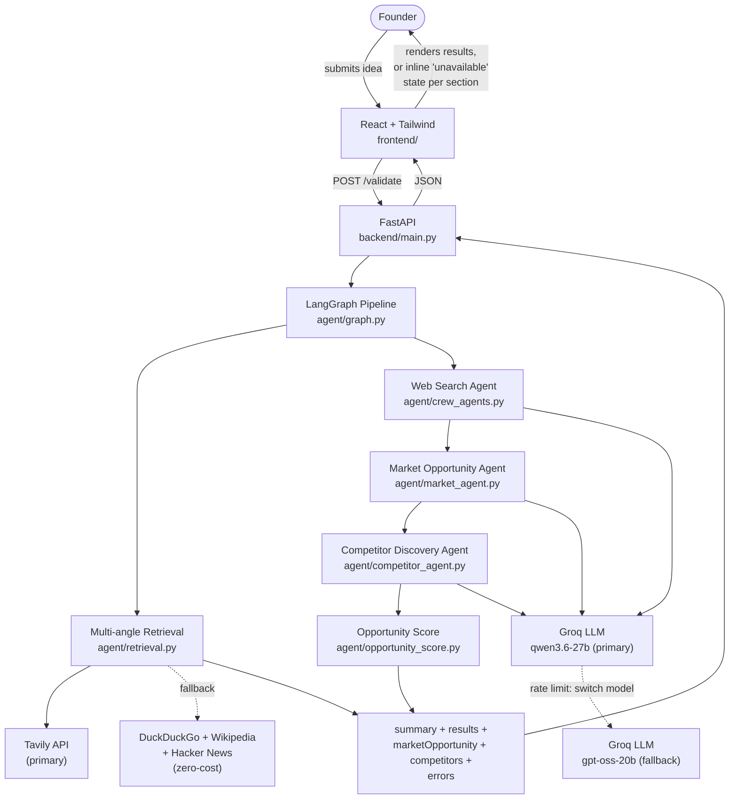
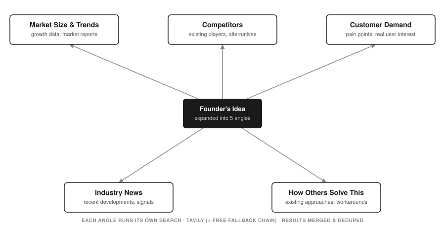
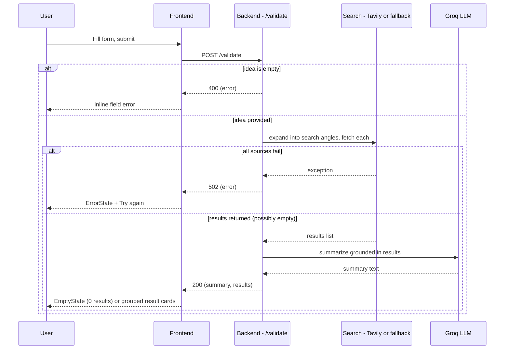

# System Architecture — Milestone 1 & 2

Owner: Yasaswini · Status: Milestone 1 complete, Milestone 2 in progress (updated Sep 3, 2026)

## 1. System Overview

The system has four pieces:

1. **Frontend** — React + Tailwind app. Renders the idea submission form and displays
   validation results.
2. **Backend API** — a small FastAPI service exposing `POST /validate`. Receives the
   submitted idea, runs it through the agent pipeline, and returns a shaped response.
3. **Web Search Agent** (Milestone 1) — a Python module that searches the web (Tavily
   when configured, otherwise DuckDuckGo/Wikipedia/Hacker News as a free fallback) for
   market/competitor information related to the submitted idea.
4. **Market Opportunity & Competitor Discovery Agents** (Milestone 2) — two more agents
   that run after the Web Search Agent, reasoning over its real results (context
   passing) to produce structured market analysis and competitor comparison.
5. **Opportunity Score node** (Milestone 2 stretch) — a post-processing step that
   combines the Market Opportunity and Competitor Discovery outputs (falling back to
   raw search-result signal if both upstream agents failed) into a single 0–100 score.

Flow at a glance:



Each of the three LLM-calling nodes (`web_search`, `market_opportunity`,
`competitor_discovery`) catches its own failures independently: a Groq rate-limit is
retried once using the wait time Groq itself reports (see §7), and if the node still
fails, that section comes back `null` with an `errors.<node>` message instead of
crashing the whole request — the other sections still render normally.

The frontend never talks to the search sources directly — it only ever calls our own
backend. This gives us one place to shape/validate responses before they reach the UI.

## 2. Agent Breakdown

Agents are built with **CrewAI** and orchestrated by a **LangGraph** `StateGraph`. Each
pipeline stage is one LangGraph node wrapping one CrewAI crew (agent + task, no tools
for the M2 agents — see below). This was deliberate from Milestone 1 even with only
one agent: it means Milestone 2+ agents are added as new graph nodes without
restructuring the backend, which is exactly what happened.

None of the M2 agents use CrewAI's `output_pydantic`/function-calling for structured
output — that proved unreliable with our tested Groq model (repeated "tool_use_failed"
errors, then silent fallback to garbage text). Instead every agent's task asks for
plain JSON in its answer, which we parse ourselves via balanced-brace scanning (finds
a valid JSON object even if the model rambles through a scratchpad first) and validate
against a strict shape before trusting it — falling back to a safe default otherwise.
See `agent/output_guard.py` for the shared reasoning-leak detection used across agents.

### Web Search Agent (Milestone 1)

- **Input**: `{ idea, targetCustomer, problem }` from the submitted form
- **CrewAI role**: "Web Search Agent" — goal: retrieve live, relevant market/competitor
  data; tool: web search (Tavily primary, DuckDuckGo/Wikipedia/Hacker News fallback)
- **LangGraph node**: `web_search` — runs two things: (1) `agent/retrieval.py` expands
  the idea into 5 search angles (market size & trends, competitors, industry news,
  customer demand, how others solve this problem — see diagram below), fetches up to
  8 results per angle,
  drops academic/research-paper domains (arXiv, ResearchGate, IEEE, etc. — not useful
  signal for a founder), dedupes by URL, and ranks the rest — all directly in code, and
  (2) the CrewAI crew produces a short plain-text summary. Results never pass through
  the LLM, so they can't be paraphrased or invented — only the summary paragraph is
  LLM-generated, and even that goes through a quality gate (see Error Handling Policy)
  before it's trusted.
- **Output**: `{ summary, results[] }` where `results` is
  `{ title, snippet, url, query, score }[]` — `query` is which search angle surfaced
  that result, `score` is a computed relevance score (word-overlap between the query
  and the result's text, since these free sources don't provide their own ranking)



### Market Opportunity & Customer Segmentation Agent (Milestone 2)

- **Input**: the Web Search Agent's real results (context passing — no re-searching)
- **CrewAI role**: "Market Opportunity & Customer Segmentation Analyst" — no tools,
  reasons only over the search results given to it
- **LangGraph node**: `market_opportunity` — runs after `web_search`
- **Output**: `{ marketSize, trends[], segments[], opportunityScore }` where each
  `segments[]` entry is `{ segment, painPoints, motivations, buyingBehavior }` — all
  four fields required per segment (not just a segment label), per the Milestone 2
  guide's requirement to surface pain points, motivations, and buying behavior, not
  just customer types. `opportunityScore` is a Milestone-2-stretch stub (`0` for now).

### Competitor Discovery & Comparison Agent (Milestone 2)

- **Input**: the Web Search Agent's real results (same context-passing pattern)
- **CrewAI role**: "Competitor Discovery & Comparison Analyst" — no tools, identifies
  competitors that actually appear in the given sources rather than inventing names
- **LangGraph node**: `competitor_discovery` — runs after `market_opportunity`, last
  in the current chain
- **Output**: `{ competitors[] }` where each entry is
  `{ name, offering, url, gap, estimatedPrice, featureBreadth }` — `url` is copied
  from the actual source it was found in (not invented), `gap` is the specific weak
  spot this competitor doesn't address, and `estimatedPrice`/`featureBreadth` are
  LLM-estimated categorical values (`"unknown"` when the sources don't support a
  guess) rather than verified data — labeled as such in the UI.

### Opportunity Score (Milestone 2 stretch)

- **Input**: the Market Opportunity and Competitor Discovery outputs, plus the raw
  search results as a grounded fallback signal
- **Not a CrewAI agent** — a plain post-processing function
  (`agent/opportunity_score.py`), run as the last LangGraph node (`opportunity_score`),
  since it's a deterministic weighted formula over data the two agents already
  produced, not something that needs its own LLM call
- **Output**: a single `opportunityScore` (0–100) written into `marketOpportunity`. If
  both upstream agents failed, it falls back to a signal computed from raw search-result
  count/relevance (capped at 50, since it's a weaker signal than real agent analysis) —
  see `agent/docs/opportunity-score-edge-cases.md` for the documented edge cases

### Confidence Indicator — not yet built

The Milestone 2 plan's third stretch feature (a "3 of 5 sources agree" indicator
aggregating per-source relevance from `retrieval.py`) has no corresponding code yet —
no `confidence.py` module, and no `confidence` field in the API contract below. Flagging
this explicitly since the contract in `docs/milestone2-plan.md` describes it as an
already-planned field.

**Future extension point (Milestone 3+):** SWOT/Risk, MVP Recommendation, GTM, and
Report Generation agents each become a new CrewAI crew wrapped in a new LangGraph node,
wired into the same graph with `add_edge`. LangGraph's state dict carries each stage's
output forward so later agents can consume earlier agents' results (context passing),
and partial failures are handled per-node rather than crashing the whole pipeline.

## 3. Data Flow

1. User fills in idea / target customer / problem and submits the form
2. Frontend sends `POST /validate` with the form data
3. Backend validates input (idea field required, non-empty)
   - If invalid → return `400` with `{ error: "..." }`, frontend shows inline field error
4. Backend calls the Search Agent, which expands the idea into several search angles
   and queries Tavily per angle (falling back to DuckDuckGo/Wikipedia/Hacker News per
   angle if Tavily isn't configured or fails)
   - If every source fails for every angle → backend returns `502` with
     `{ error: "..." }`, frontend shows an `ErrorState` ("couldn't fetch results, try
     again")
   - If search returns zero results → backend returns `200` with `{ summary: "...",
     results: [] }`, frontend shows an `EmptyState` ("no market data found for this
     idea")
5. The Market Opportunity Agent runs next, reasoning over the same real results —
   never re-searches, never runs at all if the web search step itself failed entirely
   (see node code: `if state.get("error"): return state`). If its own LLM call fails
   (after one rate-limit retry — see §7), `marketOpportunity` comes back `null` and
   `errors.marketOpportunity` is set; the pipeline still continues.
6. The Competitor Discovery Agent runs next, same failure-isolation pattern
   (`competitors: null` + `errors.competitors` on failure, independent of whether the
   Market Opportunity node succeeded)
7. The Opportunity Score node runs last, combining whatever the two agents above
   actually produced (or falling back to raw search signal if both failed)
8. Backend shapes the combined response into the shared contract and returns `200`
   (a `200` even with one or both of `marketOpportunity`/`competitors` `null` — only a
   failure in step 4, the web search step itself, returns a non-200)
9. Frontend renders the summary, market opportunity, competitor analysis (including the
   price/feature-breadth positioning grid), and grouped result cards — any section whose
   value is `null` renders its own inline "this analysis wasn't available" message
   instead of an error or a blank gap



## 4. API Contract

```
POST /validate
Content-Type: application/json

Request:
{
  "idea": string,            // required, non-empty
  "targetCustomer": string,  // optional
  "problem": string          // optional
}

Response 200:
{
  "summary": string,
  "results": [
    { "title": string, "snippet": string, "url": string, "query": string, "angle": string, "score": number }
  ],
  "marketOpportunity": {
    "marketSize": string,
    "trends": [string],
    "segments": [
      { "segment": string, "painPoints": string, "motivations": string, "buyingBehavior": string }
    ],
    "opportunityScore": number   // 0-100, computed by agent/opportunity_score.py
  } | null,   // null if the market_opportunity node failed (see errors.marketOpportunity)
  "competitors": {
    "competitors": [
      {
        "name": string,
        "offering": string,
        "url": string,
        "gap": string,
        "estimatedPrice": "low" | "mid" | "high" | "unknown",
        "featureBreadth": "narrow" | "moderate" | "broad" | "unknown"
      }
    ]
  } | null,   // null if the competitor_discovery node failed (see errors.competitors)
  "errors": {
    "marketOpportunity": string | null,
    "competitors": string | null
  }
}

Response 400 / 502:
{
  "error": string
}
```

`marketOpportunity` and `competitors` are `null` (not an object with empty arrays) when
that node's LLM call fails outright (after the rate-limit retry in §7 is exhausted) or
its output can't be validated — `errors.<node>` carries the failure message in that
case. The frontend shows an inline "this analysis wasn't available" state for that
section rather than an error or a blank gap, since the summary + real search results
are still valid and shown regardless. A `competitors: { competitors: [] }` (empty
array, not `null`) is a different, valid outcome — the node ran successfully and
genuinely found no competitors in the sources; the frontend distinguishes the two.

This contract is locked for Milestone 1/2 — Sashi (competitor agent), Yalene
(orchestration), and Anu Kumari (frontend) should build against this without needing to
sync on every field.

## 5. Tech Stack Decisions

| Layer | Choice | Why |
|---|---|---|
| Frontend | React (Vite) + Tailwind CSS | Team wants a premium, polished UI — faster to achieve with component reuse + utility classes than hand-rolled CSS. **Note:** this deviates from the milestone guide's plain HTML/CSS/JS wording; flagging that explicitly since it's a deliberate call. |
| Backend | FastAPI | Lightweight, async-friendly, minimal boilerplate for a single endpoint, easy to extend with more agents later. |
| Orchestration | LangGraph | Owns pipeline state and node wiring — each agent is a graph node, so M2-M4 agents are added without restructuring the backend. |
| Agents | CrewAI | Role/goal-based agent definitions, one Agent+Task per pipeline stage — matches the brief's named-agent structure directly. Only the Web Search Agent uses a tool; the M2 reasoning agents (Market Opportunity, Competitor Discovery) take real data as context instead, since tool-calling proved to be the source of the reasoning-leak bug. |
| Search | Tavily API (primary), DuckDuckGo + Wikipedia + Hacker News (fallback chain) | Tavily gives a real, trained relevance score and reliable results — used whenever `TAVILY_API_KEY` is set. If it's missing or fails, the app falls back to the zero-cost chain (own computed relevance score) instead of erroring out. Tried DuckDuckGo as sole primary first, but its unofficial scraping library proved too flaky (empty or irrelevant results, inconsistent run to run) to trust for a live demo. Academic/research-paper domains are filtered out per mentor guidance — they read as literature review material, not market/competitor signal. |
| Reasoning LLM | Groq (via CrewAI/LiteLLM), two models on the same account — primary + automatic same-provider fallback | Primary `groq/qwen/qwen3.6-27b`, fallback `groq/openai/gpt-oss-20b`, both configurable via `LLM_MODEL`/`LLM_FALLBACK_MODEL` + one `GROQ_API_KEY`. Groq rate-limits per model, not per account (confirmed via `GET /openai/v1/models` and a direct latency test on both) — so on a rate limit, `agent/llm.py`'s `kickoff_with_fallback()` switches to the fallback model immediately (no wait, it's a separate quota bucket) instead of retrying the same exhausted one; only if *both* are rate limited does it fall back to waiting out the last one's suggested cooldown (capped at 30s) — see Error Handling Policy. A cross-*provider* fallback to Google Gemini (using the key already in `.env`) was tried and reverted: message-format incompatibilities with our pinned LiteLLM version, then confirmed by direct testing to hang for minutes past its own `timeout` parameter before ever raising — worse than the existing static fallback content, so dropped in favor of the same-provider approach above. The model also occasionally leaks raw ReAct-style reasoning text into its answer, so the summary output is validated before use. |
| Product UI | No framework/provider names shown | Per mentor guidance, the UI doesn't surface "CrewAI," "Groq," "Tavily," etc. anywhere — footer/status text describes capability generically ("Multi-agent Pipeline," "Live Web Search") instead of naming the underlying tech. |
| Hosting | Render | Already set up for this repo (see `render.yaml`). |

## 6. Deployment Topology

Two Render web services:

- **`startup-validator-frontend`** — serves the built React app (static site or Node
  web service)
- **`startup-validator-backend`** — runs the FastAPI service; holds `GROQ_API_KEY`
  (required) and `TAVILY_API_KEY` (optional — falls back to free search if unset) as
  Render environment variables (never committed to the repo)

Frontend reads the backend's URL via `VITE_API_URL` (env var, set per environment —
local vs. deployed).

## 7. Error Handling Policy

- Backend never lets a raw exception/stack trace reach the frontend — every failure path
  returns `{ error: string }` with an appropriate status code
- Frontend never shows a blank or frozen screen on failure — every failed/empty state
  renders a specific `ErrorState` or `EmptyState` component with a human-readable message
- Timeouts: each search source call uses a short timeout (5s) so one slow/unreachable
  source doesn't hang the whole request — the pipeline just moves to the next fallback
- LLM output quality gate: the Web Search Agent's summary is rejected (and replaced
  with a clean, results-based fallback sentence) if it contains a line break, markdown
  bold/heading syntax, or telltale reasoning-leak phrases — structural checks proved
  far more robust than matching specific phrases, since the model invents new ways to
  ramble faster than a keyword list can keep up (see `agent/output_guard.py`)
- M2 agents (Market Opportunity, Competitor Discovery) don't use the same text-based
  gate — since their output must be JSON anyway, strict shape validation after
  balanced-brace extraction is a stronger and more precise check: if it parses to
  valid JSON with every required field of the right type, it's used regardless of any
  scratchpad rambling around it; otherwise it falls back to a safe default
- LLM rate-limit fallback: every crew (web search, market opportunity, competitor
  discovery) goes through `agent/llm.py`'s `kickoff_with_fallback()`, which builds and
  runs the crew against the primary Groq model and, on a rate limit, immediately
  rebuilds it against a second Groq model instead of waiting — a separate quota bucket
  on the same account (see Tech Stack Decisions). Only if that fallback model is *also*
  rate limited does it wait out its suggested cooldown (capped at 30s) for one final
  try. A non-rate-limit exception, or a failure after both models and the final retry,
  is re-raised immediately and handled by that node's own try/except (see below) — it
  does not retry indefinitely and does not fall back to a different LLM *provider* (see
  Tech Stack Decisions for why)
- Node-level partial-failure isolation: `market_opportunity_node` and
  `competitor_discovery_node` each catch their own exceptions independently. A failure
  in one sets `marketOpportunity`/`competitors` to `null` and populates
  `errors.<node>`, but does not prevent the other node (or the rest of the response)
  from succeeding — only a failure in the `web_search` node itself (no results to
  reason over at all) short-circuits the whole pipeline to a `502`

## 8. Repo Structure

```
.
├── frontend/          # React + Tailwind app (Anu Kumari)
│   └── ...
├── backend/           # FastAPI app + agent pipeline
│   ├── main.py         # POST /validate route
│   └── agent/
│       ├── graph.py            # LangGraph pipeline: state + node wiring
│       ├── crew_agents.py       # Web Search Agent (Milestone 1)
│       ├── market_agent.py      # Market Opportunity Agent (Milestone 2)
│       ├── competitor_agent.py  # Competitor Discovery Agent (Milestone 2, Sashi)
│       ├── opportunity_score.py # Opportunity Score post-processing node (Milestone 2 stretch)
│       ├── output_guard.py      # shared reasoning-leak detection
│       ├── retrieval.py         # multi-angle query expansion + dedup
│       ├── tools.py             # Tavily (primary) + DuckDuckGo/Wikipedia/Hacker News fallback
│       └── llm.py               # reasoning LLM selection + same-provider rate-limit fallback (kickoff_with_fallback)
├── docs/
│   ├── architecture.md        # this file
│   ├── milestone1-plan.md
│   └── frontend-spec.md
├── render.yaml         # updated for two services (Yalene)
└── README.md
```

The existing root-level `app.py` (Streamlit prototype) stays as-is for reference but is
superseded by `frontend/` + `backend/` going forward.
