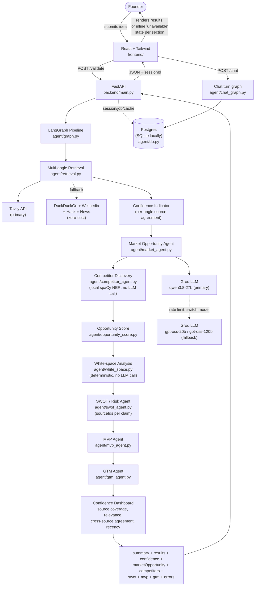
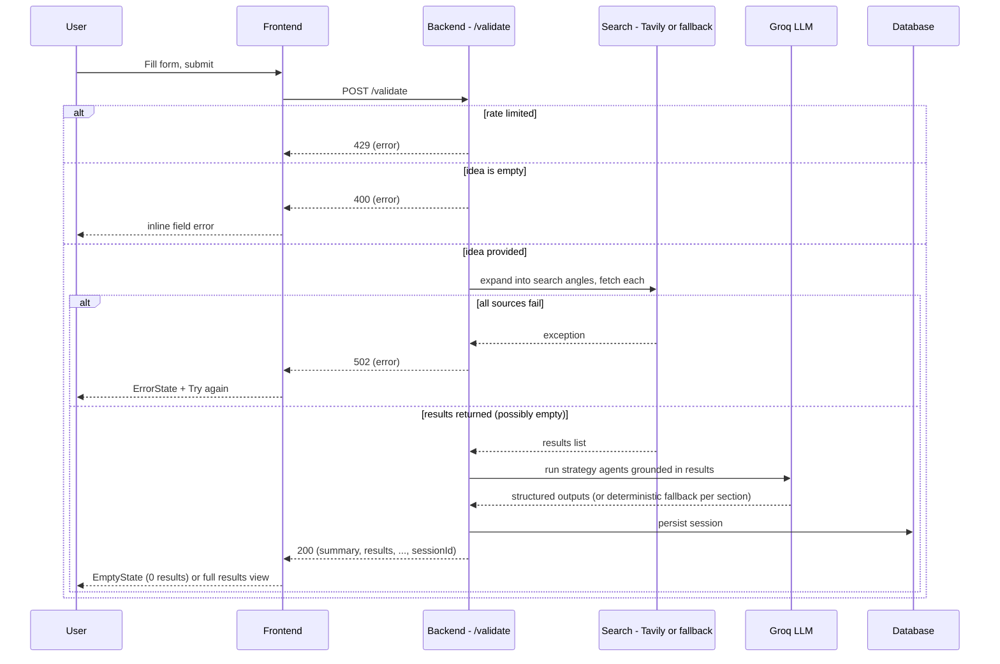

# System Architecture — Milestones 1–4

Owner: Yasaswini · Status: Milestones 1–3 complete, Milestone 4 in progress (updated Sep 19, 2026)

## 1. System Overview

The system has five pieces:

1. **Frontend** — React + Tailwind app. Renders the idea submission form, results,
   chat advisor, and report export controls.
2. **Backend API** — a FastAPI service exposing `POST /validate`, `POST /chat`,
   PDF/report export routes, and job-status polling. Rate-limited per IP and
   request-traced (see §7).
3. **Web Search step** (Milestone 1) — a Python module that searches the web (Tavily
   when configured, otherwise DuckDuckGo/Wikipedia/Hacker News as a free fallback) for
   market/competitor information related to the submitted idea, then builds a summary
   directly from those results via a plain template - no LLM call (see §7).
4. **Market/Competitor/Strategy agents** (Milestones 2–3) — Market Opportunity and the
   SWOT/MVP/GTM agents are CrewAI crews reasoning over upstream context; Competitor
   Discovery and White-space analysis are local, non-LLM steps (see §2).
5. **Database layer** (Milestone 4) — Postgres in production, SQLite locally
   (`backend/agent/db.py`), backing validation sessions, background jobs, and the
   response cache. Replaces what used to be process-local dicts that didn't survive a
   restart or work across more than one backend instance.

Flow at a glance:



`market_opportunity`, `swot_analysis`, `mvp_recommendation`, and `gtm_strategy` are the
nodes that call the reasoning LLM. Each catches its own failure: a Groq rate-limit
switches immediately to the next model in the fallback chain (see §7), and if every
model fails, that node's output comes back as a real deterministic-fallback result
(`"degraded": true`, see `agent/deterministic_fallback.py`) with the failure noted in
`errors.<section>` — never a hard crash, never a silently blank section.
`competitor_discovery` and `white_space` have no LLM call to fail this way; an empty
`competitors: []` there is a genuine "none found in the sources" outcome, not a failure.

The frontend never talks to the search sources directly — it only ever calls our own
backend. This gives us one place to shape/validate responses before they reach the UI.

## 2. Agent Breakdown

The pipeline is orchestrated by a **LangGraph** `StateGraph`; not every node is an LLM
agent. Market Opportunity, SWOT/Risk, MVP, and GTM are each a **CrewAI** crew (agent +
task, no tools). Competitor Discovery and White-space are pure local steps (spaCy NER
and deterministic post-processing respectively) — a deliberate design choice, not a
fallback, made to keep the shared Groq quota free for the agents that actually need
open-ended reasoning.

None of the LLM-backed agents use CrewAI's `output_pydantic`/function-calling for
structured output — that proved unreliable with our tested Groq models (repeated
"tool_use_failed" errors, then silent fallback to garbage text). Instead each task asks
for plain JSON in its answer, which is parsed via a **shared** balanced-brace scanner
with invalid-escape repair (`agent/structured_output.py`'s `extract_json_object` —
originally duplicated per-agent, consolidated into one implementation so a parsing
bugfix reaches every agent at once) and validated against a strict shape before being
trusted — falling back to `agent/deterministic_fallback.py`'s evidence-based summary
otherwise. See `agent/output_guard.py`'s `strip_reasoning()`, used before JSON-shape
validation on every LLM-backed agent.

### Web Search Step (Milestone 1)

- **Input**: `{ idea, targetCustomer, problem }` from the submitted form
- **Not a CrewAI agent** — no LLM call at all. `agent/retrieval.py` expands the idea
  into 5 search angles (market size & trends, competitors, industry news, customer
  demand, how others solve this problem — see diagram below), fetches up to 8 results
  per angle, drops academic/research-paper domains (arXiv, ResearchGate, IEEE, etc. —
  not useful signal for a founder), dedupes by URL, and ranks the rest — all directly
  in code. The summary is then built from those same results by a plain template
  (`graph.py`'s `_build_summary`), not generated by an LLM.
- **LangGraph node**: `web_search`
- **Output**: `{ summary, results[] }` where `results` is
  `{ title, snippet, url, query, angle, score, publishedAt }[]` — `query` is which
  search angle surfaced that result, `score` is a computed relevance score (word-overlap
  between the query and the result's text for the free providers; Tavily's own trained
  score otherwise), `publishedAt` is an ISO-8601 date when the provider exposes one
  (Tavily sometimes, Hacker News's Algolia API reliably) or `null` when it genuinely
  doesn't (DuckDuckGo's text search, Wikipedia's search API — see `agent/tools.py`)


### Market Opportunity & Customer Segmentation Agent (Milestone 2)

- **Input**: the Web Search step's real results (context passing — no re-searching)
- **CrewAI role**: "Market Opportunity & Customer Segmentation Analyst" — no tools,
  reasons only over the search results given to it
- **LangGraph node**: `market_opportunity` — runs after `confidence_indicator`
- **Output**: `{ marketSize, trends[], segments[], opportunityScore }` where each
  `segments[]` entry is `{ segment, painPoints, motivations, buyingBehavior }` — all
  four fields required per segment (not just a segment label). `opportunityScore` is
  filled in by the `opportunity_score` node below.

### Competitor Discovery (Milestone 2) — local NER, not an LLM agent

- **Input**: the Web Search step's real results (same context-passing pattern)
- **Not a CrewAI agent, no LLM call, no API dependency** — by explicit decision, not
  as a fallback. Local Named Entity Recognition (spaCy's `en_core_web_sm`) reads
  company names off real search snippets for zero API cost, zero rate limit, and zero
  latency variance, freeing the entire shared Groq quota for the agents that need it.
- **LangGraph node**: `competitor_discovery` — runs after `market_opportunity`
- **Output**: `{ competitors[] }` where each entry is
  `{ name, offering, url, gap, estimatedPrice, featureBreadth }` — `url` is copied
  from the actual source it was found in (not invented). `estimatedPrice`/
  `featureBreadth` are rough local pattern matches from nearby source text, or
  `"unknown"` rather than guessing when there's no signal. An empty `competitors: []`
  is a genuine "the sources didn't name an identifiable company" outcome, not a
  failure — see §4.

### Opportunity Score (Milestone 2 stretch)

- **Input**: the Market Opportunity and Competitor Discovery outputs, plus the raw
  search results as a grounded fallback signal
- **Not a CrewAI agent** — a plain post-processing function
  (`agent/opportunity_score.py`), run as the `opportunity_score` LangGraph node
- **Output**: a single `opportunityScore` (0–100) written into `marketOpportunity`. If
  both upstream agents failed, it falls back to a signal computed from raw search-result
  count/relevance (capped at 50, since it's a weaker signal than real agent analysis).

### Confidence Indicator + Confidence Dashboard

Two related but distinct nodes, both local and deterministic (no LLM call):

- **`confidence_indicator`** (Milestone 2 stretch) — runs early, right after
  `web_search`. Counts how many already-fetched sources have a relevance score above
  threshold, per research angle (`agreeingSources`/`totalSources`/`percentage`/
  `perAngle`). This is the only implementation of this idea that has ever been wired
  into the live pipeline — an earlier, separately-built `agent/confidence.py` module
  with a *different* contract (`marketGrowth`/`competitivePressure`, regex-based
  signal-word matching) was written independently, never actually reached from
  `/validate`, and was removed once that divergence was found - if you see it
  referenced elsewhere in `docs/`, that reference predates the removal.
- **`confidence_dashboard`** (Milestone 4, Track A) — runs *last*, after every
  strategy agent, extending the same `confidence` object with: `sourceCoverage` (%
  of claims citing at least one source), `averageRelevance` (mean relevance of
  actually-cited sources), `crossSourceAgreement` (% of claims backed by 2+
  independent sources), `directEvidenceRatio` (direct vs. inferred claim counts), and
  `sourceRecency` (`sourcesWithKnownDate`/`totalSources`/`medianAgeDays`, computed from
  each result's `publishedAt` where a provider exposes one). It reads `sourceIds` off
  whatever sections already have them (currently SWOT; automatically extends to
  MVP/GTM/Market the moment those agents add the same field, no code change needed
  here when that lands).

### White-Space Analysis

The white-space feature is implemented as `agent/white_space.py` and the
`white_space` graph node. It combines customer pain points from Market Opportunity,
competitor density from Competitor Discovery, and retrieved source snippets into
founder-readable opportunity gaps. Like the confidence nodes, this is a local
post-processing node rather than another LLM agent.

### SWOT & Risk Agent (Milestone 3)

- **Input**: the idea, Market Opportunity, Competitor Discovery, White-space, and raw
  results (for source citation)
- **CrewAI role**: "SWOT and Risk Analyst"
- **LangGraph node**: `swot_analysis`
- **Output**: `{ strengths[], weaknesses[], opportunities[], threats[], risks[] }`
  where every strength/weakness/opportunity/threat is `{ text, sourceIds[] }` (not a
  bare string) and every risk is `{ risk, severity, likelihood, sourceIds[] }`.
  `sourceIds` reference the `src-N` ids `agent/structured_output.py`'s
  `compact_sources()` assigns to the results passed into the agent's context; a
  `sourceId` the model invents that isn't in that list is dropped before it reaches a
  caller (`agent/swot_agent.py`'s `_sanitize_source_ids`), never trusted silently.

### MVP Feature Recommendation Agent (Milestone 3)

- **Input**: the idea, problem, SWOT output, and Market Opportunity segments
- **CrewAI role**: "MVP Feature Recommendation Analyst"
- **LangGraph node**: `mvp_recommendation` — runs after `swot_analysis`
- **Output**: `{ features[] }` where each entry is
  `{ feature, rationale, impact, effort }` (`impact`/`effort` in `low|medium|high|unknown`)

### GTM Strategy Agent (Milestone 3)

- **Input**: the idea, target customer, Market Opportunity, Competitor Discovery, and
  SWOT output
- **CrewAI role**: "positioning + acquisition-channel strategist"
- **LangGraph node**: `gtm_strategy` — runs after `mvp_recommendation`, last strategy
  node before the confidence dashboard
- **Output**: `{ positioning, channels[], earlyCustomerApproach }`

### Conversational Advisor (Milestone 3)

A **separate** LangGraph graph (`agent/chat_graph.py`), not a node on the main
pipeline — the main pipeline runs once per `/validate` request, but a conversation is
many turns. `interpret` (one LLM call) decides whether a message needs a fresh, scoped
search (`agent/retrieval.collect_scoped`); `respond` (one LLM call) answers using the
full session context. Session state — the validated pipeline output plus the running
chat transcript — lives in the same database as everything else (`agent/session_store.py`),
with a per-session rate limit on top of the per-IP one at the HTTP layer (§7).

### Report Assembler + Export (Milestone 4, Track D)

`agent/report_assembler.py`'s `assemble_report()` compiles the canonical report object
(`reportId`, `sessionId`, `ideaSummary`, every agent artifact, `opportunityScore`,
`confidence`, `sectionErrors`, `degradedSections`, `generatedAt`) from a session's
already-computed context — it never re-derives analysis or calls an LLM/search
provider. `contradictions`/`experiments`/`actionPlan` (Tracks B/C, built separately)
default to empty and populate automatically once those land in session context.
`GET /reports/{sessionId}` returns it directly; `POST /reports/{sessionId}/email`
generates a PDF from it (`agent/pdf_exporter.py`, via a small shape-adapter rather than
changing that module's two existing call sites) and sends it through Resend with a
plain-text + HTML body (`agent/email_delivery.py`).

## 3. Data Flow

1. User fills in idea / target customer / problem and submits the form
2. Frontend sends `POST /validate` with the form data
3. Backend rate-limits by IP, then validates input (idea field required, non-empty)
   - Rate limited → `429` with `{ error: "..." }`
   - Invalid → `400` with `{ error: "..." }`, frontend shows inline field error
4. Backend calls the Search step, which expands the idea into several search angles
   and queries Tavily per angle (falling back to DuckDuckGo/Wikipedia/Hacker News per
   angle if Tavily isn't configured or fails)
   - If every source fails for every angle → backend returns `502` with
     `{ error: "..." }`, frontend shows an `ErrorState` ("couldn't fetch results, try
     again")
   - If search returns zero results → backend returns `200` with `{ summary: "...",
     results: [] }`, frontend shows an `EmptyState` ("no market data found for this
     idea")
5. Confidence Indicator, Market Opportunity, Competitor Discovery, Opportunity Score,
   White-space, SWOT, MVP, GTM, and the Confidence Dashboard run in sequence, each
   consuming earlier nodes' real output (context passing, never re-searching). Any
   LLM-backed node's own failure sets that section to its deterministic-fallback result
   and populates `errors.<section>` — the pipeline never crashes because one section's
   LLM call failed.
6. Backend shapes the combined response into the shared contract, creates/persists a
   session (database-backed — survives a restart, shared across instances), and
   returns `200` with a `sessionId`
7. Frontend renders every section; any section whose value is degraded/`null` renders
   its own inline "this analysis wasn't available" message instead of an error or a
   blank gap
8. Optionally: the frontend calls `POST /chat` with the `sessionId` for follow-up
   questions, or `GET /reports/{sessionId}` / the PDF/email routes to export the report



## 4. API Contract

```
POST /validate
Content-Type: application/json

Request:
{
  "idea": string,            // required, non-empty
  "targetCustomer": string,  // optional
  "problem": string,         // optional
  "email": string            // optional - triggers the async/email path if the pipeline runs long
}

Response 200:
{
  "summary": string,
  "sessionId": string,
  "results": [
    { "title": string, "snippet": string, "url": string, "query": string, "angle": string, "score": number, "publishedAt": string | null }
  ],
  "confidence": {
    "agreeingSources": number, "totalSources": number, "percentage": number, "perAngle": {...},
    "sourceCoverage": { "claimsWithSource": number, "totalClaims": number, "percentage": number },
    "averageRelevance": number | null,
    "crossSourceAgreement": { "claimsWithMultipleSources": number, "totalClaims": number, "percentage": number },
    "directEvidenceRatio": { "direct": number, "inferred": number, "percentage": number },
    "sourceRecency": { "sourcesWithKnownDate": number, "totalSources": number, "medianAgeDays": number | null }
  },
  "marketOpportunity": {
    "marketSize": string,
    "trends": [string],
    "segments": [
      { "segment": string, "painPoints": string, "motivations": string, "buyingBehavior": string }
    ],
    "opportunityScore": number   // 0-100, computed by agent/opportunity_score.py
  } | null,
  "competitors": {
    "competitors": [
      { "name": string, "offering": string, "url": string, "gap": string,
        "estimatedPrice": "low" | "mid" | "high" | "unknown",
        "featureBreadth": "narrow" | "moderate" | "broad" | "unknown" }
    ]
  },
  "whiteSpace": {
    "summary": string, "competitionNote": string,
    "opportunities": [{ "title": string, "why": string, "fit": string, "evidence": string }]
  } | null,
  "swot": {
    "strengths": [{ "text": string, "sourceIds": [string] }],
    "weaknesses": [{ "text": string, "sourceIds": [string] }],
    "opportunities": [{ "text": string, "sourceIds": [string] }],
    "threats": [{ "text": string, "sourceIds": [string] }],
    "risks": [{ "risk": string, "severity": string, "likelihood": string, "sourceIds": [string] }]
  } | null,
  "mvp": { "features": [{ "feature": string, "rationale": string, "impact": string, "effort": string }] } | null,
  "gtm": { "positioning": string, "channels": [string], "earlyCustomerApproach": string } | null,
  "errors": { "<sectionName>": string | null }
}

Response 202 (only when `email` was supplied and the pipeline is still running):
{ "status": "processing", "jobId": string, "message": string }

Response 400 / 429 / 502:
{ "error": string }
```

```
GET  /validate/status/{jobId}     -> { status: "processing" } | { status: "failed", error } | { status: "complete", ...response }
POST /chat                        -> { sessionId, message } in, { reply } out
GET  /validate/{sessionId}/pdf    -> application/pdf
POST /export-pdf                  -> validated response-shaped body in, application/pdf out
GET  /reports/{sessionId}         -> canonical report object (see §2, Report Assembler)
POST /reports/{sessionId}/email   -> { recipient } in, { status: "queued", deliveryId } out
```

Every response carries an `X-Request-ID` header (§7). An LLM-backed section is `null`
only if its deterministic fallback path was itself bypassed (rare in practice — a real
response usually contains at least the fallback shape, labeled `"degraded": true`,
with the failure noted in `errors.<section>`). `competitors` has no LLM call to fail
this way, so an empty `competitors: []` (not `null`) is a genuine "no identifiable
company in the sources" outcome, not a failure.

## 5. Tech Stack Decisions

| Layer | Choice | Why |
|---|---|---|
| Frontend | React (Vite) + Tailwind CSS | Premium, polished UI, faster to achieve with component reuse + utility classes than hand-rolled CSS. |
| Backend | FastAPI | Lightweight, async-friendly, minimal boilerplate, easy to extend with more agents/endpoints. |
| Orchestration | LangGraph | Owns pipeline state and node wiring — each agent is a graph node; a separate chat graph handles the multi-turn advisor. |
| Agents | CrewAI | Role/goal-based agent definitions for Market Opportunity, SWOT/Risk, MVP, GTM, and the advisor. Web Search summaries, Competitor Discovery, White-space, and both confidence nodes are local/deterministic instead — see §2. |
| Search | Tavily API (primary), DuckDuckGo + Wikipedia + Hacker News (fallback chain) | Tavily gives a real, trained relevance score and reliable results. If it's missing or fails, the app falls back to the zero-cost chain (own computed relevance score) instead of erroring out. Academic/research-paper domains are filtered out — literature review material, not market/competitor signal. |
| Competitor identification | Local NER (spaCy `en_core_web_sm`), not an LLM call | Reads competitor names directly off already-fetched search results — zero API cost, zero rate limit, frees the shared Groq quota. |
| Reasoning LLM | Groq (via CrewAI/LiteLLM), three models on the same account — primary + a 2-tier same-provider fallback chain | Primary `groq/qwen/qwen3.8-27b`, fallbacks `groq/openai/gpt-oss-20b` then `groq/openai/gpt-oss-120b`. On a rate limit or `model_not_found`, `agent/llm.py`'s `kickoff_with_fallback()` switches models immediately instead of retrying the exhausted one. Every call's latency and token usage is logged. |
| Database | Postgres in production, SQLite locally/in tests (SQLAlchemy, `agent/db.py`) | Sessions, background jobs, and the response cache used to be process-local dicts — didn't survive a restart, didn't work across more than one backend instance. Connection pool size/timeout/recycle are configurable via `DB_POOL_*` env vars for running multiple instances. |
| API hardening | Per-IP sliding-window rate limiting + request-id tracing (`backend/main.py`) | `/validate`, `/chat`, PDF export, and report endpoints are all rate-limited; every request gets a short id logged with method/path/status/duration and echoed back as `X-Request-ID`. |
| Report export | ReportLab PDF (`agent/pdf_exporter.py`) + Resend email (`agent/email_delivery.py`) | The canonical report (Track D) is exported as a PDF attachment with a plain-text + HTML body; email delivery only ever reads an already-assembled report, never reruns retrieval or any agent. |
| Product UI | No framework/provider names shown | Footer/status text describes capability generically ("Multi-agent Pipeline," "Live Web Search") instead of naming the underlying tech. |
| Hosting | Render | Two web services + a managed Postgres database, config in `render.yaml`. |

## 6. Deployment Topology

A Render Blueprint with three resources (`render.yaml`):

- **`startup-validator-frontend`** — serves the built React app (static site)
- **`startup-validator-backend`** — runs the FastAPI service; holds `GROQ_API_KEY`
  (required) and `TAVILY_API_KEY` (optional) as manually-set Render environment
  variables (never committed), plus `DATABASE_URL` wired automatically from the
  database resource below
- **`startup-validator-db`** — a managed Postgres instance, provisioned from
  `render.yaml`'s `databases:` block

Frontend reads the backend's URL via `VITE_API_URL` (env var, set per environment —
local vs. deployed). See the README's Deployment/Scaling-out sections for the
Blueprint-sync caveat and multi-instance guidance.

## 7. Error Handling Policy

- Backend never lets a raw exception/stack trace reach the frontend — every failure path
  returns `{ error: string }` with an appropriate status code
- Frontend never shows a blank or frozen screen on failure — every failed/empty state
  renders a specific `ErrorState` or `EmptyState` component with a human-readable message
- Timeouts: each search source call uses a short timeout (5s) so one slow/unreachable
  source doesn't hang the whole request — the pipeline just moves to the next fallback
- Every LLM-backed agent validates its JSON shape after balanced-brace extraction +
  invalid-escape repair (`agent/structured_output.py`'s shared `extract_json_object`):
  if it parses to valid JSON with every required field of the right type, it's used
  regardless of any scratchpad rambling around it; otherwise the node falls back to
  `agent/deterministic_fallback.py`'s evidence-based summary and reports through
  `errors.<section>` rather than trusting malformed output.
- LLM rate-limit fallback: every LLM-backed agent goes through `agent/llm.py`'s
  `kickoff_with_fallback()`, which builds and runs the crew against the primary Groq
  model and, on a rate limit or a `model_not_found` response, immediately rebuilds it
  against the next model in the fallback chain instead of waiting. Only once every
  model in the chain has failed does it wait out the last rate limit's suggested
  cooldown (capped at 30s) for one final try. Every call's latency and token usage
  (`prompt_tokens`/`completion_tokens`/`total_tokens`) is logged.
- Node-level partial-failure isolation: each strategy node catches its own exceptions.
  A failure sets that section to its deterministic-fallback result and populates
  `errors.<section>`, but never prevents the rest of the response from succeeding —
  only a failure in the `web_search` node itself (no results to reason over at all)
  short-circuits the whole pipeline to a `502`
- Rate limiting: a per-IP sliding-window limiter sits in front of `/validate`, `/chat`
  (on top of its existing per-session cap), and every PDF/report endpoint — returns
  `429` rather than letting one caller exhaust the shared Groq quota or database
  connections for everyone else.
- Request tracing: every request gets a short id (`X-Request-ID` response header),
  logged with method/path/status/duration, so a single request's log lines can be
  correlated with what the caller actually saw.
- Request caching (`backend/main.py`, database-backed) and a frontend submit cooldown
  further reduce quota pressure by cutting down on redundant/accidental-duplicate
  calls. Neither one is a correctness mechanism; both are purely about not wasting the
  shared Groq quota on repeat requests.

## 8. Repo Structure

```
.
├── frontend/          # React + Tailwind app
│   └── ...
├── backend/           # FastAPI app + agent pipeline
│   ├── main.py                       # /validate, /chat, PDF/report export routes; rate limiting; request tracing
│   └── agent/
│       ├── graph.py                  # LangGraph pipeline: state + node wiring, incl. the confidence dashboard node
│       ├── chat_graph.py             # Separate LangGraph chat flow for the conversational advisor
│       ├── market_agent.py           # Market Opportunity Agent
│       ├── competitor_agent.py       # Competitor Discovery - local spaCy NER, no LLM call
│       ├── swot_agent.py             # SWOT & Risk Agent - sourceIds per claim
│       ├── mvp_agent.py              # MVP Feature Recommendation Agent
│       ├── gtm_agent.py              # Go-To-Market Strategy Agent
│       ├── opportunity_score.py      # Opportunity Score post-processing node
│       ├── white_space.py            # White-space/opportunity-gap analysis - deterministic, no LLM call
│       ├── deterministic_fallback.py # Non-LLM fallback content for every LLM-backed agent
│       ├── output_guard.py           # Reasoning-leak stripping used by the LLM-backed agents
│       ├── structured_output.py      # Shared JSON-extraction/repair + compact_sources (sourceId/publishedAt)
│       ├── report_assembler.py       # Canonical report object (Track D)
│       ├── retrieval.py              # 5-angle query expansion, dedup, academic-source filter
│       ├── tools.py                  # Tavily (primary) + DuckDuckGo/Wikipedia/Hacker News fallback
│       ├── llm.py                    # LLM provider/model selection + rate-limit fallback + latency/token logging
│       ├── db.py                     # SQLAlchemy engine (Postgres/SQLite) backing sessions/jobs/cache
│       ├── session_store.py          # Validation + chat sessions (database-backed)
│       ├── job_store.py              # Background validation jobs for the async/email path (database-backed)
│       ├── pdf_exporter.py           # ReportLab PDF dossier generation
│       └── email_delivery.py         # Resend-based report email delivery
│   └── tests/                        # Unit, contract, async, and integration/concurrency tests
├── docs/
│   ├── architecture.md        # this file
│   ├── milestone1-plan.md
│   └── frontend-spec.md
├── .github/workflows/ci.yml   # backend tests + frontend lint/build on push/PR
├── render.yaml         # backend + frontend services, managed Postgres database
└── README.md
```

The existing root-level `app.py` (Streamlit prototype) stays as-is for reference but is
superseded by `frontend/` + `backend/` going forward.
