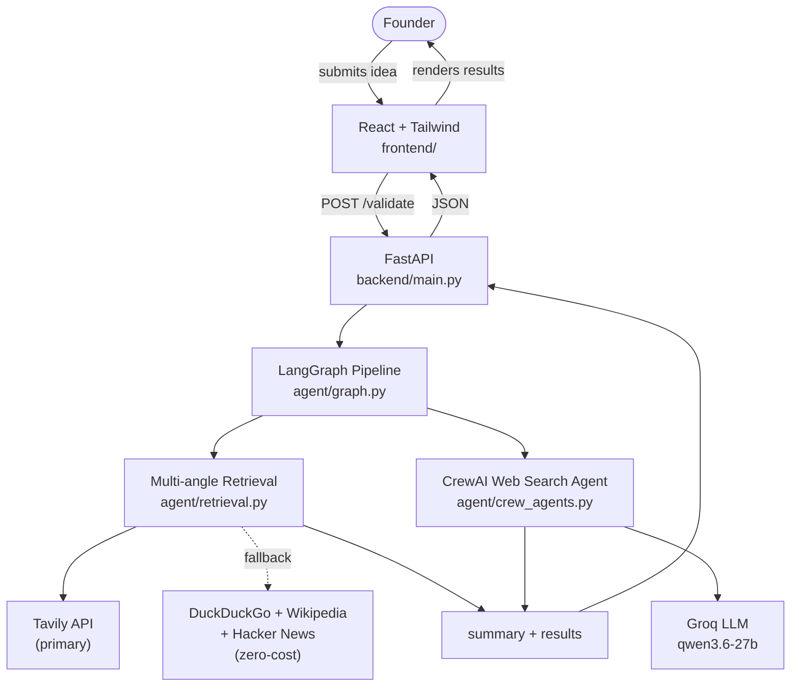
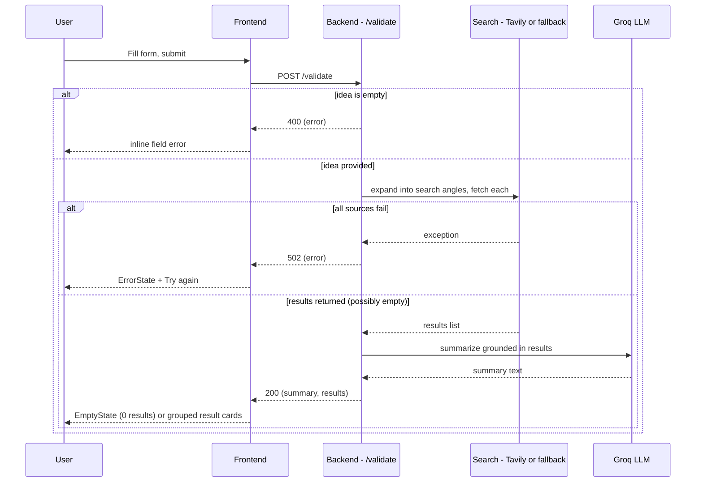

# System Architecture — Milestone 1

Owner: Yasaswini · Status: draft (Aug 25, 2026)

## 1. System Overview

The system has three pieces:

1. **Frontend** — React + Tailwind app. Renders the idea submission form and displays
   validation results.
2. **Backend API** — a small FastAPI service exposing `POST /validate`. Receives the
   submitted idea, calls the search agent, and returns a shaped response.
3. **Web Search Agent** — a Python module (used by the backend) that searches the web
   (Tavily when configured, otherwise DuckDuckGo/Wikipedia/Hacker News as a free
   fallback) for market/competitor information related to the submitted idea.

Flow at a glance:



The frontend never talks to the search sources directly — it only ever calls our own
backend. This gives us one place to shape/validate responses before they reach the UI.

## 2. Agent Breakdown

Agents are built with **CrewAI** and orchestrated by a **LangGraph** `StateGraph`. Each
pipeline stage is one LangGraph node wrapping one CrewAI crew (agent + task + tools).
This is deliberate even though Milestone 1 only has one agent: it means Milestone 2-4
agents are added as new graph nodes without restructuring the backend.

**Milestone 1 has a single agent: the Web Search Agent.**

- **Input**: `{ idea, targetCustomer, problem }` from the submitted form
- **CrewAI role**: "Web Search Agent" — goal: retrieve live, relevant market/competitor
  data; tool: web search (Tavily primary, DuckDuckGo/Wikipedia/Hacker News fallback)
- **LangGraph node**: `web_search` — runs two things: (1) `agent/retrieval.py` expands
  the idea into several search angles (market size, competitors, customer demand) and
  fetches+dedupes real results directly in code, and (2) the CrewAI crew produces a
  short plain-text summary. Results never pass through the LLM, so they can't be
  paraphrased or invented — only the summary paragraph is LLM-generated.
- **Output**: `{ summary, results[] }` where `results` is
  `{ title, snippet, url, query, score }[]` — `query` is which search angle surfaced
  that result, `score` is a computed relevance score (word-overlap between the query
  and the result's text, since these free sources don't provide their own ranking)

**Future extension point (Milestone 2+):** Market Opportunity, Competitor Discovery,
SWOT/Risk, MVP Recommendation, GTM, and Report Generation agents each become a new
CrewAI crew wrapped in a new LangGraph node (e.g. `market_opportunity`,
`competitor_discovery`, ...), wired into the same graph with `add_edge`. LangGraph's
state dict carries each stage's output forward so later agents can consume earlier
agents' results (context passing), and partial failures are handled per-node rather
than crashing the whole pipeline.

## 3. Data Flow

1. User fills in idea / target customer / problem and submits the form
2. Frontend sends `POST /validate` with the form data
3. Backend validates input (idea field required, non-empty)
   - If invalid → return `400` with `{ error: "..." }`, frontend shows inline field error
4. Backend calls the Search Agent, which expands the idea into several search angles
   and queries Tavily per angle (falling back to DuckDuckGo/Wikipedia/Hacker News per
   angle if Tavily isn't configured or fails)
   - If every source fails for every angle → backend returns `502` with
     `{ error: "..." }`, frontend shows an `ErrorState` ("couldn't fetch results, try
     again")
   - If search returns zero results → backend returns `200` with `{ summary: "...",
     results: [] }`, frontend shows an `EmptyState` ("no market data found for this
     idea")
5. Backend shapes the response into the shared contract and returns `200`
6. Frontend renders the summary + result cards below the form



## 4. API Contract

```
POST /validate
Content-Type: application/json

Request:
{
  "idea": string,            // required, non-empty
  "targetCustomer": string,  // optional
  "problem": string          // optional
}

Response 200:
{
  "summary": string,
  "results": [
    { "title": string, "snippet": string, "url": string, "query": string, "angle": string, "score": number }
  ]
}

Response 400 / 502:
{
  "error": string
}
```

This contract is locked for Milestone 1 — Varshini (agent) and Anu Kumari (frontend)
should build against this without needing to sync on every field.

## 5. Tech Stack Decisions

| Layer | Choice | Why |
|---|---|---|
| Frontend | React (Vite) + Tailwind CSS | Team wants a premium, polished UI — faster to achieve with component reuse + utility classes than hand-rolled CSS. **Note:** this deviates from the milestone guide's plain HTML/CSS/JS wording; flagging that explicitly since it's a deliberate call. |
| Backend | FastAPI | Lightweight, async-friendly, minimal boilerplate for a single endpoint, easy to extend with more agents later. |
| Orchestration | LangGraph | Owns pipeline state and node wiring — each agent is a graph node, so M2-M4 agents are added without restructuring the backend. |
| Agents | CrewAI | Role/goal/tool-based agent definitions, one Agent+Task per pipeline stage — matches the brief's named-agent structure directly. |
| Search | Tavily API (primary), DuckDuckGo + Wikipedia + Hacker News (fallback chain) | Tavily gives a real, trained relevance score and reliable results — used whenever `TAVILY_API_KEY` is set. If it's missing or fails, the app falls back to the zero-cost chain (own computed relevance score) instead of erroring out. Tried DuckDuckGo as sole primary first, but its unofficial scraping library proved too flaky (empty or irrelevant results, inconsistent run to run) to trust for a live demo. |
| Reasoning LLM | Groq (via CrewAI/LiteLLM) | Default provider for agent reasoning (`groq/qwen/qwen3.6-27b`), configurable via `LLM_MODEL` + provider API key (`GROQ_API_KEY`). Tried Google Gemini for a higher rate limit, but its current models were incompatible with our LiteLLM version (2.x deprecated for new keys, 3.x needs newer message formatting) — reverted to Groq. |
| Hosting | Render | Already set up for this repo (see `render.yaml`). |

## 6. Deployment Topology

Two Render web services:

- **`startup-validator-frontend`** — serves the built React app (static site or Node
  web service)
- **`startup-validator-backend`** — runs the FastAPI service; holds `GROQ_API_KEY`
  (required) and `TAVILY_API_KEY` (optional — falls back to free search if unset) as
  Render environment variables (never committed to the repo)

Frontend reads the backend's URL via `VITE_API_URL` (env var, set per environment —
local vs. deployed).

## 7. Error Handling Policy

- Backend never lets a raw exception/stack trace reach the frontend — every failure path
  returns `{ error: string }` with an appropriate status code
- Frontend never shows a blank or frozen screen on failure — every failed/empty state
  renders a specific `ErrorState` or `EmptyState` component with a human-readable message
- Timeouts: each search source call uses a short timeout (5s) so one slow/unreachable
  source doesn't hang the whole request — the pipeline just moves to the next fallback

## 8. Repo Structure (proposed)

```
.
├── frontend/          # React + Tailwind app (Anu Kumari)
│   └── ...
├── backend/           # FastAPI app + search agent (Varshini)
│   ├── main.py         # POST /validate route
│   └── agent/
│       ├── graph.py         # LangGraph pipeline
│       ├── crew_agents.py    # CrewAI Agent/Task/Crew
│       ├── retrieval.py      # multi-angle query expansion + dedup
│       ├── tools.py          # Tavily (primary) + DuckDuckGo/Wikipedia/Hacker News fallback
│       └── llm.py            # reasoning LLM selection
├── docs/
│   ├── architecture.md        # this file
│   ├── milestone1-plan.md
│   └── frontend-spec.md
├── render.yaml         # updated for two services (Yalene)
└── README.md
```

The existing root-level `app.py` (Streamlit prototype) stays as-is for reference but is
superseded by `frontend/` + `backend/` going forward.
