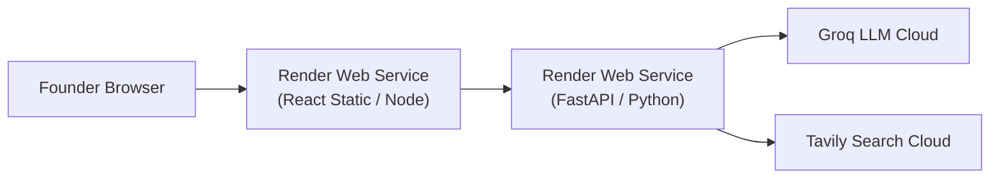

# Operations & Incident Runbook
**Project:** Affinity — AI-Based Startup Idea Validator with Market Analysis Assistance  
**Document Version:** 2.0 · September 2026  
**Status:** Operational  

---

## 1. Local Environment Setup

### 1.1 System Requirements
- **OS:** Windows 10/11, macOS 12+, or Ubuntu 20.04+
- **Python:** Version 3.10 or higher
- **Node.js:** Version 18.0 or higher
- **Git:** Installed and configured

### 1.2 Step-by-Step Installation

```bash
# 1. Clone the repository
git clone https://github.com/Yasaswini-ch/Development-of-AI-Based-Startup-Idea-Validator-with-Market-Analysis-Assistance.git
cd Development-of-AI-Based-Startup-Idea-Validator-with-Market-Analysis-Assistance

# 2. Backend Environment Setup
cd backend
python -m venv venv
# On Windows PowerShell:
.\venv\Scripts\Activate.ps1
# On macOS/Linux:
# source venv/bin/activate

pip install -r requirements.txt
python -m spacy download en_core_web_sm  # Downloads local spaCy NER model

# Configure environment variables
cp .env.example .env
# Edit .env and set GROQ_API_KEY=your_key_here

# Launch backend dev server
uvicorn main:app --host 127.0.0.1 --port 8000

# 3. Frontend Environment Setup (Open second terminal window)
cd ../frontend
npm install
cp .env.example .env  # Ensure VITE_API_URL=http://localhost:8000
npm run dev           # Launches Vite dev server at http://localhost:5173
```

> [!IMPORTANT]
> **Backend Reloading Notice:** The backend server runs via Uvicorn without auto-reload enabled (`uvicorn main:app --host 127.0.0.1 --port 8000`). When modifying code inside `backend/`, you MUST terminate the running Uvicorn process and restart it. Otherwise, incoming test requests will execute against stale code in memory.

---

## 2. Production Deployment (Render Infrastructure)

Affinity uses a multi-service setup on **Render** specified in [`render.yaml`](file:///C:/Opensource/AI%20Based%20Startup%20Idea%20Validator/render.yaml).



### 2.1 Environment Variable Configuration Matrix

| Variable | Target Service | Mandatory? | Default / Example Value | Description |
|---|---|---|---|---|
| `GROQ_API_KEY` | Backend | **Yes** | `gsk_...` | API key for Groq LLM model execution |
| `TAVILY_API_KEY` | Backend | Optional | `tvly-...` | API key for Tavily search (DDG fallback used if absent) |
| `FRONTEND_ORIGIN` | Backend | **Yes** | `http://localhost:5173` | Allowed CORS origin header for API responses |
| `VITE_API_URL` | Frontend | **Yes** | `http://localhost:8000` | Target FastAPI backend URL |

---

## 3. Incident Playbooks & Troubleshooting Matrix

### Playbook 1: Groq LLM Quota Exhaustion (`RateLimitError`)
- **Symptom:** Backend logs indicate `RateLimitError: Rate limit reached for model groq/qwen/qwen3.8-27b`.
- **Automated Handling:** [`backend/agent/llm.py`](file:///C:/Opensource/AI%20Based%20Startup%20Idea%20Validator/backend/agent/llm.py) catches `RateLimitError` and triggers the model fallback chain:
  1. Primary: `groq/qwen/qwen3.8-27b`
  2. Fallback 1: `groq/openai/gpt-oss-20b`
  3. Fallback 2: `groq/openai/gpt-oss-120b`
- **Partial Failure Outcome:** If all three fallback models hit rate limits, `marketOpportunity` returns `null` with `errors.marketOpportunity` set. The frontend UI renders an inline `UnavailableCard` for Market Opportunity while Competitors and Web Sources render normally.
- **Action Required:** None. The free-tier minute quota resets automatically within 60 seconds.

---

### Playbook 2: Model Deprecation (`model_not_found`)
- **Symptom:** Logs show `litellm.NotFoundError: GroqException - {"error":{"message":"The model qwen/qwen3.6-27b does not exist"}}`.
- **Root Cause:** Provider deprecated an old model ID (e.g. `qwen3.6-27b`).
- **Resolution Steps:**
  1. `_is_model_not_found_error()` in `agent/llm.py` catches `model_not_found` and immediately advances down the fallback chain.
  2. Update `DEFAULT_MODEL` in [`backend/agent/llm.py`](file:///C:/Opensource/AI%20Based%20Startup%20Idea%20Validator/backend/agent/llm.py) to the latest active model ID listed on Groq's dashboard (`qwen/qwen3.8-27b`).
  3. Update `LLM_MODEL` in local `.env` and Render environment configuration.

---

### Playbook 3: Search Provider Disruption / Missing Tavily Key
- **Symptom:** `TAVILY_API_KEY` is missing, expired, or Tavily service is down.
- **Automated Handling:** [`backend/agent/retrieval.py`](file:///C:/Opensource/AI%20Based%20Startup%20Idea%20Validator/backend/agent/retrieval.py) seamlessly switches to zero-cost fallback search:
  - Step 1: DuckDuckGo Search (`duckduckgo-search`)
  - Step 2: Wikipedia Search API (`wikipedia`)
  - Step 3: Hacker News Search API (`hn`)
- **Action Required:** None. System continues operating without search cost.

---

### Playbook 4: spaCy `en_core_web_sm` Model Missing
- **Symptom:** Backend fails on startup with `OSError: [E050] Can't find model 'en_core_web_sm'`.
- **Resolution Command:**
  ```bash
  python -m spacy download en_core_web_sm
  ```

---

### Playbook 5: Stale Frontend Render State
- **Symptom:** UI displays old validation results even after backend edits or page refresh.
- **Root Cause:** [`frontend/src/App.jsx`](file:///C:/Opensource/AI%20Based%20Startup%20Idea%20Validator/frontend/src/App.jsx) caches session results in browser `sessionStorage` (`affinity:lastValidation`) to survive tab reloads.
- **Resolution:** Open Browser DevTools Console (F12) and run:
  ```javascript
  sessionStorage.clear();
  location.reload();
  ```

---

### Playbook 6: Port 8000 / 5173 Conflict
- **Symptom:** Server launch fails with `OSError: [Errno 10048] Address already in use`.
- **Resolution (Windows PowerShell):**
  ```powershell
  # Find process running on port 8000
  Get-NetTCPConnection -LocalPort 8000 | Select-Object OwningProcess
  # Kill process
  Stop-Process -Id <PID> -Force
  ```

---

## 4. Diagnostic & Inspection Commands

### Inspect Running Python/Uvicorn Processes (PowerShell)
```powershell
Get-CimInstance Win32_Process -Filter "Name='python.exe'" | Where-Object { $_.CommandLine -like "*uvicorn*" }
```

### Direct Health Check Probe (cURL)
```bash
curl -i http://localhost:8000/health
```

### Validation Endpoint Test Call (cURL)
```bash
curl -X POST http://localhost:8000/validate \
  -H "Content-Type: application/json" \
  -d '{"idea": "Smart water bottle for athletes"}'
```
