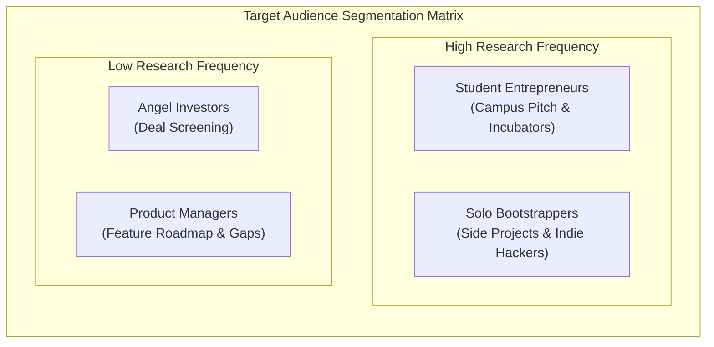
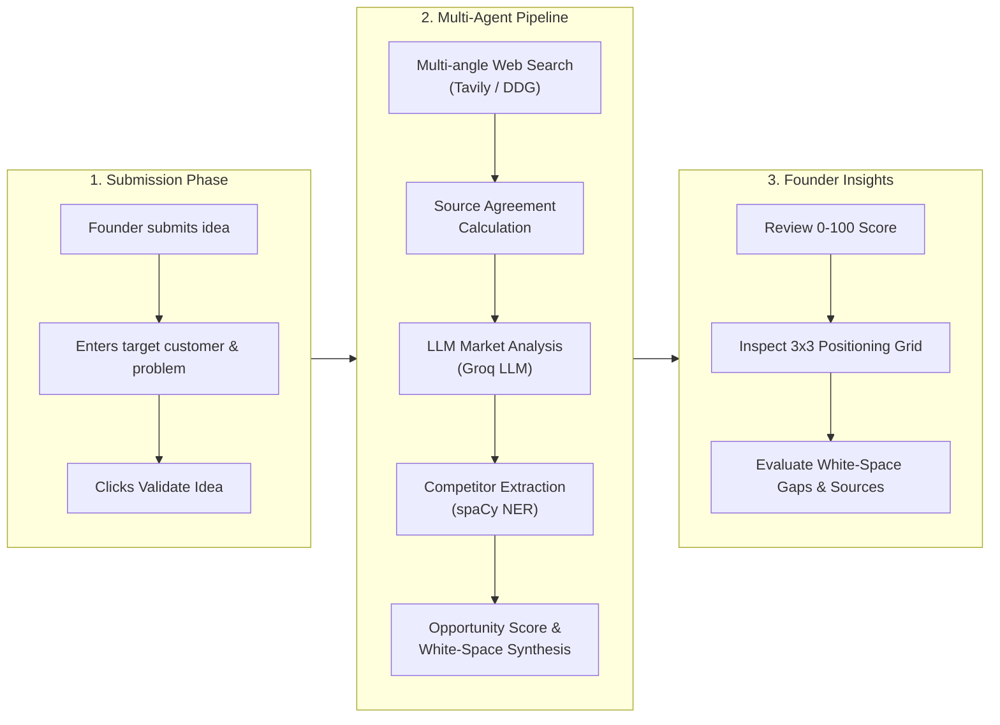

# Product Strategy & User Personas Document
**Project:** Affinity — AI-Based Startup Idea Validator  
**Document Version:** September 2026 · Milestones 1 & 2  

---

## 1. Product Vision & Executive Pitch

**Affinity** is an automated market-validation engine designed for early-stage founders, product innovators, and student entrepreneurs. 

### The Problem
90% of startups fail, primarily due to building products with no real market demand (CB Insights). Traditional market research requires weeks of manual desk research, reading research papers, searching competitor pricing tables, and compiling customer pain points. Conversely, prompting generic AI chatbots (like ChatGPT) yields ungrounded, hallucinated market size estimates and generic competitor lists without verifiable evidence.

### The Affinity Solution
Affinity expands a founder's idea into **5 targeted web-search angles**, fetches live market data, parses competitors locally using spaCy NER, and synthesizes market opportunity, positioning grids, and white-space gaps in seconds—**strictly grounded in real web evidence**.

---

## 2. Target User Personas

### Persona 1: The Solo Bootstrapper ("Alex")
- **Background:** Software developer building side projects in evenings and weekends.
- **Goals:** Wants to validate if an idea has real market pull before spending 3 months writing code.
- **Pain Points:** Limited time, limited budget ($0 budget for expensive Gartner/Statista reports), prone to over-indexing on building code rather than analyzing market competitors.
- **How Affinity Helps:** Instant 0–100 Opportunity Score, automatic competitor positioning grid, and evidence-backed white-space feature suggestions.

### Persona 2: The Student Entrepreneur ("Priya")
- **Background:** University student pitching in campus business plan competitions and startup incubators.
- **Goals:** Needs clear, evidence-backed TAM/SAM trends, structured target customer segments (pain points, motivations, buying behavior), and cited sources for pitch decks.
- **Pain Points:** Struggles to separate legitimate market signal from academic papers or directory noise.
- **How Affinity Helps:** Automatically filters out irrelevant academic papers (`arxiv.org`), isolates customer segments with clear buying behavior signals, and cites source URLs directly.

### Persona 3: The Enterprise Product Manager ("Marcus")
- **Background:** Innovation lead evaluating new feature verticals inside an established SaaS company.
- **Goals:** Needs fast competitor gap analysis to justify new product feature roadmaps to executives.
- **Pain Points:** Manual search across review sites and news portals takes days; existing vendor databases (G2, Capterra) are cluttered with ads.
- **How Affinity Helps:** Cross-source agreement indicators ("4 of 5 sources agree the market is growing") and automated White-space Analysis.

---

## 3. Value Proposition Matrix

| Feature | Generic ChatGPT / Claude Prompt | Traditional Market Agency | **Affinity AI Validator** |
|---|---|---|---|
| **Turnaround Time** | ~30 seconds | 2–4 weeks | **~10 seconds** |
| **Cost per Report** | $0.05 - $0.20 | $5,000 - $25,000 | **$0.00 (API-Frugal Local Hybrid)** |
| **Evidence Grounding** | Low (prone to hallucinating market size & TAM) | High (manual interviews & secondary research) | **High (Strictly grounded in 10+ live web sources)** |
| **Competitor Discovery** | Generic memory lookup (often outdated) | Manual vendor matrices | **Live spaCy NER Extraction over current search web data** |
| **Competitor Positioning** | Unstructured prose | Hand-drawn 2x2 or 3x3 grids | **Automated 3x3 Price vs. Feature Breadth Grid** |
| **Data Privacy** | Default opt-in to model training | Confidential NDA | **Zero database storage, 30-min ephemeral in-memory cache** |

---

## 4. User Journey Map

---

## 5. Strategic Roadmap

- **Milestone 1 (Complete):** Multi-angle web search retrieval (Tavily + zero-cost fallback), basic summary, initial frontend.
- **Milestone 2 (Complete):** Hybrid Market Agent (LLM) + Competitor Discovery (spaCy NER), 3x3 positioning grid, Cross-Source Agreement, White-space Analysis, Opportunity Score.
- **Milestone 3 (Planned):** Export validation reports as PDF / Pitch-deck slide outlines, side-by-side idea comparison mode.
- **Milestone 4 (Planned):** User accounts, saved idea history dashboard, custom competitor monitoring alerts.
