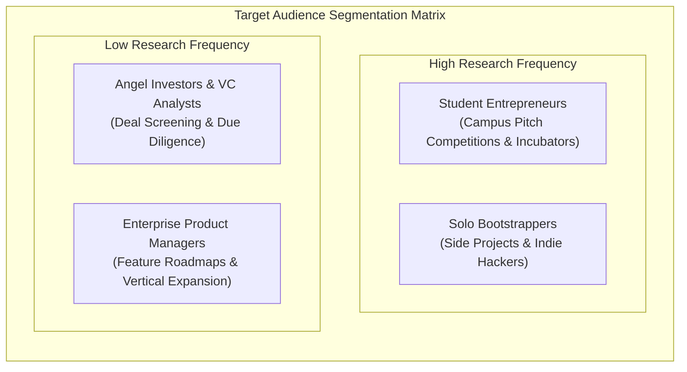
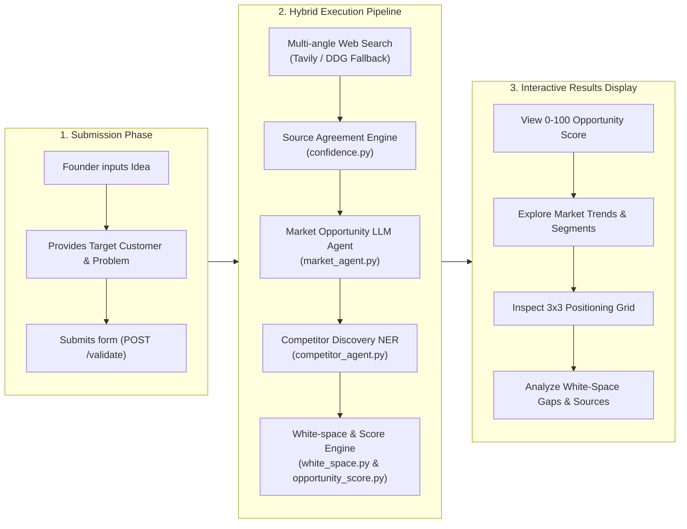

# Comprehensive Product Strategy, Market Analysis & User Personas
**Project:** Affinity — AI-Based Startup Idea Validator with Market Analysis Assistance  
**Document Version:** 2.0 · September 2026  
**Status:** Verified & Operational  

---

## 1. Product Vision & Executive Summary

### 1.1 The Core Problem
According to CB Insights, **42% of startups fail due to lack of market need**, while 29% run out of cash before achieving product-market fit (PMF). Early-stage founders face a major dilemma when attempting to validate new venture concepts:

1. **Manual Market Research (High Cost & Friction):** Traditional secondary research requires scouring industry reports (Statista, Gartner), searching multiple news aggregators, cross-referencing competitor pricing tables, and reading dozens of user reviews. This takes weeks and costs thousands of dollars.
2. **Generic LLM Chatbots (High Risk & Hallucinations):** Using ungrounded LLM prompts (e.g., ChatGPT, Claude) often produces **hallucinated TAM/SAM figures**, outdated competitive intelligence, and fake market growth rates because standard LLMs lack direct real-time web verification and structured entity extraction mechanisms.

### 1.2 The Affinity Solution
**Affinity** bridges this gap by acting as an automated, evidence-backed startup validation engine. When a founder inputs a startup idea, target customer, and problem statement, Affinity:
- Expands the submission into **5 distinct search research angles**.
- Fetches real-time, non-academic web evidence via multi-provider search tools.
- Evaluates **Cross-Source Agreement** across fetched documents without extra API overhead.
- Runs a specialized LLM agent to analyze **Market Opportunity** (market size, CAGR, TAM/SAM constraints, trends, and 4-tier customer segment profiles).
- Executes local Named Entity Recognition (spaCy NER) to discover **Competitors** and estimate pricing/breadth positioning without invoking costly LLMs.
- Synthesizes an **Evidence-backed White-space Analysis** and computes a unified **0–100 Opportunity Score**.

---

## 2. Target User Personas & Jobs-To-Be-Done (JTBD)

---

### Persona 1: The Solo Bootstrapper ("Alex the Developer")

#### Demographics & Context
- **Role:** Full-stack Software Engineer & Independent Builder.
- **Experience:** 4+ years of professional engineering; builds side projects during evenings and weekends.
- **Tools:** VS Code, Next.js, Tailwind, Supabase, Stripe, Product Hunt, X/Twitter.
- **Budget:** $0 to $50/month for validation tools.

#### Behavioral Profile & Frustrations
- Tends to jump directly into writing code before verifying whether real demand exists.
- Has previously spent 3–6 months building products that launched to zero active users.
- Overwhelmed by lengthy financial market reports; wants quick, actionable signals.

#### Jobs-To-Be-Done (JTBD) Statement
> *"When I come up with a new software idea, I want to quickly evaluate existing competitors and market growth within 2 minutes, so that I can decide whether to build a prototype or discard the idea before spending months coding."*

#### Affinity Value Mapping
- **Instant 0–100 Opportunity Score:** Gives an immediate quantitative benchmark on feasibility and market saturation.
- **3x3 Competitor Positioning Grid:** Highlights market gaps across low/mid/high price points and narrow/broad feature breadth.
- **White-Space Opportunities:** Identifies unmet feature demands directly extracted from customer complaints in search results.

---

### Persona 2: The Student Entrepreneur ("Priya the Founder")

#### Demographics & Context
- **Role:** Undergraduate / Master's Student in Business, CS, or Design.
- **Context:** Participating in University Hackathons, Venture Competitions, or Campus Incubators.
- **Tools:** Notion, Figma, Pitch, Google Docs, LinkedIn, Canva.
- **Budget:** $0 (relies heavily on free tiers and open-source software).

#### Behavioral Profile & Frustrations
- Needs verified market statistics (CAGR, TAM/SAM) to present in pitch decks to judges and mentors.
- Struggles to differentiate legitimate industry news from academic research papers that offer no commercial application.
- Needs structured customer segment breakdowns (pain points, motivations, buying behaviors).

#### Jobs-To-Be-Done (JTBD) Statement
> *"When preparing a business plan or pitch deck for a startup competition, I want verified market trends and cited web sources, so that I can defend our market thesis in front of investors with real data."*

#### Affinity Value Mapping
- **Academic Source Filtering:** Automatically excludes noise from `arxiv.org` and `ncbi.nlm.nih.gov` to focus on commercial market data.
- **4-Tier Customer Segmentation:** Produces actionable profiles for 4 distinct customer types with explicit pain points and buying behaviors.
- **Source Agreement Indicators:** Displays metrics like *"4 of 5 sources agree the market is growing"* to back up claims.

---

### Persona 3: The Enterprise Product Manager ("Marcus the PM")

#### Demographics & Context
- **Role:** Lead Product Manager at a Series-B+ B2B SaaS Company.
- **Context:** Evaluating new feature modules or adjacent vertical markets for product expansion.
- **Tools:** Jira, Productboard, Amplitude, Gong, Gartner, Capterra.
- **Budget:** Corporate credit card ($500+/month tool budget).

#### Behavioral Profile & Frustrations
- Needs fast competitor feature matrices to justify roadmap expansion to C-suite executives.
- Dislikes ad-cluttered software review aggregators (G2, Capterra) that rank vendors based on paid placement.
- Needs objective evidence of competitor feature gaps.

#### Jobs-To-Be-Done (JTBD) Statement
> *"When pitching an adjacent product expansion to executive leadership, I want an unbiased analysis of market trends and competitor feature coverage, so that I can validate our feature roadmap with objective market evidence."*

#### Affinity Value Mapping
- **Unbiased Local NER Extraction:** Reads competitor mentions directly from search text without sponsored placement bias.
- **Cross-Source Evidence Grounding:** Mitigates hallucinated industry claims by requiring explicit web snippets.

---

### Persona 4: The Early-Stage VC Analyst ("Elena the Investor")

#### Demographics & Context
- **Role:** Associate / Senior Analyst at an Early-Stage Micro-VC or Angel Syndicate.
- **Context:** Screening 20+ inbound startup pitch decks per week.
- **Tools:** PitchBook, Crunchbase, Typeform, Notion, Substack.
- **Budget:** Enterprise subscriptions.

#### Behavioral Profile & Frustrations
- Needs a 60-second sanity check on inbound pitch deck claims regarding market size and competitors.
- Tired of founders claiming "We have zero competitors" in crowded markets.

#### Jobs-To-Be-Done (JTBD) Statement
> *"When screening an inbound founder deck claiming a novel market, I want to instantly identify existing competitors and market saturation, so that I can decide whether to book an initial screening call."*

#### Affinity Value Mapping
- **Rapid Competitor Uncovering:** Local spaCy NER catches stealth and emerging startup competitors mentioned in recent blogs and news articles.
- **Market Saturation Density Metric:** Feeds directly into the Opportunity Score calculation.

---

## 3. Comprehensive Value Proposition Matrix

| Evaluation Dimension | Generic LLM Chatbot (e.g., ChatGPT / Claude Prompt) | Traditional Market Research Firm (Gartner / Agencies) | **Affinity AI Startup Validator** |
|---|---|---|---|
| **Turnaround Time** | ~30 seconds | 2 to 4 weeks | **~10 seconds (Real-time pipeline)** |
| **Cost Per Analysis** | $0.05 – $0.20 API token spend | $5,000 – $25,000 per custom report | **$0.00 (Frugal hybrid architecture)** |
| **Real-time Web Grounding** | Variable (often relies on training cutoff) | Manual desk research | **100% Live multi-angle web search** |
| **Factual Metric Grounding** | Poor (high risk of inventing TAM/CAGR) | Verified | **Strict (Cites TAM/CAGR only when explicit in sources)** |
| **Academic Noise Filtering** | None (includes scholarly papers) | Manual curation | **Automatic domain exclusion (`arxiv`, `ncbi`)** |
| **Competitor Extraction** | Memory-based (misses recent startups) | Manual vendor matrices | **Local spaCy NER over live web results** |
| **Competitor Positioning** | Unstructured bullet points | Static 2x2 graphics | **Dynamic 3x3 Price vs. Breadth Grid** |
| **White-Space Identification** | Generic advice | In-depth strategic consulting | **Algorithmic synthesis of pain points vs density** |
| **Data Privacy & Retention** | Model training opt-in by default | Confidential NDA | **Zero database storage, 30-min volatile cache** |

---

## 4. End-to-End User Journey & System Interaction Map

---

## 5. Strategic Product Roadmap

### Milestone 1: Multi-Angle Search & Core Pipeline (Completed)
- Multi-angle retrieval engine (`agent/retrieval.py`) querying 5 search angles.
- Zero-cost search fallback chain (Tavily → DuckDuckGo → Wikipedia → Hacker News).
- Academic domain exclusion filter (`_EXCLUDED_DOMAINS`).
- Initial React + Tailwind UI with fast feedback state.

### Milestone 2: Hybrid Agents, Positioning & Score (Completed)
- Market Opportunity LLM Agent (`market_agent.py`) with 4 customer segment tiers.
- Non-LLM Competitor Discovery (`competitor_agent.py`) using local spaCy NER.
- 3x3 Competitor Positioning Grid (Price vs. Feature Breadth).
- Cross-Source Confidence Indicator (`confidence.py`).
- Algorithmic White-Space Analysis (`white_space.py`).
- Consolidated 0–100 Opportunity Score (`opportunity_score.py`).
- Ephemeral 30-minute in-memory response cache and submit cooldown.

### Milestone 3: Report Export & Idea Comparison (Planned)
- One-click PDF / Pitch Deck Outline export (downloadable report summary).
- Side-by-side comparison mode for evaluating two competing startup ideas.
- Custom search angle toggle for niche domains (e.g. Biotech vs Web3).

### Milestone 4: Workspace Collaboration & Monitoring (Planned)
- Optional authenticated user workspaces.
- Automated monthly competitor movement alerts.
- API webhooks for incubator and pitch competition integration.
