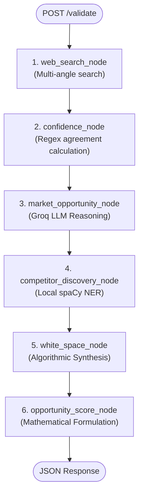
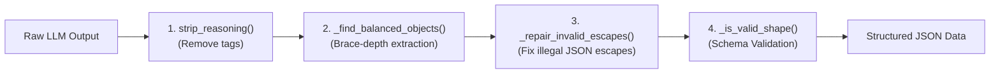

# Prompt Engineering & Agent System Architecture Guide
**Project:** Affinity — AI-Based Startup Idea Validator with Market Analysis Assistance  
**Document Version:** 2.0 · September 2026  
**Target Audience:** AI Engineers, System Architects, and Academic Evaluators  

---

## 1. System Architecture Rationale

Affinity utilizes a **hybrid multi-agent system** combining large language models (LLMs) with deterministic local algorithms (spaCy Named Entity Recognition, regular expressions, and weighted mathematical scoring).

### 1.1 The Anti-Pattern: Over-reliance on LLM Agents
In early prototypes of multi-agent frameworks (such as CrewAI default setups), every node in a pipeline is assigned to an LLM agent. Live load testing across multi-angle startup queries revealed major vulnerabilities with this approach:

1. **API Quota Exhaustion:** Running 3 to 4 sequential LLM calls per validation request rapidly exhausts rate limits on free-tier and low-latency API providers (such as Groq's 1,000 output tokens/minute limit).
2. **Entity Extraction Drift:** Prompting an LLM to extract competitor names often returns hallucinated companies, generic words ("Software", "Platform"), or out-of-date market players.
3. **Execution Latency:** Multi-LLM chains introduce 30–60 second response times, frustrating users.

### 1.2 The Hybrid Multi-Agent Solution
Affinity solves this through strict **task-to-tool scoping**:

| Pipeline Stage | Module | Architecture Class | Execution Engine | API Cost |
|---|---|---|---|---|
| **1. Search Retrieval** | [`agent/retrieval.py`](file:///C:/Opensource/AI%20Based%20Startup%20Idea%20Validator/backend/agent/retrieval.py) | Direct Tool Search | Tavily API (Primary) / DDG + Wikipedia + HN (Fallback) | $0.00 to $0.008 |
| **2. Confidence Indicator** | [`agent/confidence.py`](file:///C:/Opensource/AI%20Based%20Startup%20Idea%20Validator/backend/agent/confidence.py) | Deterministic Regex | Python Regular Expressions | **$0.00** |
| **3. Market Opportunity** | [`agent/market_agent.py`](file:///C:/Opensource/AI%20Based%20Startup%20Idea%20Validator/backend/agent/market_agent.py) | **Single LLM Agent** | Groq (`qwen/qwen3.8-27b` primary) | Free-tier / Paid |
| **4. Competitor Discovery** | [`agent/competitor_agent.py`](file:///C:/Opensource/AI%20Based%20Startup%20Idea%20Validator/backend/agent/competitor_agent.py) | Local NLP Engine | spaCy `en_core_web_sm` NER | **$0.00** |
| **5. White-space Analysis** | [`agent/white_space.py`](file:///C:/Opensource/AI%20Based%20Startup%20Idea%20Validator/backend/agent/white_space.py) | Algorithmic Synthesis | Deterministic Python heuristics | **$0.00** |
| **6. Opportunity Score** | [`agent/opportunity_score.py`](file:///C:/Opensource/AI%20Based%20Startup%20Idea%20Validator/backend/agent/opportunity_score.py) | Mathematical Model | Weighted scoring formula | **$0.00** |

---

## 2. Multi-Agent Pipeline Topology



---

## 3. Market Opportunity Agent Prompt Engineering

The Market Opportunity agent evaluates startup ideas against retrieved web content.

### 3.1 Context Structuring Strategy
Passing raw search results directly into an LLM prompt can blow up the context window and crowd out relevant market insights with general text. 

[`backend/agent/market_agent.py`](file:///C:/Opensource/AI%20Based%20Startup%20Idea%20Validator/backend/agent/market_agent.py) implements `_build_context()` to filter and prioritize context:
- Ensures search results from the `"Market size & trends"` angle get first priority in the prompt context.
- Caps snippets at 300 characters per source and limits total sources to 10.

```python
def _build_context(results: list) -> str:
    market_results = [r for r in results if r.get("angle") == "Market size & trends"]
    other_results = [r for r in results if r.get("angle") != "Market size & trends"]
    ordered = market_results + other_results

    lines = []
    for r in ordered[:10]:
        snippet = (r.get("snippet") or "")[:300]
        lines.append(f"- {r.get('title', '')}: {snippet}")
    return "\n".join(lines) if lines else "No search results were available."
```

### 3.2 System Prompt & Negative Constraints
The agent task description uses strict negative prompts to enforce factual grounding:

```text
Startup idea: "{idea}"
Target customer: {target_customer}
Problem being solved: {problem}

Here are real, current web search results about this idea's market:
{context}

Based only on the information above, analyze:
1. Market size (state whether the figures are global, regional, or niche if the sources indicate this) and growth trend. Include TAM, SAM, or CAGR only when the provided sources explicitly support those figures; otherwise state that they are not clear from the sources.
2. Up to 4 notable trends or adoption patterns.
3. Up to 4 customer segments - for each, their pain points (what problem they're trying to solve), motivations (what they care about / why they'd buy), and buying behavior (how they decide or purchase, if the sources suggest anything about this).

Do not invent statistics, segments, or behaviors that aren't supported by the sources - if buying behavior isn't evident from the sources, say so plainly rather than guessing.
Output strict JSON only: within JSON strings, never escape an apostrophe with a backslash - write don't directly, not don\'t.
```

### 3.3 Reasoning Effort Tuning
Open-weights models running on Groq (e.g., `qwen/qwen3.8-27b`) default to performing internal hidden reasoning before emitting text. Without bounds, hidden reasoning cycles consume thousands of tokens per call, causing rate limits.

In [`backend/agent/llm.py`](file:///C:/Opensource/AI%20Based%20Startup%20Idea%20Validator/backend/agent/llm.py), explicit `reasoning_effort` mapping tunes per-model performance:

```python
_REASONING_EFFORT = {
    "groq/qwen/qwen3.8-27b": "none",
    "groq/openai/gpt-oss-20b": "low",
    "groq/openai/gpt-oss-120b": "low",
}
```

---

## 4. Multi-Stage Output Guard & JSON Repair System

LLMs occasionally emit non-compliant JSON formatting (such as markdown code fences or invalid string escapes like `don\'t`). Affinity uses a 4-layer validation pipeline in `market_agent.py`:



### 4.1 Invalid Escape Repair Function
```python
def _repair_invalid_escapes(text: str) -> str:
    _JSON_LEGAL_ESCAPES = set('"\\/bfnrtu')
    out = []
    i = 0
    while i < len(text):
        ch = text[i]
        if ch == "\\" and i + 1 < len(text):
            nxt = text[i + 1]
            if nxt not in _JSON_LEGAL_ESCAPES:
                out.append(nxt)  # Drop illegal backslash
                i += 2
                continue
        out.append(ch)
        i += 1
    return "".join(out)
```

---

## 5. Non-LLM Agent Deep Dive

### 5.1 Competitor Discovery Engine (`agent/competitor_agent.py`)
Rather than relying on LLMs, competitor discovery processes retrieved search text locally using spaCy's `en_core_web_sm` model:

1. **Text Normalization:** Scraped comparison table snippets are joined with `". "` to ensure clean sentence boundaries.
2. **Entity Tagging:** spaCy identifies entities tagged as `ORG` (Organization).
3. **Filtering Rules:**
   - Excludes generic words (`Android`, `iOS`, `PDF`, `Newsweek`, `Directory`, `Ratings`).
   - Rejects single-word candidates unless product context (`app`, `software`, `pricing`, `monthly`) exists nearby in at least one mention (`_has_product_context`).
   - camelCase entity detection (e.g., `HelloFresh`, `RocketMoney`) is preserved.
4. **Local Context Attribute Extraction:** Pattern-matches pricing dollar amounts (`$10/mo`) and feature breadth keywords (`all-in-one`, `niche`, `specialized`) strictly from the competitor's 2-sentence context block.

---

### 5.2 Confidence Indicator Engine (`agent/confidence.py`)
Calculates cross-source consensus using regular expressions without LLM calls:

```python
_GROWTH_PATTERNS = [
    r"\bcagr\b", r"\bgrowing\b", r"\bgrowth\b", r"\bexpanding\b",
    r"\bforecast\b", r"\bmarket size\b", r"\bvaluation\b"
]

_COMPETITION_PATTERNS = [
    r"\bcompetitor\b", r"\balternative\b", r"\bversus\b",
    r"\bmarket share\b", r"\brival\b", r"\bcompete\b"
]
```

Counts matching documents across `"Market size & trends"` and `"Competitors"` search angles to produce metrics like `{"marketGrowth": {"agree": 4, "total": 5}}`.

---

### 5.3 Opportunity Score Formulation (`agent/opportunity_score.py`)

The Opportunity Score is calculated via a deterministic formula yielding a 0–100 integer score:

$$\text{Score} = \text{Base} + S_{\text{market}} + S_{\text{growth}} - S_{\text{density}} + S_{\text{gaps}}$$

Where:
- $\text{Base} = 50$
- $S_{\text{market}} = +15$ if TAM/SAM market size exceeds \$1B, $+5$ if positive.
- $S_{\text{growth}} = +15$ if CAGR > 10% or strong growth trends exist.
- $S_{\text{density}} = -15$ if > 5 direct competitors identified, $-5$ if 2–4 competitors.
- $S_{\text{gaps}} = +15$ if clear white-space feature gaps are identified.
- Score is clamped to $[0, 100]$.

---

## 6. Resilience & Fallback Execution Chain

When an LLM endpoint fails (due to rate limits or model deprecation), `kickoff_with_fallback()` in [`agent/llm.py`](file:///C:/Opensource/AI%20Based%20Startup%20Idea%20Validator/backend/agent/llm.py) executes a model sequence:

```python
FALLBACK_MODELS = [
    "groq/qwen/qwen3.8-27b",
    "groq/openai/gpt-oss-20b",
    "groq/openai/gpt-oss-120b",
]
```

If every LLM fallback fails, the node raises an exception caught by [`agent/graph.py`](file:///C:/Opensource/AI%20Based%20Startup%20Idea%20Validator/backend/agent/graph.py), populating `errors.marketOpportunity` while allowing competitor discovery, confidence metrics, and white-space analysis to return partial data cleanly.
