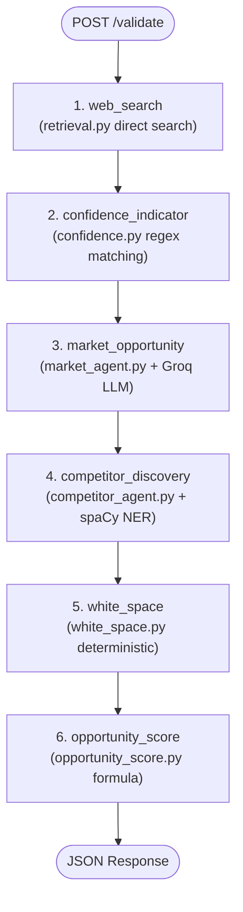

# Prompt Engineering & Agent System Architecture Guide
**Project:** Affinity — AI-Based Startup Idea Validator  
**Document Version:** September 2026 · Milestones 1 & 2  
**Target Audience:** AI Engineers, System Architects, and Academic Evaluators  

---

## 1. Executive Summary & Design Rationale

Affinity uses a **hybrid multi-agent system** combining large language models (LLMs) with deterministic local algorithms (spaCy NER, regular expressions, and weighted arithmetic).

A common antipattern in multi-agent systems is invoking LLMs for simple extraction tasks. In early iterations of Affinity, both Market Opportunity analysis and Competitor Discovery used LLM agents. Live testing revealed that splitting API quota across multiple LLM calls caused rate limits on free-tier providers (Groq) and introduced hallucination risks into simple entity extraction.

### Architecture Decisions
1. **Single LLM Node:** Only [`backend/agent/market_agent.py`](file:///C:/Opensource/AI%20Based%20Startup%20Idea%20Validator/backend/agent/market_agent.py) executes an LLM call per validation request.
2. **Local spaCy NER:** Competitor discovery ([`backend/agent/competitor_agent.py`](file:///C:/Opensource/AI%20Based%20Startup%20Idea%20Validator/backend/agent/competitor_agent.py)) uses `en_core_web_sm` entity recognition instead of an LLM.
3. **Regex Alignment:** Confidence calculation ([`backend/agent/confidence.py`](file:///C:/Opensource/AI%20Based%20Startup%20Idea%20Validator/backend/agent/confidence.py)) operates via regex pattern matching over retrieved search content.
4. **Deterministic Synthesis:** White-space analysis ([`backend/agent/white_space.py`](file:///C:/Opensource/AI%20Based%20Startup%20Idea%20Validator/backend/agent/white_space.py)) and Opportunity Scoring ([`backend/agent/opportunity_score.py`](file:///C:/Opensource/AI%20Based%20Startup%20Idea%20Validator/backend/agent/opportunity_score.py)) use algorithmic synthesis over upstream outputs.

---

## 2. Multi-Agent Pipeline Flow



---

## 3. Market Opportunity Agent Prompt Design

The Market Opportunity agent evaluates startup ideas against retrieved web snippets.

### 3.1 Prompt Structure & Grounding Constraints

The system prompt enforces strict evidence grounding:

```text
Startup idea: "{idea}"
Target customer: {target_customer}
Problem being solved: {problem}

Here are real, current web search results about this idea's market:
{context}

Based only on the information above, analyze:
1. Market size (state whether the figures are global, regional, or niche if the sources indicate this) and growth trend. Include TAM, SAM, or CAGR only when the provided sources explicitly support those figures; otherwise state that they are not clear from the sources.
2. Up to 4 notable trends or adoption patterns.
3. Up to 4 customer segments - for each, their pain points, motivations, and buying behavior.

Do not invent statistics, segments, or behaviors that aren't supported by the sources - if buying behavior isn't evident from the sources, say so plainly rather than guessing.
Output strict JSON only: within JSON strings, never escape an apostrophe with a backslash - write don't directly, not don\'t.
```

### 3.2 Reasoning Effort Optimization

Groq LLMs (such as `qwen/qwen3.8-27b`) utilize internal reasoning cycles before returning final text. Unconstrained, these reasoning cycles generate thousands of hidden tokens that exhaust per-minute rate limits.

In [`backend/agent/llm.py`](file:///C:/Opensource/AI%20Based%20Startup%20Idea%20Validator/backend/agent/llm.py), explicit `reasoning_effort` configurations limit overhead:

```python
_REASONING_EFFORT = {
    "groq/qwen/qwen3.8-27b": "none",
    "groq/openai/gpt-oss-20b": "low",
    "groq/openai/gpt-oss-120b": "low",
}
```

By disabling hidden reasoning on `qwen3.8-27b`, response latency decreased by over 60% and output token consumption remained within free-tier thresholds.

---

## 4. Robust JSON Parsing & Output Repair

LLM outputs can contain formatting anomalies such as markdown wrapping or invalid escape characters. Affinity implements a multi-stage parser in [`backend/agent/market_agent.py`](file:///C:/Opensource/AI%20Based%20Startup%20Idea%20Validator/backend/agent/market_agent.py).

### 4.1 Parsing Pipeline
1. **Reasoning Strip:** `strip_reasoning()` filters out `<think>...</think>` tags emitted by open-weights models.
2. **Balanced Object Extraction:** `_find_balanced_objects()` extracts top-level `{ ... }` blocks using depth counting instead of naive string matching.
3. **Invalid Escape Repair:** `_repair_invalid_escapes()` rewrites illegal escape sequences (e.g., `don\'t` to `don't`) before JSON decoding.
4. **Schema Validation:** `_is_valid_shape()` enforces structural correctness for required keys (`marketSize`, `trends`, `segments`).

```python
def _repair_invalid_escapes(text: str) -> str:
    _JSON_LEGAL_ESCAPES = set('"\\/bfnrtu')
    out = []
    i = 0
    while i < len(text):
        ch = text[i]
        if ch == "\\" and i + 1 < len(text):
            nxt = text[i + 1]
            if nxt not in _JSON_LEGAL_ESCAPES:
                out.append(nxt)
                i += 2
                continue
        out.append(ch)
        i += 1
    return "".join(out)
```

---

## 5. Non-LLM Agent Engineering

### 5.1 Competitor Discovery via Local spaCy NER
Instead of invoking an LLM, [`backend/agent/competitor_agent.py`](file:///C:/Opensource/AI%20Based%20Startup%20Idea%20Validator/backend/agent/competitor_agent.py) processes retrieved search snippets with spaCy's `en_core_web_sm` model:
- Extracts entities tagged as `ORG`.
- Filters generic platform terms (`Android`, `iOS`, `PDF`, `Newsweek`, `Directory`).
- Requires product context for single-word entities (e.g., presence of keywords like `app`, `software`, `pricing`, `monthly`).
- Pattern-matches price points and feature metrics from adjacent text snippets.

### 5.2 Confidence Indicator Algorithm
[`backend/agent/confidence.py`](file:///C:/Opensource/AI%20Based%20Startup%20Idea%20Validator/backend/agent/confidence.py) scans retrieved search documents using regular expressions to evaluate source consensus:
- **Market Growth Angle:** Matches terms such as `cagr`, `growing`, `forecast`, `market size`.
- **Competitive Pressure Angle:** Matches terms such as `alternative`, `competitor`, `versus`, `market share`.

---

## 6. Resilience & Model Fallback Chain

When an LLM endpoint returns an error (e.g., `RateLimitError` or `model_not_found`), `kickoff_with_fallback()` in [`backend/agent/llm.py`](file:///C:/Opensource/AI%20Based%20Startup%20Idea%20Validator/backend/agent/llm.py) automatically iterates through configured backup models:

1. `groq/qwen/qwen3.8-27b` (Primary)
2. `groq/openai/gpt-oss-20b` (Fallback 1)
3. `groq/openai/gpt-oss-120b` (Fallback 2)

If all LLM calls fail, the node returns a partial failure state (`errors.marketOpportunity`) allowing the rest of the pipeline to complete and render in the UI.
