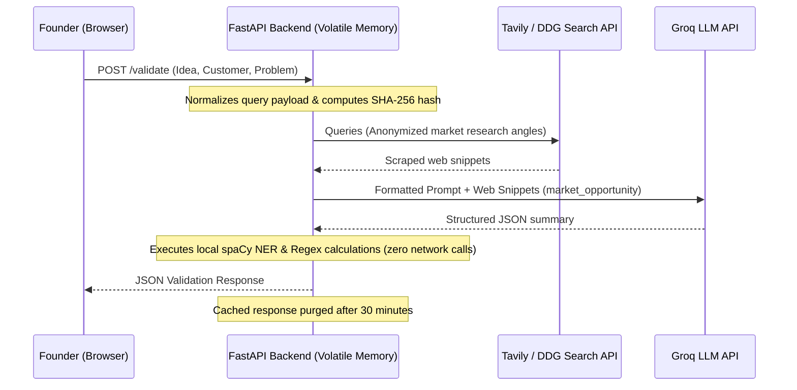

# Security, Privacy, and AI Ethics Specification
**Project:** Affinity — AI-Based Startup Idea Validator with Market Analysis Assistance  
**Document Version:** 2.0 · September 2026  
**Status:** Verified & Operational  

---

## 1. Overview & Core Security Commitments

Affinity validates early-stage startup ideas using automated web retrieval and LLM reasoning. Founders submitting unreleased or proprietary business concepts require strict data privacy, minimal retention, and transparent AI reasoning.

### Core Architecture Commitments
1. **Zero Persistent Storage:** Submitted ideas, problem statements, and generated reports are held strictly in volatile memory. No relational database, document store, or disk-backed tracking exists.
2. **Ephemeral In-Memory Caching:** Results are cached in volatile memory for 30 minutes (`_CACHE_TTL_SECONDS = 1800`) to prevent duplicate API requests and expire automatically.
3. **No Third-Party Model Training:** API integrations with LLM providers (Groq) and search providers (Tavily) operate under commercial terms prohibiting the use of submitted prompt payloads for model retraining.
4. **Deterministic Evidence Grounding:** Strategic insights are generated only from retrieved web evidence to prevent AI hallucinations.

---

## 2. Information Security & Data Life-Cycle

### 2.1 Data Flow Architecture



---

### 2.2 In-Memory Cache Security Implementation

The caching engine in [`backend/main.py`](file:///C:/Opensource/AI%20Based%20Startup%20Idea%20Validator/backend/main.py) uses cryptographic SHA-256 hashing to generate cache keys from normalized input parameters:

```python
_CACHE_TTL_SECONDS = 30 * 60
_cache: dict[str, tuple[float, dict]] = {}

def _cache_key(payload: ValidateRequest) -> str:
    normalized = json.dumps(
        {
            "idea": payload.idea.strip().lower(),
            "targetCustomer": payload.targetCustomer.strip().lower(),
            "problem": payload.problem.strip().lower(),
        },
        sort_keys=True,
    )
    return hashlib.sha256(normalized.encode("utf-8")).hexdigest()
```

- **Partial Failure Protection:** Responses containing errors (`errors.marketOpportunity != null`) are **never cached**, ensuring transient upstream disruptions do not persist.
- **Client Session Isolation:** The React frontend uses `sessionStorage` (`affinity:lastValidation`) instead of `localStorage`. Analysis state is retained during active browser tab reloads and automatically destroyed when the tab is closed.

---

## 3. Privacy & Search Anonymization

When an idea is submitted, Affinity's retrieval layer in [`backend/agent/retrieval.py`](file:///C:/Opensource/AI%20Based%20Startup%20Idea%20Validator/backend/agent/retrieval.py) generates up to 5 generalized search queries:
1. `Market size & trends`
2. `Competitors`
3. `Industry news`
4. `Customer demand`
5. `How others solve this`

### Anonymization Practices
- Search queries contain only generalized market descriptors derived from the user's idea.
- User IP addresses, browser fingerprinting, and personally identifiable information (PII) are stripped before sending requests to Tavily or DuckDuckGo.
- Domain filtering (`_EXCLUDED_DOMAINS`) strips academic paper hubs (`arxiv.org`, `ncbi.nlm.nih.gov`) and generic affiliate directory sites (`alternativeto.net`, `saashub.com`) to prevent privacy leaks and maintain signal quality.

---

## 4. AI Ethics & Hallucination Mitigation

### 4.1 Factual Metric Grounding
A primary threat in AI-based financial validation is "hallucinated market figures" (e.g., invented TAM/SAM statistics or fabricated CAGR percentages).

Affinity enforces strict negative constraints in [`backend/agent/market_agent.py`](file:///C:/Opensource/AI%20Based%20Startup%20Idea%20Validator/backend/agent/market_agent.py):
- The model is instructed to cite TAM, SAM, or CAGR metrics **only** when retrieved web snippets explicitly contain those figures.
- If market metrics are missing in search results, the system explicitly reports: *"TAM/SAM figures are not clear from the provided sources."*

### 4.2 Transparent Partial Failure UI
If an LLM call fails, the application does not substitute fake placeholder content. Instead:
- The section returns `null` with an error description in `errors.marketOpportunity`.
- The frontend renders an inline `UnavailableCard` informing the user of the temporary disruption while preserving valid competitor and web source results.

---

## 5. Decision Support Disclaimer

Affinity is an **automated market research assistant** designed for preliminary feasibility screening.

- Outputs do not constitute formal financial, legal, or investment advice.
- Opportunity Scores (0–100) are comparative heuristic indicators calculated from available online search density and growth indicators.
- Founders should perform direct customer interviews and legal due diligence before committing capital.
