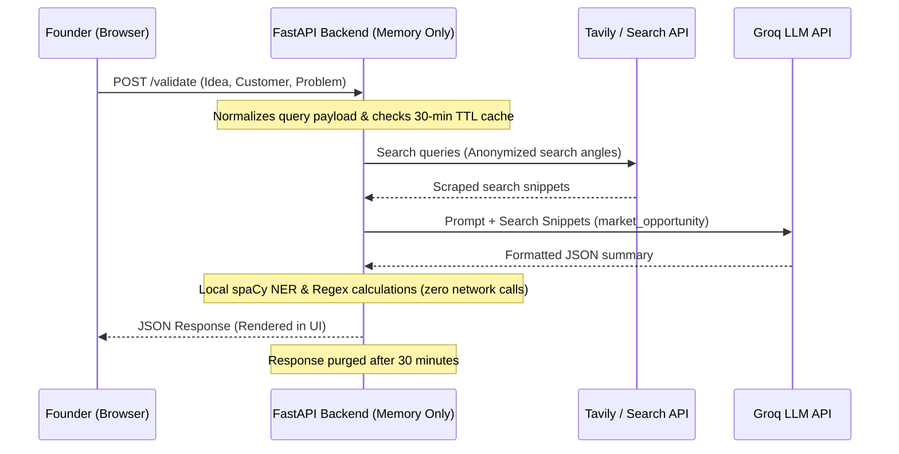

# Security, Privacy, and AI Ethics Specification
**Project:** Affinity — AI-Based Startup Idea Validator  
**Document Version:** September 2026 · Milestones 1 & 2  

---

## 1. Overview & Core Commitments

Affinity validates early-stage startup ideas using automated web retrieval and LLM reasoning. Founders submitting unreleased startup concepts require strict data privacy, minimal retention, and transparent AI reasoning.

### Core Architecture Guarantees
1. **Zero Persistent Storage:** Submitted ideas, problem statements, and generated reports are stored strictly in volatile memory. No relational or document database exists in the architecture.
2. **Ephemeral In-Memory Caching:** Responses are cached in-memory for 30 minutes to prevent duplicate API requests and expire automatically.
3. **No Model Training on Inputs:** API providers (Groq, Tavily) are configured via enterprise API tiers that prohibit training third-party models on submitted payload data.
4. **Deterministic Evidence Grounding:** Strategic insights are generated only from retrieved search evidence to mitigate AI hallucinations.

---

## 2. Information Security & Data Handling

### 2.1 Data Flow Architecture



### 2.2 In-Memory Cache Security
The backend caching system in [`backend/main.py`](file:///C:/Opensource/AI%20Based%20Startup%20Idea%20Validator/backend/main.py) uses SHA-256 hashes of normalized input text as cache keys:

```python
_CACHE_TTL_SECONDS = 30 * 60
_cache: dict[str, tuple[float, dict]] = {}

def _cache_key(payload: ValidateRequest) -> str:
    normalized = json.dumps(
        {
            "idea": payload.idea.strip().lower(),
            "targetCustomer": payload.targetCustomer.strip().lower(),
            "problem": payload.problem.strip().lower(),
        },
        sort_keys=True,
    )
    return hashlib.sha256(normalized.encode("utf-8")).hexdigest()
```

- **Partial Failure Guard:** Responses containing errors (`errors.marketOpportunity != null`) are **never cached**, ensuring transient upstream failures do not persist.
- **Session Storage Isolation:** The React frontend uses `sessionStorage` instead of `localStorage`. Analysis state is retained during active browser tab reloads and automatically destroyed when the tab is closed.

---

## 3. Privacy & Search Anonymization

When an idea is submitted, Affinity's retrieval layer in [`backend/agent/retrieval.py`](file:///C:/Opensource/AI%20Based%20Startup%20Idea%20Validator/backend/agent/retrieval.py) generates up to 5 research queries:
1. `Market size & trends`
2. `Competitors`
3. `Industry news`
4. `Customer demand`
5. `How others solve this`

### Anonymization Practices
- Search queries contain only generalized market descriptors derived from the user's idea.
- No user IP addresses, browser fingerprinting, or personally identifiable information (PII) are appended to search API calls.
- Academic repository domains (`arxiv.org`, `ncbi.nlm.nih.gov`) and directory aggregator sites (`alternativeto.net`, `saashub.com`) are excluded via `_EXCLUDED_DOMAINS` to ensure search precision and prevent tracking leaks.

---

## 4. AI Ethics & Hallucination Mitigation

### 4.1 Factual Grounding Policy
A risk in automated market validation is "hallucinated financial metrics" (e.g., invented TAM/SAM figures or fake market CAGR percentages).

Affinity enforces strict grounding guidelines in [`backend/agent/market_agent.py`](file:///C:/Opensource/AI%20Based%20Startup%20Idea%20Validator/backend/agent/market_agent.py):
- The model is explicitly instructed to cite TAM, SAM, or CAGR metrics **only** when retrieved web snippets explicitly contain those figures.
- If market metrics are absent in search results, the system explicitly reports: *"TAM/SAM figures are not clear from the provided sources."*

### 4.2 Transparent Isolation of Partial Failures
If an upstream LLM rate-limits or fails, the application does not substitute fake placeholder data. Instead:
- The section returns `null` with a specific error flag in `errors.marketOpportunity`.
- The frontend renders a dedicated `UnavailableCard` informing the user of the temporary disruption while preserving valid competitor and web source results.

---

## 5. Decision Support Disclaimer

Affinity is designed as an **early-stage market research assistant** and automated idea screening tool. 

- Outputs do not constitute formal financial, legal, or investment advice.
- Market scores (Opportunity Score) are comparative heuristic indicators derived from available online search density and growth indicators.
- Founders are advised to perform direct customer interviews and formal legal due diligence before making capital allocation decisions.
