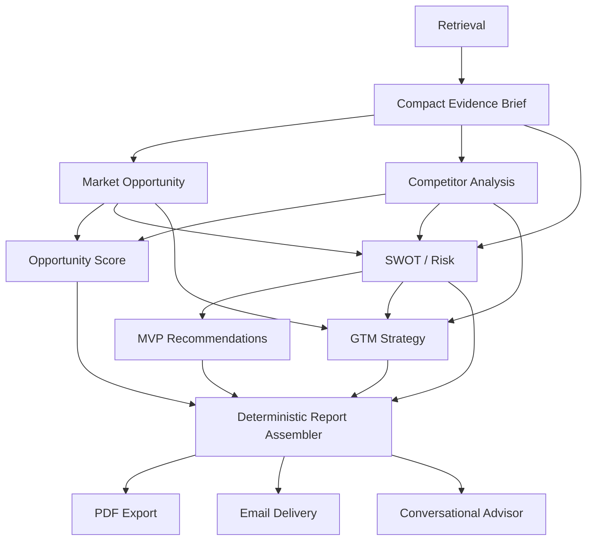

# Affinity — Differentiators and Integration Plan

**Status:** Approved direction for Milestones 3 and 4  
**Priority:** Milestone 3 and 4 requirements remain mandatory. The features in this
document enhance those deliverables and must not delay the core pipeline.

## 1. Product Direction

Affinity should differ from a generic LLM-generated startup report by making every
recommendation traceable, reusable, and actionable. The product will:

- ground analysis in live market evidence;
- reuse structured outputs across agents instead of repeatedly sending raw context;
- expose uncertainty and contradictory signals;
- convert findings into validation experiments and a 7/30/90-day action plan;
- generate a polished downloadable report; and
- email an already-generated report without rerunning the agent pipeline.

## 2. Required Milestone Coverage

### Milestone 3

- SWOT and Risk Analysis Agent
- MVP Feature Recommendation Agent
- Go-To-Market Strategy Agent
- Conversational Startup Advisor

### Milestone 4

- Startup Validation Report Generation Agent
- Report UI and PDF export
- Full-pipeline end-to-end and failure-path testing
- Search-query, prompt, latency, and token optimization
- Technical documentation, project report, and final demonstration

## 3. Shared Artifact Mesh

Affinity will use a **shared artifact mesh** (also known as a blackboard pattern), not
an all-to-all conversational agent mesh. Every pipeline node reads a small set of
validated upstream artifacts and writes one structured artifact back to LangGraph
state and the session store.



### Mesh rules

1. Retrieval runs once and produces a deduplicated evidence brief.
2. Sources receive stable IDs such as `src-1`; downstream claims cite source IDs
   instead of copying full snippets.
3. Each agent receives only the fields required for its task.
4. Outputs are schema-validated before entering shared state.
5. A failed node records an explicit section error and does not erase valid artifacts.
6. Node results are cached by normalized inputs and upstream artifact versions.
7. Retrying one section resumes at that node instead of restarting the pipeline.
8. The Report Generation Agent assembles existing artifacts and does not re-derive
   analysis.

Example:

```json
{
  "evidence": {
    "sources": {
      "src-1": {
        "title": "Market report",
        "url": "https://example.com/report",
        "snippet": "A compact supporting excerpt",
        "publishedAt": "2026-08-10",
        "relevance": 0.91
      }
    }
  },
  "swot": {
    "opportunities": [
      {
        "text": "Demand is increasing in the target segment.",
        "sourceIds": ["src-1"]
      }
    ]
  }
}
```

## 4. Token and Latency Controls

- Keep only the strongest 8–12 deduplicated sources in the evidence brief.
- Apply fixed snippet-length and total-context budgets.
- Bound output sizes, such as four items per SWOT category, five MVP features, and
  three primary GTM channels.
- Use the smaller configured model for extraction, chat intent classification, and
  compact summaries; reserve the stronger model for analysis that needs reasoning.
- Prefer deterministic Python for scoring, confidence, contradiction checks, report
  assembly, and formatting.
- Store a rolling chat summary and only a limited number of recent messages.
- Use deterministic search-intent rules before calling an LLM for chat interpretation.
- Add `quick` and `deep` validation modes. Quick mode returns core market validation;
  deep mode completes every Milestone 3 agent and the full strategic report.
- Limit concurrent LLM calls with a backend semaphore or queue and honor provider retry
  headers.
- Never restart successful upstream nodes when a fallback model or downstream node
  fails.

## 5. Distinctive Features

### 5.1 Evidence-backed insights

SWOT items, risks, MVP recommendations, GTM claims, and report conclusions include
`sourceIds`. The UI lets a founder inspect the evidence behind a claim.

### 5.2 Confidence dashboard

Confidence is calculated without another LLM call using:

- source coverage;
- average relevance;
- agreement across independent sources;
- source recency; and
- direct evidence versus inferred conclusions.

Confidence must be presented as evidence strength, not as a guarantee that a business
will succeed.

### 5.3 Contradiction detector

Deterministic rules compare structured artifacts and flag tensions such as:

- market growth with weak customer-demand evidence;
- high opportunity score with several high-severity risks;
- premium positioning with price-sensitive segments; or
- broad MVP scope with high effort and limited validation.

The report preserves both sides of a contradiction instead of forcing an artificially
positive conclusion.

### 5.4 Validation experiment generator

The system converts risky assumptions into actionable experiments:

```json
{
  "hypothesis": "Target customers will pay for the proposed solution.",
  "method": "Run a landing-page smoke test.",
  "successMetric": "At least 8% of qualified visitors join the waitlist.",
  "duration": "7 days",
  "budget": "low",
  "relatedRiskIds": ["risk-2"]
}
```

This can initially be generated from deterministic templates using structured risks,
segments, and MVP features. An LLM refinement call is optional.

### 5.5 Founder action plan

The final report organizes validated recommendations into:

- **Next 7 days:** test the highest-risk assumptions;
- **Next 30 days:** build and measure the smallest useful MVP; and
- **Next 90 days:** execute the strongest evidence-backed GTM channel.

### 5.6 Advisor decision history

The session store records important pivots and decisions from chat. The advisor can
show what changed from the original idea without resending the entire transcript to
the model.

## 6. Report Generation and PDF Export

The report assembler consumes structured pipeline artifacts and produces one canonical
report object:

```json
{
  "reportId": "string",
  "sessionId": "string",
  "ideaSummary": {},
  "marketOpportunity": {},
  "competitors": {},
  "opportunityScore": 0,
  "swot": {},
  "mvp": {},
  "gtm": {},
  "confidence": {},
  "contradictions": [],
  "experiments": [],
  "actionPlan": {},
  "sources": [],
  "sectionErrors": {},
  "generatedAt": "ISO-8601 timestamp"
}
```

The frontend renders this canonical object. Browser print styles provide an immediate
download-as-PDF option. Server-side PDF rendering is added for email attachments and
must reuse the same report object and visual section order.

## 7. Email Delivery

**Selected provider:** Resend transactional email API  
**Application integration:** FastAPI calls Resend through its HTTP API or Python SDK.  
**Secret:** `RESEND_API_KEY`, stored only in local/Render environment variables.

The discovered Resend Agent Finder resource is a development aid, not a runtime
dependency:

- https://github.com/resend/resend-skills/blob/main/skills/resend/SKILL.md

No MCP server is required in the deployed application. The runtime integration stays
small, explicit, and testable.

### Implemented now: long-running-validation email delivery

Before the Milestone 4 report assembler exists, a narrower version of this is already
wired into `/validate` itself (`backend/agent/email_delivery.py`,
`backend/agent/job_store.py`):

- `ValidateRequest.email` is optional. Requests without it keep the original fully
  synchronous behavior, unchanged.
- When an email is supplied and the pipeline is still running past
  `VALIDATE_ASYNC_THRESHOLD_SECONDS` (default 25s), `/validate` returns `202` with a
  `jobId` immediately instead of holding the connection open. The pipeline keeps
  running in a detached background task (`asyncio.wait`, not `asyncio.wait_for`, so
  the task isn't cancelled by the timeout).
- `GET /validate/status/{jobId}` lets the frontend poll for completion even without
  relying on email deliverability - the in-memory job store mirrors session_store.py's
  bounded/TTL design.
- On completion, `send_report_email` sends a plain HTML summary (not yet the full
  Milestone 4 canonical report object below) via Resend's HTTP API, called directly
  with `urllib` rather than adding the `resend` SDK as a dependency.
- No `RESEND_API_KEY` -> `send_report_email` logs a warning and returns `False` rather
  than raising; a failed/skipped email never fails the underlying validation job.

This is intentionally the smaller, immediate version of the feature described below,
not a replacement for it - once the Milestone 4 report assembler exists, this path
should send the canonical report object instead of the current inline HTML summary.

### Proposed endpoint (Milestone 4 - full report, not yet built)

```http
POST /reports/{sessionId}/email
Content-Type: application/json

{
  "recipient": "founder@example.com"
}
```

Successful queueing returns:

```json
{
  "status": "queued",
  "deliveryId": "string"
}
```

### Email rules

1. Email delivery only reads an existing completed report.
2. It never reruns retrieval or any agent.
3. Validate and normalize the recipient address.
4. Generate or reuse the report PDF, then send it as an attachment.
5. Return `202 Accepted` after the provider accepts the request.
6. Record `queued`, `sent`, or `failed` status without exposing provider secrets or raw
   exceptions.
7. Do not place full report contents or email addresses in normal application logs.
8. Add rate limiting to prevent abuse of the public endpoint.
9. Require explicit user action and consent before sending.
10. Provide a plain-text summary and accessible HTML body in addition to the PDF.

For development and tests, use a fake email adapter that records delivery requests
without contacting Resend.

## 8. Delivery Order

1. Complete the required Milestone 3 agents and session/chat infrastructure.
2. Introduce the compact evidence brief and shared artifact contracts.
3. Add deterministic report assembly and partial-report handling.
4. Build the report UI and browser PDF export.
5. Add server-side PDF rendering and the Resend adapter.
6. Add citations and confidence indicators.
7. Add contradiction detection, validation experiments, and the action plan.
8. Run end-to-end, partial-failure, token-budget, mobile, export, and email tests.
9. Optimize prompts and queries from measured test results.
10. Complete deployment configuration and final documentation.

## 9. Acceptance Criteria

- Every required Milestone 3 and 4 output is available in the final report.
- No downstream agent repeats retrieval or receives the entire raw search response.
- Every evidence-backed claim can reference one or more source IDs.
- A failed optional section still produces a usable partial report.
- Report assembly, confidence scoring, contradictions, and export preparation require
  no additional LLM call.
- Repeated identical validation can reuse cached node artifacts.
- Emailing a report does not invoke any search or LLM provider.
- Provider failures produce explicit UI-visible delivery states.
- API keys and recipient data are never exposed to the frontend or committed.
- The complete deep-mode flow and the reduced-cost quick mode are both tested.
